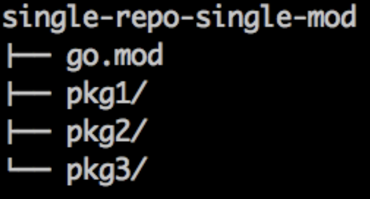

# Workspace

Go 的 workspace 被定义在 $GOPATH 工作目录下，其结构有三个子目录：

## GOPATH

指定 workspace 的位置，默认为 $HOME/go

Go 的编译模式为：

- go get 获取的代码会放在 `$GOPATH/src` 下面
- go build 会在 `$GOROOT/src` 和 `$GOPATH/src` 下面按照 import path 去搜索 pkg

## src/

用于存放源文件

- src/：下面可以包含多个 git rep
- repo：一个repo可以包含多个 module，但大部分情况下一个 repo 对应一个 module
- module：一个 module 包含一组 Go pkg
  - module 用 go.mod 文件来记录元信息
- pkg：每个 pkg 是一个目录下的多个源文件
  - module/repo 的路径（github.com/bigwhite/gocmpp）会作为 pkg 的导入路径（import path）

## bin/ 

存放编译后的可执行文件

- 将 bin/ 目录添加到 $PATH

``export PATH=$PATH:$(go env GOPATH)/bin``

## pkg/

存放编译后的库文件

