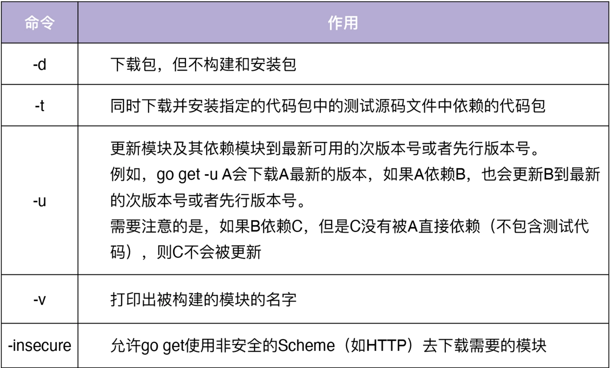

# 包&Module

## 包

Go 程序被组织到 Go 包中，Go 包是同一目录中一起编译的 Go 源文件的集合。在一个源文件中定义的函数、类型、变量和常量，对于同一包中的所有其他源文件可见。

### 整体

- repo：一个 repo 一般对应一个 module，但一个 repo 也可以包含多个 module
- module：一个 module 包含多个 pkg，module 用 go.mod 来记录元信息
- pkg：每个 pkg 是一个目录下的多个源文件，往往采用 repo/module/ 的路径（github.com/bigwhite/gocmpp）作为 pkg 的导入路径（import path）

### 包结构

包指一个目录下的一组源文件，但这组源文件的包声明必须是一致的包名。所有语法可见性均定义在包这个级别，也就是一个目录/包下不同的源文件内的函数对于包来说同级，不会区分不同文件。

- 每个包开始于一个与目录同名的.go文件：如 http 包应该在 http/ 目录下的 http.go 文件中定义
- 不同的功能分布在不同的源文件中：如 message.go 包含 Request 和 Response 类型，负责 HTTP 序列化请求和响应；http.go 应该包含底层网络处理逻辑；client.go 包含 Client 类型，server.go 包含 Server 类型，实现 HTTP 业务逻辑、请求路由；

#### 导入路径 vs. 包名

包名可以与目录名不同，但尽量相同。

如在使用实时分布式消息平台 nsq 提供的 go client api 时，导入的路径为 `import “github.com/bitly/go-nsq”`。但在使用其提供的函数时，却直接用 nsq 做前缀包名 `q, _ := nsq.NewConsumer("write_test", "ch", config)`。因为 import 导入的是包在 $GOPATH 下的目录路径，并非包名，而在代码中使用的是真正的包名。【1】

#### 多源文件依赖

同一个目录下、相同包声明的多个源文件属于同一个包，当源文件间存在依赖关系时，需要在 go run/build 时指明多个文件。

- go run

```bash
cd samelib
go run main.go lib1.go -name="XXX" # 需要把涉及到的文件一起运行
```

- go build

```bash
cd samelib
go build # 会自动在同目录下寻找依赖函数/文件一起编译
./samelib -name="XXX"
```

### 作用域

名称的首字母为大写的变量或函数才可以被当前包外的代码引用（公有），否则它就只能被当前包内的其他代码引用（私有）。

- 小写：私有
- 大写：公有

### 分类

Go 中有 4 种类型的包：

- Go 标准包：在 Go 源码目录下，随 Go 一起发布的包。
- 第三方包：第三方提供的包，比如来自于  github.com  的包。
- 匿名包：只导入而不使用的包。通常情况下，只是想使用导入包产生的副作用，即引用包级别的变量、常量、结构体、接口等，以及执行导入包的init()函数。
- 内部包：项目内部的包，位于项目目录下。


## Module

Go Modules 是 Go 官方推出的一个  Go 包管理方案，基于 vgo 演进而来，具有下面这几个特性：

- 可以使包的管理更加简单。
- 支持版本管理。
- 允许同一个模块多个版本共存。
- 可以校验依赖包的哈希值，确保包的一致性，增加安全性。
- 内置在几乎所有的 go 命令中，包括 go get、go build、go install、go run、go test、go list等命令。
- 具有 Global Caching 特性，不同项目的相同模块版本，只会在服务器上缓存一份。

在 Go1.14 版本以及之后的版本，Go 官方建议在生产环境中使用 Go Modules。因此，以后的 Go 包管理方案会逐渐统一到 Go Modules。

### 历史

从 Go 推出之后，因为没有一个统一的官方方案，所以出现了很多种 Go 包管理方案，比较混乱，也没有彻底解决 Go 包管理的一些问题。

Go 依赖包管理工具经历了五个阶段：

- GOPATH：在 Go1.5  版本之前，没有版本控制，所有的依赖包都放在 GOPATH 下。采用这种方式，无法实现包的多版本管理，并且包的位置只能局限在 GOPATH 目录下。如果 A 项目和 B 项目用到了同一个 Go 包的不同版本，这时候只能给每个项目设置一个 GOPATH，将对应版本的包放在各自的 GOPATH 目录下，切换项目目录时也需要切换 GOPATH。这些都增加了开发和实现的复杂度。
- Vendoring：Go1.5 推出了vendor 机制，并在 Go1.6 中默认启用。在这个机制中，每个项目的根目录都可以有一个 vendor 目录，里面存放了该项目的 Go 依赖包。在编译 Go 源码时，Go 优先从项目根目录的 vendor 目录查找依赖；如果没有找到，再去 GOPATH 下的 vendor 目录下找；如果还没有找到，就去 GOPATH 下找。这种方式解决了多 GOPATH 的问题，但是随着项目依赖的增多，vendor 目录会越来越大，造成整个项目仓库越来越大。在 vendor 机制下，一个中型项目的 vendor 目录有几百 M  的大小一点也不奇怪。
- 多种 Go 依赖包管理工具：这个阶段，社区也现了很多 Go 依赖包管理工具。
  - Godep：解决包依赖的管理工具，Docker、Kubernetes、CoreOS 等 Go  项目都曾用过 godep 来管理其依赖。
  - Govendor：它的功能比 Godep 多一些，通过 vendor 目录下的vendor.json文件来记录依赖包的版本。
  - Glide：相对完善的包管理工具，通过 glide.yaml 记录依赖信息，通过 glide.lock 追踪每个包的具体修改。
- Dep：对于从 0 构建项目的新用户来说，Glide 功能足够，是个不错的选择。不过，Golang 依赖管理工具混乱的局面最终由官方来终结了：Golang 官方接纳了由社区组织合作开发的 Dep，作为标准，成为了事实上的官方包管理工具。
- Go  Modules：Go1.11 版本推出了 Go Modules 机制，Go Modules 基于 vgo 演变而来，是 Golang  官方的包管理工具。在 Go1.13 版本，Go 语言将 Go Modules 设置为默认的 Go 管理工具；在 Go1.14 版本，Go  语言官方正式推荐在生产环境使用 Go Modules，并且鼓励所有用户从其他的依赖管理工具迁移过来。至此，Go 终于有了一个稳定的、官方的 Go 包管理工具。


### 原理

GO MODULE 的目的是确保在非 `$GOPATH/src` 目录下可以编译 go 源文件，并把结果输出到 $GOPATH 目录下。

在 module-aware mode 下，repo 的顶层目录下会放置一个 go.mod 文件，该文件定义把该 repo 定义为一个 Go module，而放置 go.mod 文件的目录被称为 module root 目录（通常一个 repo 对应一个 module，但不是必须的）。module root 目录以及其子目录下的所有 pkg 均归属于该 module，除了那些自身包含 go.mod 文件的子目录。

在 module-aware mode 下，go 编译器将不再在 $GOPATH/src 或 $GOPATH/pkg 下搜索目标程序依赖的第三方 pkg，而是主动将下载的依赖包缓存在 `$GOPATH/pkg/mod` 下。

#### go.mod

go.mod 文件中包含了以下部分：

- module：用来定义当前项目的模块路径。
- go：用来设置预期的 Go 版本，目前只是起标识作用。
- require：用来设置一个特定的模块版本，格式为<导入包路径> <版本> [//  indirect]。
- exclude：用来从使用中排除一个特定的模块版本，如果知道模块的某个版本有严重的问题，就可以使用 exclude 将该版本排除掉。
- replace：用来将一个模块版本替换为另外一个模块版本。格式为 $module => $newmodule  ，$newmodule可以是本地磁盘的相对路径，例如 github.com/gin-gonic/gin =>  ./gin。也可以是本地磁盘的绝对路径，例如 github.com/gin-gonic/gin =>  /home/lk/gin。还可以是网络路径，例如 golang.org/x/text v0.3.2 =>  github.com/golang/text v0.3.2。

执行 go build 后go.mod文件的内容为：

```shell
# cat go.mod
module wkmodule

go 1.17

require github.com/sirupsen/logrus v1.8.1

require golang.org/x/sys v0.0.0-20191026070338-33540a1f6037 // indirect
```

该 module 并没有直接依赖 d 包，因此在 d 的记录后面通过注释形式标记了 indirect，即非直接、传递依赖。

要修改 go.mod 文件，可以采用下面这三种方法：

- Go 命令在运行时自动修改。
- 手动编辑 go.mod 文件，编辑之后可以执行go mod edit  -fmt格式化 go.mod 文件。
- 执行 go mod 子命令修改。在实际使用中，我建议采用这种方法，和其他两种相比不太容易出错。

#### go.sum

Go 会根据 go.mod 文件中记载的依赖包及其版本下载包源码，但是下载的包可能被篡改，缓存在本地的包也可能被篡改。单单一个 go.mod 文件，不能保证包的一致性。为了解决这个潜在的安全问题，Go Modules 引入了 go.sum 文件。

go.sum 文件用来记录每个依赖包的 hash 值，在构建时，如果本地的依赖包 hash 值与go.sum文件中记录的不一致，则会拒绝构建。go.sum 中记录的依赖包是所有的依赖包，包括间接和直接的依赖包。

这里提示下，为了避免已缓存的模块被更改，$GOPATH/pkg/mod 下缓存的包是只读的，不允许修改。

#### 导入路径

module 作为包的导入路径，一个 module 下可以包含多个包，所以可以通过不同层级的子目录来区分包。

如 `import "github.com/cnych/stardust/api/stringsx"`

- module名：stardust
- 内部路径：api
- 包名：stringsx

#### go get

在一个 module 内执行 `go get` 时，会自动下载最新版本的包，并且更新 go.mod、go.sum 文件。



### 命令

#### 配置

可以通过环境变量 GO111MODULE 来打开或者关闭。GO111MODULE 有 3 个值：

- auto：在 Go1.14  版本中是默认值，在 $GOPATH/src 下，且没有包含 go.mod 时则关闭 Go Modules，其他情况下都开启 Go  Modules。也就是说，如果不把代码放置在 GOPATH/src 下则默认使用 MODULE 管理。
- on：启用 Go Modules，Go1.14 版本推荐打开，未来版本会设为默认值。
- off：关闭 Go  Modules，不推荐。

如果要打开 Go Modules，可以设置环境变量 export GO111MODULE=on 或 export  GO111MODULE=auto，建议直接设置 export GO111MODULE=on。

```bash
go env -w GOPROXY=https://mirrors.cloud.tencent.com/go/,direct
go env -w GOPROXY=https://mirrors.aliyun.com/goproxy/
go env -w GO111MODULE=on
```

#### 命令

- init：把当前目录初始化为一个新模块，创建 go.mod 文件。
- tidy：更新/细化 go.mod 文件，添加丢失的模块，并移除无用的模块。默认情况下，Go 不会移除 go.mod 文件中的无用依赖。当依赖包不再使用了，可以使用go mod  tidy 命令来清除它。它会check go.mod 中所有依赖的 pkg 并下载到 `$GOPATH/pkg/mod/`下。
- downlowd：下载 go.mod 文件中记录的所有依赖包到`$GOPATH/pkg/mod/` 下。
- vendor：将所有依赖包存到当前目录下的 vendor  目录下，将 `$GOPATH/pkg/mod/`下的依赖包复制到本地 vendor/ 目录下。
- edit：编辑 go.mod 文件。
- graph：查看现有的依赖结构。
- verify：检查当前模块的依赖是否已经存储在本地下载的源代码缓存中，以及检查下载后是否有修改。
- why：查看为什么需要依赖某模块。

## Lab

### 新建mod/可执行-无本地依赖

所有依赖为外部包

```bash
cd wkmodule
rm go.mod & rm go.sum # 清除环境
go mod init wkmodule # 创建go.mod
go mod tidy # 检测该目录下所有引入的依赖，并放入 go.mod中，并自动下周所有依赖包至$GOPATH/pkg/mod
go run main.go
go install  # 安装wkmodule可执行文件到 $GOPATH/bin
```

- mod更新依赖：在 go.mod 所在目录

```bash
go mod tidy
```

- mod使用指定版本

```bash
go mod -require=bitbucket.org/bigwhite/c@v1.0.0 # 会更新go.mod reqire部分
```

#### 基于vendor编译（推荐）

可以不使用 $GOPATH/pkg/mod/ 而使用本地 vendor/ 来存放依赖包。Go Modules 默认会忽略 vendor/ 这个目录，但如果希望将依赖包都放入 vendor/，可以执行 `go mod vendor`。vender/ 目录会包含所有的依赖模块代码，并且会在该目录下面添加一个名为 modules.txt 的文件用来记录依赖包的一些信息。

```bash
go mod vendor # 将刚才下载至 $GOPATH/mod/pkg 的依赖包转移至该项目目录的 vendor 目录下
# go build -getmode=vendor main.go
go build -ldflags "-s -w" -a -installsuffix cgo -o wkmodule-local .
```

### 下载mod/可执行-无本地依赖

所有依赖为外部包，无本地依赖

```bash
cd wkapp
go mod tidy
go run main.go
```

### 下载mod/可执行-有本地依赖

改为本地依赖

````bash
cd wkapp2
go mod init wkapp # 创建go.mod
修改 go.mod，加入本地依赖
```
require (
	github.com/rebirthmonkey/wklib2 v0.0.0
)

replace github.com/rebirthmonkey/wklib2 => /Users/ruan/workspace/go/10_basics/10_environment/20_pkg-module/wklib2

```
go mod tidy 
go run main.go
````

### 下载mod/库-被依赖

如果下载的库是被其他程序 import，则：

- 公开：通过 import github.com/xxx/ 被导入
- 本地：通过 go.mod 中的 replace xxx=>yyy 被导入

## Ref

1. [理解Golang包导入](https://studygolang.com/articles/3189)
1. [亲测GO环境搭建，理解go build、go install、go get](https://blog.csdn.net/zhangliangzi/article/details/77914943)
1. [go module 基本使用](https://www.cnblogs.com/chnmig/p/11806609.html)
1. [一文搞懂 Go Modules 前世今生及入门使用](https://www.cnblogs.com/wongbingming/p/12941021.html)
1. [关于Go Modules，看这一篇文章就够了](https://zhuanlan.zhihu.com/p/105556877?utm_source=wechat_session)
1. [初窥Go module](https://tonybai.com/2018/07/15/hello-go-module/)
1. [Go 语言全新依赖管理系统 Go Modules 使用详解](https://www.toutiao.com/i6714564564194689543/?tt_from=weixin&utm_campaign=client_share&wxshare_count=1&timestamp=1597249873&app=news_article&utm_source=weixin&utm_medium=toutiao_ios&use_new_style=1&req_id=2020081300311301001405309209375D1B&group_id=6714564564194689543)
1. 

