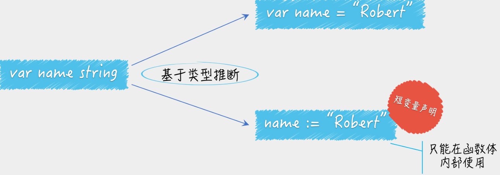

# 程序结构

## 源文件

- 文件名
- 包申明：package name
  - package main：可执行文件
- 包引入：
  - import . "fmt"：调用 fmt 包内函数不需要用包名可以直接调用
- 变量&常量
- 函数
  - 内容
    - 语句&表达式
    - 注释
  - 类型
    - main：主函数入口

## 变量&常量

### 变量

#### 声明

- 标准声明

```go
var name string = "XXX"
或
var name string 
name = "XXX"
```

- 合并声明：采用了Go的类型判断

```go
var name = "XXX"
```

- 短变量声明：采用了Go的类型判断，但只能在函数体内使用短变量声明

```go
name := "XXX"
```



#### 作用域

作用域最大的用处就是对程序的访问权限的控制，一个程序的作用域总是会被限制在某个代码块中。

- 代码引用变量总会最优先查找当前代码块中的那个变量
- 如果当前代码块中没有，则会沿着代码块的嵌套关系一层层地向上查找，一直查到当前包
- 如果仍然找不到，那么就会报错了

#### 类型断言 表达式

- `x.(T)`：x 代表要被判断类型的值，T 代表判断类型
- `T(x)`：类型转换表达式

```go
value, ok := interface{}(container).([]string)
```

- 把container变量的值转换为空接口值的interface{}(container)
- 判断前者的类型是否为切片类型 []string  `.([]string)`

### 常量

### 指针

#### 声明

- 标准声明：var p *int = &b
- 简化声明：p := &b

#### 赋值

- 指针赋值：p = &b
- 值赋值：*p = 2

#### 使用

- a := *p

### type

自定义变量类型

- type xxx int：一般类型申明

- type xxx struct{}：结构型声明

- type xxx interface{}：接口

### nil

空

- if err != nil：如果err不为空，即有错误。

### Lab

- [变量声明](10_variable-constant-declaration.go)
- [变量作用域](12_variable-scope.go)

```bash
go run 10_variable-constant-declaration.go
```

```bash
go run 12_variable-scope.go
```

## func 函数

### 声明

func 函数构成了代码执行的逻辑结构，在 Go 中，函数的基本形式为：func 函数名 (参数列表) (返回值列表) {函数体}。因为Go 是编译型语言，所以函数编写的顺序是无关紧要的，鉴于可读性的需求，最好把 main() 函数写在文件的前面，其他函数按照一定逻辑顺序进行编写（例如函数被调用的顺序）。

编写多个函数的主要目的是将一个需要很多行代码的复杂问题分解为一系列简单的任务来解决。而且，同一个任务（函数）可以被多次调用，有助于代码重用。

当函数执行到代码块最后一行 `}` 之前或 return 语句的时候会退出，其中 return 语句可以带有零个或多个参数，这些参数将作为返回值供调用者使用，简单的 return 语句也可以用来结束 for 的死循环，或者结束一个 goroutine。

函数的类型被称为函数的标识符，如果两个函数的参数列表和返回值列表中的变量类型一一对应，那么这两个函数被认为有相同的类型和标识符，参数和返回值的变量名不影响函数标识符也不影响它们是否可以以省略参数类型的形式表示。Go 里面拥 3 种类型的函数：

- 普通的带有名字的函数
- 匿名函数或 lambda 函数
- 方法

#### 参数列表

每一次函数在调用时都必须按照声明顺序为所有参数提供参数值。在函数调用时，Go 没有默认参数值，也没有任何方法可以通过参数名指定参数，因此参数和返回值的变量名对于函数调用者而言没有意义。

- 变量+类型

- ...
  - 函数任意多个该类型的独立参数
  - 不是作为参数列表，而是作为一个个参数直接传！
  
##### 传递方式

- by value：在函数中，参数值默认通过值传递的方式进行传递，因此函数的参数是拷贝，在函数内对参数进行修改不会影响原始参数。
- by pointer：如果参数包括引用类型，如指针、slice、map、function、channel 等，参数可能会由于在函数内的间接引用被修改。

##### 可变参数

可变参数是指函数传入的参数个数是可变的，为了做到这点，需要将函数定义为可以接受可变参数的类型。

形如 `...type` 格式的类型只能作为函数的参数类型存在，并且必须是最后一个参数，它是一个语法糖（syntactic sugar），即这种语法对语言的功能并没有影响，但是更方便程序员使用。通常来说，使用语法糖能够增加程序的可读性，从而减少程序出错的可能。

从内部实现机理上来说，类型 `...type` 本质上是一个 slice ，也就是 `[]type`，这也是为什么上面的参数 args 可以用 for 循环来获得每个传入的参数。可变参数列表的数量不固定，传入的参数是一个切片，如果需要获得每一个参数的具体值时，可以对可变参数变量进行遍历。

```go
func myfunc(args ...int) {
	for _, arg := range args {
    fmt.Println(arg)
  }
}
```

##### Lab

- [函数&传参](30_function.go)
```bash
go run 30_function.go
```

#### 返回值列表

Go 支持多返回值，多返回值能方便地获得函数执行后的多个返回参数，Go 经常使用多返回值中的最后一个返回参数返回函数执行中可能发生的错误。

- 变量+类型，但变量可以省略
- 如果只有一个输出，可以省略()

#### 函数体

##### Loop

###### IF

```go
if <Boolean expression> { 
  <Statements>
}
```

###### IF-ELSE

```go
if <Boolean expression> { 
  <Statements>
} else { 
  <Statements>
}
```

###### Switch

```go
switch {
  case <condition>: 
    <statements>
  case <condition>:
    <statements>
  default:
    <statements>
}
```

##### Loop

The Go for loop has 4forms:

1. for<initialization>;<condition>;<increment/decrement>{} 
2. for<condition>{}-likeawhileloop
3. for{}-aninfinitewhileloop.
4. forwithrange.

###### Range

The range keyword is used in for loop to iterate data in data structures (arrays, slices, string, maps etc.). 

```go
func main() {
  arr := []int{1, 2, 3}
  for _, v := range arr {
    arr = append(arr, v)
  }
  fmt.Println(arr)
}
```

###### Lab

- [loop for](33_loop-for.go)
- [loop switch](34_loop-switch.go)
```bash
go run 33_loop-for.go
```

```bash
go run 34_loop-switch.go
```

##### defer

处理业务中涉及成对的操作是一件比较烦琐的事情，比如打开和关闭文件、接收请求和回复请求、加锁和解锁等。在这些操作中，最容易忽略的就是在每个函数退出处正确地释放和关闭资源。defer 语句正好是在函数退出时执行的语句，所以使用 defer 能非常方便地处理资源释放问题。

###### 使用场景

- 函数 return 前执行已注册 defer
- 函数执行到最后执行已注册 defer
- panic 前执行已注册 defer

###### 原理

- 先给返回值赋值
- 执行defer语句
- 包裹函数return返回

###### Lab

- [Defer](60_defer.go)
- [Defer](62_defer.go)

```bash
go run 60_defer.go
echo $?
```

```bash
go run 62_defer.go
echo $?
```

#### 调用

#### 异常处理

函数在定义后，可以通过调用的方式让当前代码跳转到被调用的函数中进行执行，调用前的函数局部变量都会被保存起来不会丢失，被调用的函数运行结束后，恢复到调用函数的下一行继续执行代码，之前的局部变量也能继续访问。函数内的局部变量只能在函数体中使用，函数调用结束后，这些局部变量都会被释放并且失效。

Go语言的函数调用格式：`返回值变量列表 = 函数名(参数列表)`

- 函数名：需要调用的函数名。
- 参数列表：参数变量以逗号分隔，尾部无须以分号结尾。
- 返回值变量列表：多个返回值使用逗号分隔。


### 匿名函数

Go 支持匿名函数，即在需要使用函数时再定义函数，匿名函数没有函数名只有函数体。**匿名函数可以作为一种类型被赋值给函数类型的变量**，匿名函数也往往以变量方式传递，这与 C 语言的回调函数比较类似。不同的是，Go 支持随时在代码里定义匿名函数。

匿名函数是指不需要定义函数名的一种函数实现方式，由一个不带函数名的函数声明和函数体组成。其声明方式为：func (参数列表) (返回值列表) {函数体}。

#### 赋值

```go
f := func(data int){fmt.Println("hello", data)}
```

- 可以被作为一种类型被赋值给函数类型的变量

```go
f(100) # 调用
```

#### 回调

所谓回调，是指将一个函数作为参数传递给某个程序。在程序中可以调用该函数执行某些操作。回调使程序的输入更加多样性，除了变量还可以输入函数逻辑，从而使程序更加灵活。

匿名函数作为回调函数的设计在 Go 的系统包中也比较常见。

```go
package main
 
import "fmt"
 
// 遍历切片的每个元素, 通过给定函数进行元素访问
func visit(list []int, f func(int)) {
	for _, v := range list {
		f(v)
	}
}
 
func main() {
  // 使用匿名函数打印切片内容
  visit([]int{1, 2, 3, 4}, func(v int) {
  	fmt.Println(v)
  })
}
```

### 异常处理

#### error

程序员可预知的异常

- errors.New()
- fmt.Errorf()
- interface

##### 自定义错误

返回错误前，需要定义会产生哪些可能的错误。在 Go 中，使用 errors 包进行错误的定义，格式如下：

```go
var err = errors.New("this is an error")
```

错误字符串由于相对固定，一般在包作用域声明，应尽量减少在使用时直接使用 errors.New 返回。

#### panic

Go 的类型系统会在编译时捕获很多错误，但有些错误只能在运行时检查，如数组访问越界、空指针引用等，这些运行时错误会引起 panic。panic 可能会造成体验停止、服务中断，就像没有人希望在取钱时遇到 ATM 机蓝屏一样。一般而言，当 panic 发生时，程序会中断运行，并立即执行在该程序中被延迟的函数（defer 机制）。随后，程序崩溃并输出日志信息，日志信息包括 panic value 和函数调用的堆栈跟踪信息，panic value 通常是某种错误信息。

虽然 Go 的 panic 机制类似于其他语言的异常，但 panic 的适用场景有一些不同，由于 panic 会引起程序的崩溃，因此 panic 一般用于严重错误，如程序内部的逻辑不一致。任何崩溃都表明了代码中可能存在漏洞，所以对于大部分漏洞，应该使用Go提供的 error 错误机制，而不是 panic。

- 程序员无法预知的异常
- recovery
  - 从panic中恢复，并返回panic value
    - 导致panic异常的函数不会继续运行，但能正常返回 Exit Code 0
  - 必须被defer直接调用

##### 手动触发

Go 可以在程序中手动触发 panic 让程序崩溃，这样开发者可以及时地发现错误，同时减少可能的损失。示例代码如下：

```go
package main

func main() {
	panic("crash")
}
```

##### defer

当 panic() 触发的宕机发生时，panic() 后面的代码将不会被运行，但是在 panic() 函数前面已经运行过的 defer 语句依然会在宕机发生时发生作用。

```go
package main
     
import "fmt"
     
func main() {
	defer fmt.Println("宕机后要做的事情1")
	defer fmt.Println("宕机后要做的事情2")
	panic("宕机")
}

代码输出如下：
宕机后要做的事情2
宕机后要做的事情1
panic: 宕机
```

##### recover

Recover 是一个 Go 的内建函数，可以让进入宕机流程中的 goroutine 恢复过来。recover 仅在延迟函数 defer 中有效，在正常的执行过程中，调用 recover 会返回 nil 并且没有其他任何效果。如果当前的 goroutine 陷入恐慌，调用 recover 可以捕获到 panic 的输入值，并且恢复正常的执行。

通常来说，不应该对进入 panic 宕机的程序做任何处理，但有时，需要可以从宕机中恢复，至少可以在程序崩溃前，做一些操作。举个例子，当 web 服务器遇到不可预料的严重问题时，在崩溃前应该将所有的连接关闭，如果不做任何处理，会使得客户端一直处于等待状态。如果 web 服务器还在开发阶段，服务器甚至可以将异常信息反馈到客户端，帮助调试。

在其他语言里，宕机往往以异常的形式存在，底层抛出异常，上层逻辑通过 try/catch 机制捕获异常，没有被捕获的严重异常会导致宕机，捕获的异常可以被忽略，让代码继续运行。

Go 没有异常系统，其使用 panic 触发宕机类似于其他语言的抛出异常，recover 的宕机恢复机制就对应其他语言中的 try/catch 机制，让程序在崩溃时继续执行。

下面的代码实现了 ProtectRun() 函数，该函数传入一个匿名函数或闭包后的执行函数，当传入函数以任何形式发生 panic 崩溃后，可以将崩溃发生的错误打印出来，同时允许后面的代码继续运行，不会造成整个进程的崩溃。

```go
package main
     
import (
	"fmt"
	"runtime"
)
     
// 崩溃时需要传递的上下文信息
type panicContext struct {
  function string // 所在函数
}

// 保护方式允许一个函数
func ProtectRun(entry func()) {

  // 延迟处理的函数
  defer func() {

    // 发生宕机时，获取panic传递的上下文并打印
    err := recover()

    switch err.(type) {
      case runtime.Error: // 运行时错误
      fmt.Println("runtime error:", err)
      default: // 非运行时错误
      fmt.Println("error:", err)
    }

  }()

  entry()
}

func main() {
  fmt.Println("运行前")

  // 允许一段手动触发的错误
  ProtectRun(func() {

    fmt.Println("手动宕机前")

    // 使用panic传递上下文
    panic(&panicContext{
      "手动触发panic",
    })

    fmt.Println("手动宕机后")
  })

  // 故意造成空指针访问错误
  ProtectRun(func() {

    fmt.Println("赋值宕机前")

    var a *int
    *a = 1

    fmt.Println("赋值宕机后")
  })

  fmt.Println("运行后")
}

代码输出结果：

运行前
手动宕机前
error: &{手动触发panic}
赋值宕机前
runtime error: runtime error: invalid memory address or nil pointer dereference
运行后
```


#### Lab

- [错误函数](80_error-func.go)
- [Error Interface实现错误](82_error-interface.go)
- [Panic简介](84_panic.go)
- [Panic通过Defer来Recover](85_panic-recover.go)

```bash
go run 80_error-func.go
```

```bash
go run 82_error-interface.go
```

```bash
go run 84_panic.go
echo $?
```

```bash
go run 85_panic-recover.go
```

## Ref

1. [Go语言函数](https://blog.csdn.net/weixin_39345003/article/details/109295173)
