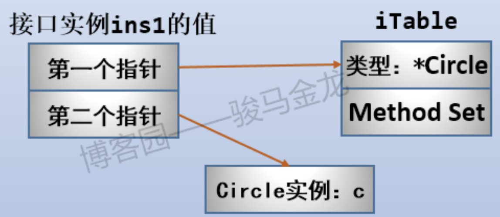
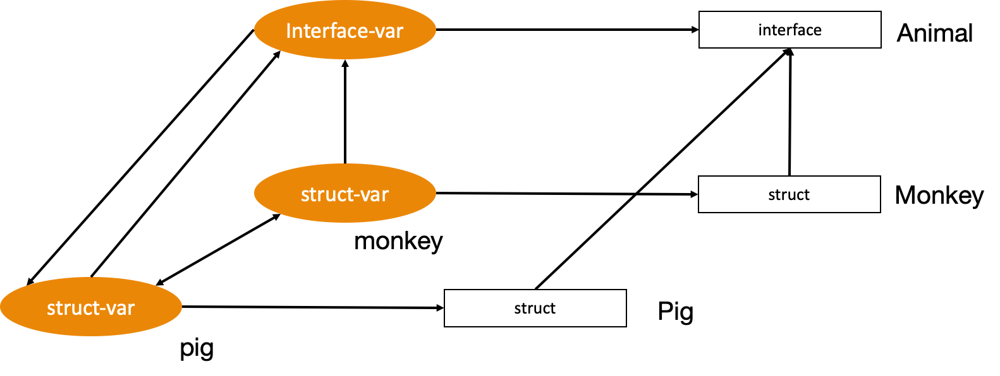

# 数据结构

## 基础

### boolean

```go
var B bool = true
```

### integer

int8、int16、int32、int64：8 表示变量在内存中的大小（以位为单位）

```go
var i int = -1000
```

#### unsigned integer

uint8、uint16、uint32、uint64

```go
var j uint = 1000
```

#### byte

byte = int8

#### rune

rune = int32, used to store Unicode characters

### float

float32、float64

```go
var f float32 = 1.2345
```

### complex

复数：complex64、complex128

### Lab

- [基础数据结构](01_basic.go)


```bash
go run 01_basic.go
```

## 复合

### 数组（array）

数组类型的值（简称数组）的长度是固定的，而切片类型的值（切片）是可变长的。

数组是由相同类型元素的集合组成的数据结构，系统会为数组分配一块连续的内存来保存其中的元素，可以利用数组中元素的索引快速访问元素对应的存储地址。常见的数组大多都是一维的线性数组，而多维数组在数值和图形计算领域却有比较常见的应用。

Go 中数组在初始化之后大小就无法改变，存储元素类型相同、但是大小不同的数组类型在 Go 看来也是完全不同的两个数组。

#### 申明/创建

```go
var a [10]int
var b [100]interface{}
```

#### 初始化

```go
arr1 := [3]int{1,2,3} // 可以跳过声明
arr2 := [...]int{1,2,3} // 会被转化为上一个
```

#### 访问/赋值

```go
arr1[3]
arr2[2] = 3
```

#### func

- len()：长度
- cap()：容量

### 切片（slice）

更常用的数据结构其实是切片，切片就是动态数组，它的长度并不固定，可以随意向切片中追加元素，而切片会在容量不足时自动扩容。

Slice is an abstraction over Array, it actually uses arrays as an underlying structure. To define a slice, you can declare it as an array without specifying its size.

切片的类型字面量中只有元素的类型，而没有长度。切片的长度可以自动地随着其中元素数量的增长而增长，但不会随着元素数量的减少而减小。

在每个切片的底层数据结构中，一定会包含一个数组。数组可以被叫做切片的底层数组，而切片也可以被看作是对数组的某个连续片段的引用。切片可以想象成有一个窗口，可以通过这个窗口看到一个数组，但是不一定能看到该数组中的所有元素，有时候只能看到连续的一部分元素。

Slice is an abstraction over Array, it actually uses arrays as an underlying structure.
To define a slice, you can declare it as an array without specifying its size.

The various operations over slice are:

- append(): add the elements to a slice. If the size of underlying array is not enough then automatically a new array is created and content of the old array is copied to it.
- len(): returns the number of elements presents in the slice.
- cap(): returns the capacity of the underlying array of the slice.
- copy(): the contents of a source slice are copied to a destination slice.
- <SliceName>[start:end]: returns a slice object containing the elements of base slice from index start to end- 1.

#### 申明

```go
var s []int
a := make([]int, 10)
b := make([]int, 0, 10)
c := s[2:4]
```

#### 初始化

```go
s := []int{1,2,3,4,5,6,7,8,9,10} // 跳过声明
```

上例中，由于 c 是通过在 s 上施加切片操作得来的，所以 s 的底层数组就是c的底层数组。

#### func

- len()
- cap()
- append()：在slice尾部添加跟多的元素或切片。在无需扩容时，append函数返回的是指向原底层数组的新切片，而在需要扩容时，append函数返回的是指向新底层数组的新切片。

### 字典（map）

哈希表是除了数组之外，最常见的数据结构，几乎所有的语言都会有数组和哈希表这两种集合元素，有的语言将数组实现成列表，有的语言将哈希表称作结构体或者字典，但是它们是两种设计集合元素的思路，数组用于表示元素的序列，而哈希表示的是键值对之间映射关系，只是不同语言的叫法和实现稍微有些不同。

A map is a collection of Key-Value pairs. Hash-Table is used to store elements in a Map so it is unordered.

字典（map）存储的不是单一值的集合，而是键值对的集合。在 Go 中，为了避免歧义，将键值对换了一种称呼，叫做：“键 - 元素对”。A map is a collection of Key-Value pairs. Hash-Table is used to store elements in a Map so it is unordered.

Go 的字典类型其实是一个哈希表（hash table）的实现。在这个实现中，键和元素的最大不同在于，键的类型是受限的，而元素却可以是任意类型的。可以把键理解为元素的一个索引，可以在哈希表中通过键查找与它成对的那个元素。键和元素的这种对应关系，在数学里就被称为“映射”，这也是“map”这个词的本意，哈希表的映射过程就存在于对键 - 元素对的增、删、改、查的操作之中。

#### 声明/创建

```go
hash := make(map[string]int, 3)
```

#### 初始化

```go
hash := map[string]int{
    "1": 2,
    "3": 4,
    "5": 6,
}
```

#### 访问/赋值

如要在哈希表中查找与某个键值对应的那个元素值，那么需要先把键值作为参数传给这个哈希表。哈希表会先用哈希函数（hash function）把键值转换为哈希值。哈希值通常是一个无符号的整数。一个哈希表会持有一定数量的哈希桶（bucket），这些哈希桶会均匀地储存其所属哈希表收纳的“键-元素”对。因此，哈希表会先用这个键哈希值的低几位去定位到一个哈希桶，然后再去这个哈希桶中查找这个键。由于“键 - 元素”对总是被捆绑在一起存储的，所以一旦找到了键，就一定能找到对应的元素值。随后，哈希表就会把相应的元素值作为结果返回。只要这个“键-元素”对存在哈希表中就一定会被查找到，因为哈希表增、改、删“键-元素”对时的映射过程，与前文所述如出一辙。

```go
hash["1"] = 2
hash["3"] = 4
hash["5"] = 6
```

### 列表（list）

Go 的链表实现在标准库的 container/list 包中，实现了一个双向链表，而 Element 则代表了链表中元素的结构。

List 和 Element 都是结构体类型。结构体类型的特点就是它们的零值都会是拥有特定结构，但是没有任何定制化内容的值，相当于一个空壳。值中的字段也都会被分别赋予各自类型的零值。广义来讲，所谓的零值就是只做了声明，但还未做初始化的变量被给予的缺省值。每个类型的零值都会依据该类型的特性而被设定。

### Ring

container/ring 包中的 Ring 类型实现的是一个循环链表，也就是俗称的环。循环链表一旦被创建，其长度是不可变的。

### 字符串（string）

- A String is a sequence of Unicode character.
- String is an immutable type variable.
- Double quotes are used to declare strings.

#### 初始化

```go
var s string = "Hello, World!" // 标准
```

```go
s := "Hello, World!" // 简短
```

#### Operation

- `len(mystring)` --> `12`: Used to find the number of characters in mystring
- `“hello”+“world”` --> `“helloworld”`: 2 strings are concatenated into a single string
- `“world” == “hello”` --> `False`: Equality can be tested using “==” sign
- `“a” < “b”` --> `True`: Unicode value can also be used to “b” < “a” False compare
- `mystring[0]` --> `“h”` Indexing: String are indexed same as array.
- `mystring[1:4]` --> `"ell"`: Slicing

### Lab

- [数组 Array](10_array.go)
- [切片 Slice](11_slice.go)
- [切片 Slice](12_slice2.go)
- [切片 Slice Sum](14_slice-sum.go)：the sum of all the elements of the integer list，given list as an input argument.
- [切片 Slice Sequential Search](15_slice-sequential-search.go)：for unsorted values
- [切片 Slice Binary Search](16_slice-binary-search.go)：for sorted values
- [字典 Map](22_map.go)
- [双向链表 List](25_list.go)
- [字符串 String](29_string.go)

```bash
go run 10_array.go
```

```bash
go run 11_slice.go
```

```bash
go run 12_slice2.go
```

```bash
go run 14_slice-sum.go
```

```bash
go run 15_slice-sequential-search.go
```

```bash
go run 16_slice-binary-search.go
```

```bash
go run 22_map.go
```
```bash
go run 25_list.go
```

```bash
go run 29_string.go
```


## 结构体（struct）

Go 中提供了对 struct 结构体的支持，与数组一样，结构体属于复合类型。

### 定义

使用 struct 关键字可以定义一个结构体，结构体中的成员，称为结构体的字段或属性。

```go
type Point struct { 
    x int
    y int 
}
```

### 使用

#### 创建变量

##### 直接定义

不做初始化

```go
var p1 Point //所有字段均为空值
```

##### 使用字面量创建变量

```go
point1 := Point{50, 50}
point2 := Point{x: 100, y: 100}
```

#### 访问/赋值

通过变量名，使用逗号`(.)`，可以访问 struct 中的字段，或为字段赋值，也可以对字段进行取址(&)操作。

```go
point1.x = 3
```

```go
a := point2.y
```

### 指针结构体

struct 与 array 一样，都是值传递，比如当把 struct 作为实参传给函数的形参时，会复制一个副本。所以为了提高性能，一般不会把 struct 直接传递给函数，而是在把 struct 传给函数时，使用`指针结构体`。指针结构体，即一个指向结构体的指针。声明 struct 变量时，在 struct 类型前加*号，便声明一个指向 struct 的指针，如：

```go
var ppoint3 *Point
var ppoint8 new(Point)
var ppoint3 *Point = &point1
```

如果将 struct 转给函数，只是复制 struct 的副本。如果在函数内修改 struct 字段值，外面的 struct 并不会受影响。而如果将 struct 指针传给函数，则在函数中使用指针对 struct 所做的修改，都会影响到指针指向的 struct。

#### 访问/赋值

- (*ppoint3).x 与ppoint3.y 等价：可以通过指针名直接调用值的变量或方法。指针可用来代替值，但值无法代替指针，因为可能有多个指针指向同一个值，Go 会自动把指针转换为值。
- 函数的输入/输出一般采用指针 struct

### 成员

#### 变量

- point1.X
- 结构体不能包含自身，但可包含自身的结构体指针

#### 方法

##### 方法接收器

在 Go 中，将函数绑定到 struct 上，则称该函数是该 struct 的方法，其定义的方式是在 func 与函数名间加上具体 struct 变量，这个 struct 变量称为"方法接收器"。

通过`方法接收器`可以访问 struct 的字段，这类似其他编程语言中的 this 关键词，但在 Go 中，只是一个变量名而已。

###### 值接收器

值传递，修改时不会修改原 struct 变量

```go
func (p Point) Distance(q Point) float64 {
  ...
}
```

在下例中 
```go
type Member struct {
    Id     int
    Name   string
    Email  string
    Gender int
    Age    int
}

//普通函数
func setName(m Member,name string){
    m.Name = name
}

//绑定到Member结构体的方法，是值传递
func (m Member)setName(name string){
    m.Name = name
}

m := Member{}
m.setName("小明")
fmt.Println(m.Name)//输出为空
```

上面的代码中，虽然调用了 setName() 方法设置了字段 Name 的值，但因为 struct 是值传递，当调用setName时，方法接收器接收到是只是 struct 变量的一个副本，通过副本对值进行修复，并不会影响调用者。因此，可以将方法接收器定义为指针 struct，就可达到修改 struct 的目的了。

###### 指针接收器

指针传递，修改时会修改值中原 struct 变量

```go
func (p *Point) Distance(q Point) float64 {
  ...
}
```

```go
func (p Point) Distance(q Point) float64 {
  ...
}
```

在下例中 
```go
type Member struct {
    Id     int
    Name   string
    Email  string
    Gender int
    Age    int
}

//绑定到Member结构体的方法，是值传递
func (m *Member)setName(name string){
    m.Name = name
}

m := Member{}
m.setName("小明")
fmt.Println(m.Name) //输出值为 “小明”
```

#### 可见性

当定义的 struct 字段名首字母是小写的，这意味着这些字段在`包外不可见`，因而无法在其他包中被访问，只允许包内访问。如果想在一个包中访问另一个包中 struct 的字段，则必须是大写字母开头的变量，即可导出的变量。

#### Tags

在定义 struct 字段时，除字段名称和数据类型外，还可以使用反引号为 struct 字段声明元信息，这种元信息称为 Tag，用于编译阶段关联到字段中。

```go
type Member struct {
    Id     int    `json:"id,-"`
    Name   string `json:"name"`
    Email  string `json:"email"`
    Gender int    `json:"gender,"`
    Age    int    `json:"age"`
}
```

上例中使用 encoding/json 包编码或解码 struct 时使用的 Tag 信息。Tag 由反引号括起来的一系列用空格分隔的key/value 键值对组成。

### 嵌套/匿名组合

#### 组合

struct 中并没有继承的概念，其实，在 Go 中也没有继承的概念。Go 的编程哲学里，推荐使用`组合`的方式来达到代码复用效果。组合，可以理解为定义一个 struct 中，其字段可以是其他的 struct ，这样不同的 struct 就可以共用相同的字段。

```go
type Animal struct {
    Name   string  //名称
    Color  string  //颜色
    Height float32 //身高
    Weight float32 //体重
    Age    int     //年龄
}
//奔跑
func (a Animal)Run() {
    fmt.Println(a.Name + "is running")
}
//吃东西
func (a Animal)Eat() {
    fmt.Println(a.Name + "is eating")
}

type Cat struct {
    a Animal
}

func main() {
    var c = Cat{
	    a: Animal{
            Name:   "猫猫",
            Color:  "橙色",
            Weight: 10,
            Height: 30,
            Age:    5,
        },
    }
    fmt.Println(c.a.Name)
    c.a.Run()
}
```

#### 匿名组合

在上例中，把 Animal 结构体作为 Cat 的字段时，其变量名为a，所以访问 Animal 的方法时，语法为`c.a.Run()`。这种通过子属性访问某个字段类型所带的方法和字段用法非常繁琐。

Go语言支持直接将一个 struct 作为另一个 struct 的字段，而不需要取变量名，这种字段叫`匿名组合`。通过匿名组合，访问匿名字段类型所带的方法和字段时，不需要使用子属性，非常方便。

下例中，通过 struct 组合实现继承，Point 的成员直接变为 Circle 的成员，而不需要加一层嵌套。

```go
type Circle struct { 
  Point 
}
c := Circle{x:8, y:10}
```

### Lab

- [结构体 struct](50_struct.go)
- [结构体方法 method](51_struct-method.go)

```bash
go run 50_struct.go
```

```bash
go run 51_struct-method.go
```

## 接口（interface）

### 简介

接口（interface）是一种类型，用来定义行为（方法）。Go 中的接口定义了一组方法的集合，但这些方法不会在接口上直接实现，而是需要通过用户自定义的 struct 来实现方法。在接口类型中的方法都是没有实际 struct 的，仅仅只是在接口中存放一些方法的签名（签名 = 函数名+参数(类型)+返回值(类型)）。

使用接口具有以下好处：

- 提高代码扩展性：同样的 interface 可以有不同的实现。在开发中用的比较多的是将数据库的 CURD 操作抽象成接口，从而可以实现同一份代码连接不同数据库的目的。
- 可以解耦上下游的实现：如某个 interface 可以有多个不同的 struct 的实现，使用时不用关注 struct 是如何实现的，只需要调用 interface 提供的方法即可。
- 提高了代码的可测性：因为接口可以解耦上下游实现，在单元测试需要依赖第三方系统/数据库的代码时，可以利用接口将具体实现解耦，实现 fake 类型。
- 提高代码的健壮性：如要更改一个方式，只需要更改相关类型的方法即可，完全影响不到使用该方法的函数。

#### 优点

- 代码扩展性更强了
- 可以解耦上下游的实现：为不同层级的模块提供一个定义好的中间层。这样，上游不再需要依赖下游的具体实现，充分地对上下游进行了解耦。
- 提高了代码的可测性
- 代码更健壮、更稳定了

#### Go是面向接口编程

面向接口编程是根据结构体可以执行的操作而不是其所包含的数据来设计抽象。接口可以看做结构体的“基类”，它定义了结构体的行为。结构体则是接口的实现，通过实现所有接口声明的方法来实现该接口。当结构体中包含了该接口，则表示结构体实现该“基类”

### 声明&实现

在接口声明中只能定义方法签名，不能包含变量。

```go
package main

import (
    "fmt"
)

// Shape接口类型
type Shape interface {
    Area() float64
}

// Circle struct类型
type Circle struct {
    radius float64
}

// Circle类型实现Shaper中的方法Area()
func (c *Circle) Area() float64 {
    return 3.14 * c.radius * c.radius
}

// Square struct类型
type Square struct {
    length float64
}

// Square类型实现Shaper中的方法Area()
func (s *Square) Area() float64 {
    return s.length * s.length
}

func main() {
    // Circle类型的指针类型实例
    c := new(Circle)
    c.radius = 2.5

    // Square类型的值类型实例
    s := Square{3.2}

    // Shape接口实例ins1，它自身是指针类型的
    var ins1 Shape

    // 将Circle实例c赋值给接口实例ins1，那么ins1中就保存了实例c
    ins1 = c
    fmt.Println(ins1)

    // 使用类型推断将Square实例s赋值给接口实例
    ins2 := s
    fmt.Println(ins2)
  
    fmt.Println(ins1.Area())   // 输出19.625
    fmt.Println(ins2.Area())   // 输出10.24
}
```

当用户自定义的 struct 实现了 interface 中定义的方法时，那么**自定义 struct 的实例可以赋值给 interface 类型的实例**。这个赋值过程使得 interface 实例中保存了 2 个指针：

- 用户自定义 struct 类型：这部分是实例的类型信息。
- 用户自定义 struct 实例：这部分是实例自身信息。

如：struct 实例 c 与接口实例 ins1 包含了两个地址：【1】



当一个 struct 为一个 interface 中所有的方法提供定义时，它被称为实现了该 interface。而判断一个 struct 是否实现了一个interface 是完全是自动地。

#### 方法接收器

- 值接收器：会在方法内部创建/复制一个 struct 实例进行操作，但出了方法后该 struct 实例就会被销毁，所以无法向外传递该 struct 实例。
- 指针接收器：会通过指针直接使用外部的 struct 实例，所有在方法内对该 struct 实例的操作都会在外部的实例生效。

### 调用&多态

通常在 func 定义中都会直接**使用 interface 实例**，通过 interface 的方法操作该 interface 实例。当该函数被具体调用时，会传入具体的 struct 实例。该 struct 实例会被自动转换为 interface 实例而被操作。

因此可以看成通过 interface 定义“基类”，多个 struct 实现 interface 中定义的所有方法，从而实现这个“基类”。当通过 struct 调用该 interface 的方法时，所有符合该 interface 的 struct 都可被调用，从而实现多态调用。

#### 基类/interface定义

重点是实现方法的主体，无论是 struct 还是指针 struct

```go
animals := []Animal{Dog{}, Cat{}} // Animal是个接口
animals := []Animal{Dog{}, &Cat{}} // 既有结构体，也有接头体指针
func TotalPerimeter(shapes ...Shape) float64 {...}
TotalPerimeter(a, b, c, d) // 实现Shape的结构体或结构体指针
```

### interface{}

interface{} 作为所有类的通用“基类”被使用

```go
func PrintAll(vals []interface{}) {...}
```

可将 []string 转为 []interface{} 类型

### Lab

- [Interface 指针接收器](52_interface.go)
- [多态](53_interface-polymorphism.go)
- [多态](54_interface-polymorphism.go)
- [多态](55_interface-polymorphism.go)
- [多态](56_interface-polymorphism.go)
- [通用 interface](59_interface-general.go)

```bash
go run 52_interface.go
```

```bash
go run 53_interface-polymorphism.go
```

```bash
go run 54_interface-polymorphism.go
```

```bash
go run 55_interface-polymorphism.go
```

```bash
go run 56_interface-polymorphism.go
```

```bash
go run 59_interface-general.go
```

## 类型转换

### 基本

`b=type(a)` 如：`b = int32(a)`

### struct



#### 子类->基类

struct->interface

- 值接收器：animal1 := Animal(monkey)

- 指针接收器：animal2 := Animal(&cat)

#### 子类->子类

struct->struct，因为两个 struct 都实现了该 interfact（方法），所以可以相互转换。

- 值接收器：pig := Pig(monkey)

- 指针接收器：

  - 结构体：dog1 := Dog(cat)

  - 结构体指针：dog2 := (*Dog)(&cat)

#### 基类->子类

interface->struct

- 值接收器：monkey2, ok := animal1.(Monkey)

- 指针接收器

  - 结构体

    - 原路返回（animal2 从 cat 转换过来）：cat2, ok := animal2.(*Cat)

    - 非原路返回（不可行）：dog3 , ok := animal2.(*Dog)

  - 结构体指针：太复杂，不考虑

### Lab

- [基础数据结构转换](80_basic-type-trans.go)
- [字符串String转换](81_basic-string-trans.go)
- [Interface-Struct转换](85_interface-trans.go)

```bash
go run 80_basic-type-trans.go
```

```bash
go run 81_basic-string-trans.go
```

```bash
go run 85_interface-trans.go
```

## Ref

1. [Golang 之 interface接口全面理解](https://blog.csdn.net/Webben/article/details/110448404?utm_medium=distribute.pc_relevant.none-task-blog-2~default~baidujs_baidulandingword~default-0.queryctr&spm=1001.2101.3001.4242.1&utm_relevant_index=2)
