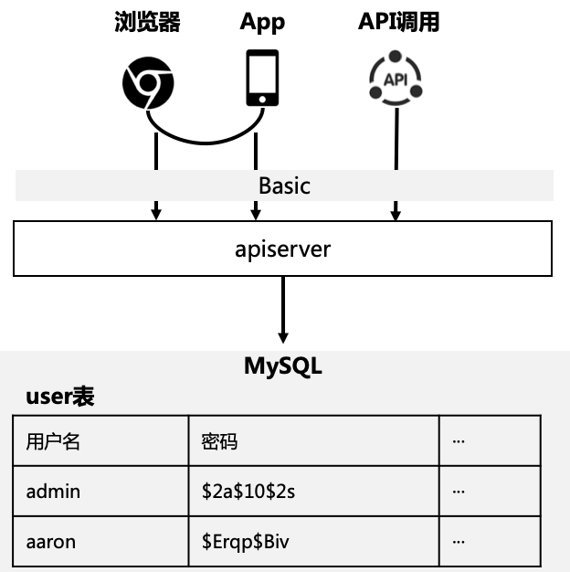
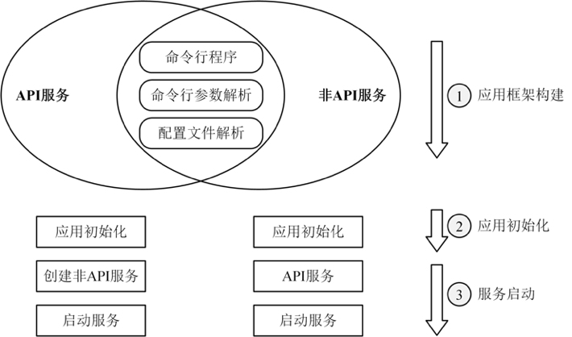

# apiserver 示例

## 简介

从本章开始，穿插着各个 Go 的知识点，会用一个真正的、企业级的 Go 应用 apiserver 进行讲解。一步步展示如何构建该应用，在构建过程中，如何使用现有的各个知识点。

### 架构

apiserver 应用核心是对外提供一个 web service，包括 CRUD 等不同操作。




### roadmap

总体来说，整个 apiserver 应用将从实战准备、基础实战、进阶实战等 3 个阶段进行讲解。具体内容包括：


## 应用框架

目前见到的 Go App，基本上可以分为 API 服务和非 API 服务两类。

- API 服务：通过对外提供 HTTP/RPC 接口来完成指定的功能。比如订单服务，通过调用创建订单的 API 接口，来创建商品订单。
- 非 API 服务：通过监听、定时运行等方式，而不是通过 API 调用来完成某些任务。比如数据处理服务，定时从 Redis 中获取数据，处理后存入后端存储中。再比如消息处理服务，监听消息队列（如 NSQ/Kafka/RabbitMQ），收到消息后进行处理。

 对于 API 服务和非 API 服务，它们的启动流程基本一致，都可以分为以下 3 步：

- 应用框架的构建，这是最基础的一步。
- 应用初始化。
- 服务启动。



命令行程序、命令行参数解析和配置文件解析，是所有服务都需要具备的功能，这些功能有机结合到一起，共同构成了应用框架。所以，要构建的任何一个应用程序，至少要具备命令行程序、命令行参数解析和配置文件解析这 3 种功能：

- 命令行程序：用来启动一个应用。命令行程序需要实现诸如应用描述、help、参数校验等功能。根据需要，还可以实现命令自动补全、打印命令行参数等高级功能。
- 命令行参数解析：用来在启动时指定应用程序的命令行参数，以控制应用的行为。
- 配置文件解析：一个大型应用，通常具有很多参数，为了便于管理和配置这些参数，通常会将这些参数放在一个配置文件中，供程序读取并解析。

这 3 个部分的功能，可以自己开发，也可以借助业界已有的成熟实现。不建议自己开发，更建议采用业界已有的成熟实现。命令行参数可以通过 Pflag 来解析，配置文件可以通过 Viper 0来解析，应用的命令行框架则可以通过 Cobra 来实现。目前这 3 个包也是最受欢迎的包，并且三者不是割裂的，而是有联系的。可以通过有机地组合这 3 个包，实现一个非常强大、优秀的应用命令行框架。上述 3 类功能跟业务关系不大，可以抽象成一个统一的框架。应用初始化、创建 API/非 API 服务、启动服务，跟业务联系比较紧密，难以包含在统一的框架。

## 代码实现

### 命令行构建

apiserver 的 main 函数位于 `cmd/apiserver.go` 文件中，可以跟读代码了解 apiserver 的代码实现。

首先提供了 NewApp 函数来创建一个应用：

```go
func NewApp(name string, basename string, opts ...Option) *App {
  a := &App{
    name:   name,
    basename: basename,
  }

  for _, o := range opts {
    o(a)
  }
  a.buildCommand()
  return a
}
```

该 App 基于 Cobra.Command，cobra.Command 是 App 自带 Cobra 的 Command 结构体，用于处理 flag、option、config-file 等。

#### WithOption

NewApp 中使用了设计模式中的选项模式，来动态地配置 App，支持 WithRunFunc、WithDescription、WithValidArgs 等选项：

- WithOption()：将 Options 赋值给 App
- WithRunFunc()：将 回调函数赋值给 App 的启动流程
- WithDescription()：将 desc 赋值给 App 的 Description

#### buildCommand() 流程

NewApp() 最终会调用 buildCommand 方法来创建 Cobra Command 类型的命令，命令的功能通过指定 Cobra Command 类型的各个字段来实现。通常可以指定：Use、Short、Long、SilenceUsage、SilenceErrors、RunE、Args 等字段。

buildCommand() 具体通过以下代码段给应用添加了命令行参数：

```go
var namedFlagSets cliflag.NamedFlagSets

if a.options != nil {
  namedFlagSets = a.options.Flags()
  fs := cmd.Flags()
  for _, f := range namedFlagSets.FlagSets {
    fs.AddFlagSet(f)
  }
  ...
}

if !a.noVersion {
  verflag.AddFlags(namedFlagSets.FlagSet("global"))
}

if !a.noConfig {
  addConfigFlag(a.basename, namedFlagSets.FlagSet("global"))
}

globalflag.AddGlobalFlags(namedFlagSets.FlagSet("global"), cmd.Name())

// add new global flagset to cmd FlagSet          
cmd.Flags().AddFlagSet(namedFlagSets.FlagSet("global")) 
```

namedFlagSets 中引用了 Pflag 包，上述代码先通过 a.options.Flags() 创建并返回了一批 FlagSet，a.options.Flags() 函数会将 FlagSet 进行分组。通过一个 for 循环，将 namedFlagSets 中保存的 FlagSet 添加到 Cobra 应用框架中的 FlagSet 中。

如果设置了 noConfig=false，那么就会在命令行参数 global 分组中添加以下命令行选项：

```shell
-c, --config FILE 
Read configuration from specified FILE, support JSON, TOML, YAML, HCL, or Java properties formats.
```

buildCommand 还会根据应用的配置，选择性添加一些 flag。例如，在 global 分组下添加 --version 和 --config 选项。

这里有下面 2 个技巧，供借鉴：

- 将 flag 分组：一个大型系统，可能会有很多个 flag，例如 kube-apiserver 就有 200 多个 flag，这时对 flag 分组就很有必要了。通过分组，可以很快地定位到需要的分组及该分组具有的标志。例如，想了解 MySQL 有哪些标志，可以找到 MySQL 分组：

```shell
Mysql flags:
   --mysql.database string
        Database name for the server to use.
   --mysql.host string
        MySQL service host address. If left blank, the following related mysql options will be ignored. (default "127.0.0.1:3306")
   --mysql.log-mode int
        Specify gorm log level. (default 1)
   ...
```

- flag 的名字带有层级关系：flag 的名字带有层级关系，这样不仅可以知道该 flag 属于哪个分组，而且能够避免重名。如对于 MySQL 和 Redis，都可以指定相同的 host 标志，通过 --mysql.host 也可以知道该 flag 隶属于 mysql 分组，代表的是 MySQL 的 host。

其具体流程为：

- 创建 cmd
- 将 commands[] 添加到 cmd
- 设置 cmd.RunE 为 a.runCommand
- 为 cmd 的 FlagSet 添加 flags
- 将 cmd 赋值给 App.cmd
- App 通过 Run() 调用 App.cmd.Execute()

#### 配置文件解析

在 buildCommand 函数中，通过 addConfigFlag 函数调用，添加了 -c, --config FILE 命令行参数，用来指定配置文件：

```go
addConfigFlag(a.basename, namedFlagSets.FlagSet("global"))
```

addConfigFlag 函数中，指定了 Cobra Command 在执行命令之前，需要做的初始化工作：

```go
func() {
  if cfgFile != "" {
    viper.SetConfigFile(cfgFile)
  } else {
    viper.AddConfigPath(".")
    if names := strings.Split(basename, "-"); len(names) > 1 {
      viper.AddConfigPath(filepath.Join(homedir.HomeDir(), "."+names[0]))
      viper.AddConfigPath(filepath.Join("/etc", names[0]))
    }
    viper.SetConfigName(basename)
  }
  if err := viper.ReadInConfig(); err != nil {
    _, _ = fmt.Fprintf(os.Stderr, "Error: failed to read configuration file(%s): %v\n", cfgFile, err)
    os.Exit(1)
  }
}
```

上述代码实现了以下功能：

- 如果命令行参数中没有指定配置文件的路径，则加载默认路径下的配置文件，通过 viper.AddConfigPath、viper.SetConfigName 来设置配置文件搜索路径和配置文件名。通过设置默认的配置文件，可以不用携带任何命令行参数，即可运行程序。
- 支持环境变量：通过 viper.SetEnvPrefix 来设置环境变量前缀，避免跟系统中的环境变量重名。通过 viper.SetEnvKeyReplacer 重写了 Env 键。

给应用添加了配置文件的命令行参数，并设置在命令执行前，读取配置文件。Viper 的配置是命令行参数和配置文件配置 merge 后的配置。如果在配置文件中指定了 MySQL 的 host 配置，并且也同时指定了--mysql.host 参数，则会优先取配置文件设置的值。这里需要注意的是，不同于 YAML 格式的分级方式，命令行参数是通过 . 来分级的。

### options

针对一个应用，options 结构体一般用于存储启动时需要的信息，它的主要来源是 Arg、Flag 以及配置文件 Config-file（虽然被称为 config-file，但是确切的应该是选项文件 option-file）。Option 不会存储在 runtime 的数据结构，只是在启动时使用。

在应用执行阶段，会通过 viper.Unmarshal 将配置 Unmarshal 到 Options 变量中。这样就可以使用 Options 变量中的值，来执行后面的业务逻辑。

#### Validate 校验

传入的 Options 是一个实现了 CliOptions 接口的结构体变量，CliOptions 接口定义为：

```go
type CliOptions interface {
  Flags() (fss cliflag.NamedFlagSets)
  Validate() []error
}
```

因为 Options 实现了 Validate 方法，所以可以在应用框架中调用 Validate 方法来校验参数是否合法。并且通过配置补全，可以确保一些重要的配置项具有默认值，当这些配置项没有被配置时，程序也仍然能够正常启动。一个大型项目，有很多配置项，我们不可能对每一个配置项都进行配置。所以，给重要的配置项设置默认值，就显得很重要了。

对于本 apiserver 示例提供的 Validate 方法：

```go
func (s *ServerRunOptions) Validate() []error {
  var errs []error
  errs = append(errs, s.GenericServerRunOptions.Validate()...)
  errs = append(errs, s.InsecureServing.Validate()...)
  errs = append(errs, s.SecureServing.Validate()...)
  errs = append(errs, s.MySQLOptions.Validate()...)
  errs = append(errs, s.JwtOptions.Validate()...)
  errs = append(errs, s.Log.Validate()...)
  errs = append(errs, s.FeatureOptions.Validate()...)
  return errs
}
```

可以看到，每个配置分组都实现了 Validate() 函数，对自己负责的配置进行校验。通过这种方式，程序会更加清晰。因为只有配置提供者才更清楚如何校验自己的配置项，所以最好的做法是将配置的校验放权给配置提供者（分组）。

#### Options 结构体

在命令执行时，会将配置文件中的配置项和命令行参数绑定，并将 Viper 的配置 Unmarshal 到传入的 Options 中（以下代码位于 runCommand 函数中）：

```go
if !a.noConfig {  
  if err := viper.BindPFlags(cmd.Flags()); err != nil {  
    return err  
  }  

  if err := viper.Unmarshal(a.options); err != nil {  
    return err  
  } 
} 
```

完整的 Options 结构体，包含 server、HTTPS、DB、Log 等的 option。在本例中位于 apiserver/options 包中，它用到的其他组件的 Options 结构体位于 pkg/options/ 包中。

- NewOptions()：创建 Options 结构体，因为创建时会自动填充默认值，所以不需要 Complete() 函数。
- Options.Validate()：给 Options 的值做校验。
- Options.ApplyTo(Config)：将 Options 的值转化、传递到 Config 结构体中。
- Options.Flags()/AddFlags()：为命令行添加针对 server、db、logs 等的 flag，并集成到 Options 中。

### config

针对某一个 app，在 app runtime 启动时，Options 就会被转换成 Config，用于在运行中给 app/server 使用。在本例中位于 apiserver/config 包中。

apiserver 根据 Options 来构建 Config。

#### Config 结构体

Options 结构体面向配置文件，而 Config 结构体则更面向 app 运行时的结构体。

- NewConfig()：创建默认 config，如 `config := apiserver.NewConfig()`
- Options.ApplyTo(Config)：将 Options 转换、映射成 Config，如 `Options.ApplyTo(config)`。
  - Config.CreateConfigFromOptions(Options)：也可以用本函数合并以上 2 步，将 Options 直接转成新的 Config。
- Config.Complete()：为 Config 补充默认值
- Config.Validate()：验证 Config，从而将 Config 转换成 CompletedConfig 结构体

#### CompletedConfig 结构体

已经补充、验证完所有所需值的完整 Config

- CompletedConfig.New()：基于完整的 CompleteConfig 创建 runtime app，如`apiserver := completeConfig.New()`
  - 在本例中通过 createAPIServer(Config) 合并以上几步

### runtime

#### apiServer 结构体

Config 结构体会在 App 启动后幻化为 App 自身的 runtime 结构体，在本实例中，为 APIServer。apiServer 结构体用于包含各种类型的 server，**是整个App核心的扩展处**，常包含 genericServer、grpcServer 等，本案例包含 genericServer（Gin），它位于 internal/apiserver/server.go。

- CompleteConfig.New()：把完整的 completeConfig 变成一个 runtime App（apiServer）
- server.PrepareRun()：对 apiserver 进行如 OpenAPI 以及其他 API 的安装等初始化操作，转换为 PreapreAPIServer，如 `preparedapiserver := apiserver.PrepareRun()`

#### preparedAPIServer 结构体

完成初始化后 apiServer，它位于 internal/apiserver/server.go。

- preparedapiserver.Run()：运行 preparedapiserver，如 `preparedapiserver.Run()`

##操作

```bash
go run cmd/apiserver.go -c configs/config.yaml
```

## Question

针对当前代码应用，描述 Cobra Command 加载的 flag、config-file 的逻辑及顺序，并给与验证说明。