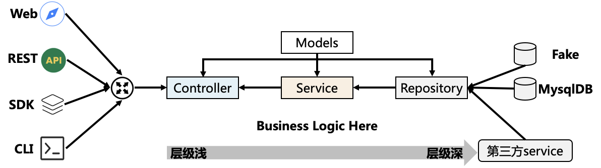

# GIN

## 简介

Gin 是 Go 语言写的一个 web 框架，它具有运行速度快，分组的路由器，良好的崩溃捕获和错误处理，非常好的支持中间件和 JSON。总之在 Go语言开发领域是一款值得好好研究的 Web 框架，[开源网址](https://github.com/gin-gonic/gin)。

Gin 核心的路由功能是通过一个定制版的 HttpRouter 来实现的，具有很高的路由性能，其主要功能包括：

- 支持 HTTP 方法：GET、POST、PUT、PATCH、DELETE、OPTIONS。
- 支持不同的 HTTP 参数：路径参数（path）、查询字符串参数（query）、表单参数（form）、HTTP 头参数（header）、消息体参数（body）。
- 支持 HTTP 路由和路由分组。
- 支持 middleware 和自定义 middleware。
- 支持自定义 Log。
- 支持 binding 和 validation，支持自定义 validator。可以 bind 如下参数：query、path、body、header、form。
- 支持重定向。
- 支持 basic auth middleware。
- 支持自定义 HTTP 配置。
- 支持优雅关闭。
- 支持 HTTP2。
- 支持设置和获取 cookie。

Installation: `go get -u github.com/gin-gonic/gin`

## 核心概念

在 Gin 的处理过程中，需要读取请求参数（消息体和 HTTP Header），经过业务处理后返回指定格式的消息。apiserver 也展示了如何进行参数的读取和返回，下面展示了如何读取和返回参数：

### HTTP Request 处理

**读取 HTTP 信息：** 在开发中需要读取的参数通常为：HTTP Header、路径参数、URL参数、消息体，读取这些参数可以直接使用 `Gin` 框架自带的函数：

- `Param()`：返回 URL 的参数值，例如

```go
 router.GET("/user/:id", func(c *gin.Context) {
     // a GET request to /user/john
     id := c.Param("id") // id == "john"
 })
```

- `Query()`：读取 URL 中的地址参数，例如

```go
   // GET /path?id=1234&name=Manu&value=
   c.Query("id") == "1234"
   c.Query("name") == "Manu"
   c.Query("value") == ""
   c.Query("wtf") == ""
```

- `DefaultQuery()`：类似 `Query()`，但是如果 key 不存在，会返回默认值，例如

```go
 //GET /?name=Manu&lastname=
 c.DefaultQuery("name", "unknown") == "Manu"
 c.DefaultQuery("id", "none") == "none"
 c.DefaultQuery("lastname", "none") == ""
```

- `Bind()`：检查 `Content-Type` 类型，将消息体作为指定的格式解析到 Go struct 变量中。通常采用的媒体类型是 JSON，所以 `Bind()` 是按 JSON 格式解析的。
- `GetHeader()`：获取 HTTP 头。

### HTTP Response 处理

**返回HTTP消息：** 因为要返回指定的格式，apiserver 封装了自己的返回函数，通过统一的返回函数 `SendResponse` 来格式化返回。

```go
func SendResponse(c *gin.Context, err error, data interface{}) {
    code, message := errno.DecodeErr(err)

    // always return http.StatusOK
    c.JSON(http.StatusOK, Response{
        Code:    code,
        Message: message,
        Data:    data,
    })
}
```

#### String()

返回的内容，可以是 String，也可以是 JSON

将 String 作为 Response 返回

#### JSON()

将 gin.H 结构体转化为 JSON 作为 Response 返回

### Context

context.Context 是 Go 中独特的涉及，可以用来用来设置截止日期、同步信号，传递请求相关值的结构体，与 Goroutine 有比较密切的关系。在 web 程序中，每个 Request 都需要开启一个 goroutine 做一些事情，这些 goroutine 又可能会开启其他的 goroutine 去访问后端资源：比如数据库、RPC 服务等。它们需要访问一些共享的资源，比如用户身份信息、认证token、请求截止时间等，这时候可以通过 Context 来跟踪这些 goroutine，并且通过 Context 来控制它们，这就是 Go 提供的 Context。

#### Context 定义

```go
type Context interface {
    Deadline() (deadline time.Time, ok bool)
    Done() <-chan struct{}
    Err() error
    Value(key interface{}) interface{}
}
```

1. Deadline方法：获取设置的截止时间。第一个返回值是截止时间，到了这个时间点，Context 会自动发起取消请求； 第二个返回值 ok==false 时表示没有设置截止时间，如果需要取消的话，需要调用取消函数进行取消。
2. Done方法：返回一个只读的 chan，类型为 struct{}。在 goroutine 中，如果该方法返回的 chan 可以读取，则意味着 parent context 已经发起了取消请求。通过 Done 方法收到这个信号后，就应该做清理操作，然后退出goroutine，释放资源。之后，Err 方法会返回一个错误，告知为什么 Context 被取消。
3. Err方法：返回取消的错误原因，因为什么 Context 被取消。
4. Value方法：获取该 Context 上绑定的值，是一个键值对，通过一个Key才可以获取对应的值，这个值一般是线程安全的。

#### 默认上下文

context 包中最常用的方法还是 context.Background()、context.TODO()，这两个方法都会返回预先初始化好的私有变量 background 和 todo， 它们会在同一个 Go 程序中被复用：

```go
func Background() Context {
 return background
}

func TODO() Context {
 return todo
}
```

这两个私有变量都是通过 new(emptyCtx) 语句初始化的，它们是指向私有结构体 context.emptyCtx 的指针。context.Background 是上下文的默认值，所有其他的上下文都应该从它衍生（Derived）出来。context.TODO 应该只在不确定应该使用哪种上下文时使用；在多数情况下，如果当前函数没有上下文作为入参，都会使用 context.Background 作为起始的上下文向下传递。

#### 使用原则

- 不要把 Context 放在结构体中，要以参数的方式传递，parent Context 一般为Background。
- 应该要把 Context 作为第一个参数传递给入口请求和出口请求链路上的每一个函数，放在第一位，变量名建议都统一，如 ctx。
- 给一个函数方法传递 Context 的时候，不要传递nil，否则在tarce追踪的时候，就会断了连接。
- Context 的 Value 相关方法应该传递必须的数据，不要什么数据都使用这个传递。
- Context 是线程安全的，可以放心的在多个 goroutine 中传递。
- 可以把一个 Context 对象传递给任意个数的 gorotuine，对它执行取消操作时，所有 goroutine 都会接收到取消信号。

### 路由

#### Group

可以分为多个 Route Group 分别对待

#### Embedded

还可以多级嵌套

#### Redirect

重定向

## Middleware

Go 的 `net/http` 设计的一大特点是特别容易构建中间件，Gin 框架也提供了类似的中间件。

在 gin 中，可以通过如下方法使用 middleware：

```go
g := gin.New()
g.Use(middleware.AuthMiddleware())
```

其中 `middleware.AuthMiddleware()` 是 `func(*gin.Context)` 类型的函数。中间件只对注册过的路由函数起作用。

在 gin 中可以设置 3 种类型的 middleware：

- 全局中间件：注册中间件的过程之前设置的路由，将不会受注册的中间件所影响。只有注册了中间件之后代码的路由函数规则，才会被中间件装饰。
- 单个路由中间件：需要在注册路由时注册中间件
  `r.GET("/benchmark", MyBenchLogger(), benchEndpoint)`
- 群组中间件：只要在群组路由上注册中间件函数即可。

### Next()

该函数会先交由后续 middleware、handler 处理完后，再继续处理剩下的代码。

## Ctl-Svr-Repo

controller 存放请求处理相关，service 存放具体的业务逻辑处理。controller 主要用来做请求参数解析、校验，参数返回，如果是简单的业务可以放在 controller 中。因为这样，也仍然能够比较清晰的看到这个请求的处理流程。但是如果是比较复杂的业务，需要放在 service 中，因为如果放在 controller 中，请求参数的处理、校验还有业务逻辑混在一起，一个是不好维护，另一个是不好阅读。



## Lab

### Basics

- [HelloWorld](01_hello-world.go)

```shell
go run 01_hello-world.go
# 新建终端，并在新建的终端继续
curl http://127.0.0.1:8080
```

或者在同一个终端窗口中执行

```bash
go run 01_hello-world.go &
sleep 10
curl http://127.0.0.1:8080
```

- [Get with JSON response](10_get-json.go)

```shell
go run 10_get-json.go
# 新建终端，并在新建的终端继续
curl http://127.0.0.1:8080/pingHandler
```

或者在同一个终端窗口中执行

```bash
go run 10_get-json.go &
sleep 10
curl http://127.0.0.1:8080/pingHandler
```

- [Get with JSON response 2](11_get-json.go)

```shell
go run 11_get-json.go
# 新建终端，并在新建的终端继续
curl http://127.0.0.1:8080/ping
```

或者在同一个终端窗口中执行

```bash
go run 11_get-json.go &
sleep 10
curl http://127.0.0.1:8080/ping
```

- [Get with Parameter](13_get-param.go)

```shell
go run 13_get-param.go
# 新建终端，并在新建的终端继续
curl http://127.0.0.1:8080/users/xxx
```

或者在同一个终端窗口中执行

```bash
go run 13_get-param.go &
sleep 10
curl http://127.0.0.1:8080/users/xxx
```

- [Get with Path Parameter General](14_get-param.go)

```shell
go run 14_get-param.go
# 新建终端，并在新建的终端继续
curl http://127.0.0.1:8080/users/xxx/
curl http://127.0.0.1:8080/users/xxx/yyy/zzz
```

或者在同一个终端窗口中执行

```bash
go run 14_get-param.go &
sleep 10
curl http://127.0.0.1:8080/users/xxx/
curl http://127.0.0.1:8080/users/xxx/yyy/zzz
```

- [Get with Query](16_get-query.go)

```shell
go run 16_get-query.go
# 新建终端，并在新建的终端继续
curl http://127.0.0.1:8080/welcome
curl http://127.0.0.1:8080/welcome\?firstname\=中国
curl http://127.0.0.1:8080/welcome\?firstname\=中国\&lastname\=天朝
curl http://127.0.0.1:8080/welcome\?firstname\=\&lastname\=天朝
curl http://127.0.0.1:8080/welcome\?firstname\=%E4%B8%AD%E5%9B%BD
```

或者在同一个终端窗口中执行

```bash
go run 16_get-query.go &
sleep 10
curl http://127.0.0.1:8080/welcome
curl http://127.0.0.1:8080/welcome\?firstname\=中国
curl http://127.0.0.1:8080/welcome\?firstname\=中国\&lastname\=天朝
curl http://127.0.0.1:8080/welcome\?firstname\=\&lastname\=天朝
curl http://127.0.0.1:8080/welcome\?firstname\=%E4%B8%AD%E5%9B%BD
```

- [Post Body](21_post-form.go)

```shell
go run 21_post-form.go
# 新建终端，并在新建的终端继续
curl -X POST http://127.0.0.1:8080/form -H "Content-Type:application/x-www-form-urlencoded" -d "message=hello&nick=wukong"
```

或者在同一个终端窗口中执行

```bash
go run 21_post-form.go &
sleep 10
curl -X POST http://127.0.0.1:8080/form -H "Content-Type:application/x-www-form-urlencoded" -d "message=hello&nick=wukong"
```

- [Post File](23_post-file.go)

```shell
go run 23_post-file.go
# 新建终端，并在新建的终端继续
curl -X POST http://127.0.0.1:8080/upload \
  -F "file=@./23_post-file.go" \
  -H "Content-Type: multipart/form-data"
```

或者在同一个终端窗口中执行

```bash
go run 23_post-file.go &
sleep 10
curl -X POST http://127.0.0.1:8080/upload \
  -F "file=@./23_post-file.go" \
  -H "Content-Type: multipart/form-data"
```

- [Post File](24_post-multi-file.go)

```shell
go run 24_post-multi-file.go
# 新建终端，并在新建的终端继续
curl -X POST http://127.0.0.1:8080/upload \
  -F "file[]=@./23_post-file.go" \
  -F "file[]=@./24_post-multi-file.go" \
  -H "Content-Type: multipart/form-data"
```

或者在同一个终端窗口中执行

```bash
go run 24_post-multi-file.go &
sleep 10
curl -X POST http://127.0.0.1:8080/upload \
  -F "file[]=@./23_post-file.go" \
  -F "file[]=@./24_post-multi-file.go" \
  -H "Content-Type: multipart/form-data"
```

- [Post JSON](27_bind-json.go)

```shell
go run 27_bind-json.go
# 新建终端，并在新建的终端继续
curl -X POST http://127.0.0.1:8080/login \
  -H "Content-Type:application/json" \
  -d '{"username": "ruan", "passwd": "123", "age": 21}'
```

或者在同一个终端窗口中执行

```bash
go run 27_bind-json.go &
sleep 10
curl -X POST http://127.0.0.1:8080/login \
  -H "Content-Type:application/json" \
  -d '{"username": "ruan", "passwd": "123", "age": 21}'
```

> 注意引号的使用方式

- [Post JSON](28_bind-json.go)

```shell
go run 28_bind-json.go
curl -X POST http://127.0.0.1:8080/login \
  -H "Content-Type:application/json" \
  -d '{"username": "ruan", "passwd": "123", "age": 21}'
# 新建终端，并在新建的终端继续
```

或者在同一个终端窗口中执行

```bash
go run 28_bind-json.go &
sleep 10
curl -X POST http://127.0.0.1:8080/login \
  -H "Content-Type:application/json" \
  -d '{"username": "ruan", "passwd": "123", "age": 21}'
```

- [Redirect](31_redirect.go)

```shell
go run 31_redirect.go
# 新建终端，并在新建的终端继续
curl http://127.0.0.1:8080/redirect/google
```

或者在同一个终端窗口中执行

```bash
go run 31_redirect.go &
sleep 10
curl http://127.0.0.1:8080/redirect/google
```

- [Multiple Routes](35_route-multi.go)

```shell
go run 35_route-multi.go
# 新建终端，并在新建的终端继续
curl http://127.0.0.1:8080/v1/login
curl http://127.0.0.1:8080/v2/login
```

或者在同一个终端窗口中执行

```bash
go run 35_route-multi.go &
sleep 10
curl http://127.0.0.1:8080/v1/login
curl http://127.0.0.1:8080/v2/login
```

- [Embedded Routes](37_route-embedded.go)

```shell
go run 37_route-embedded.go
# 新建终端，并在新建的终端继续
curl http://127.0.0.1:8080/user/index
curl http://127.0.0.1:8080/user/login
curl http://127.0.0.1:8080/user/shop/index
```

或者在同一个终端窗口中执行

```bash
go run 37_route-embedded.go &
sleep 10
curl http://127.0.0.1:8080/user/index
curl http://127.0.0.1:8080/user/login
curl http://127.0.0.1:8080/user/shop/index
```

- [Middleware1](41_middleware.go)

/before 会通过 middleware1

/after 会同时通过 middleware1 和 middleware2

```shell
go run 41_middleware.go
# 新建终端，并在新建的终端继续
go run 41_middleware.go &
sleep 10
curl http://127.0.0.1:8080/before
```

或者在同一个终端窗口中执行

```bash
go run 41_middleware.go &
sleep 10
curl http://127.0.0.1:8080/before
curl http://127.0.0.1:8080/after
```

- [Middleware2](43_middleware.go)

/before 会只通过 middleware3

/after 会只通过 middleware4，所以会报错 request4 不存在

```shell
go run 43_middleware.go
# 新建终端，并在新建的终端继续
curl http://127.0.0.1:8080/before
curl http://127.0.0.1:8080/after
```

或者在同一个终端窗口中执行

```bash
go run 43_middleware.go &
sleep 10
curl http://127.0.0.1:8080/before
curl http://127.0.0.1:8080/after
```

- [Middleware with new Logger MW](45_middleware-logger.go)：自定义 logger middleware

Middleware c.next() 之前的代码会在调用前完成，之后的代码会在调用返回后完成。

```shell
go run 45_middleware-logger.go 
# 新建终端，并在新建的终端继续
sleep 10
curl http://127.0.0.1:8080/test
```

或者在同一个终端窗口中执行

```bash
go run 45_middleware-logger.go &
sleep 10
curl http://127.0.0.1:8080/test
```

### Middleware

生产环境可用的 middleware

#### Basic Auth

- [Middleware with Basic Auth](46_middleware-basic-auth.go)：使用现有 Basic Auth Middleware

Basic Auth 必须采用浏览器登录 `http://127.0.0.1:8080/auth`

```shell
go run 46_middleware-basic-auth.go
# 新建终端，并在新建的终端继续
curl http://127.0.0.1:8080/auth --user user:password
```

或者在同一个终端窗口中执行

```bash
go run 46_middleware-basic-auth.go &
sleep 10
curl http://127.0.0.1:8080/auth --user user:password
```

### Web Application

- [A Real Web Application with HTTP and HTTPS](80_app/80_bind-json.go)：通过 c.ShouldBindJSON 函数，将 Body 中的 JSON 格式数据解析到指定的 Struct 中，通过 c.JSON 函数返回 JSON 格式的数据。

主要做法是创建一个 struct，然后把 POST 的内容通过 c.ShouldBindJSON 添加到该 struct 的变量。
在给这个 struct 变量添加类似 Create()、Get() 等方法注册到 router 的 POST、GET 上。

```shell
go run 80_app/80_bind-json.go
# 新建终端，并在新建的终端继续
# 创建产品
curl -X POST -H"Content-Type: application/json" -d'{"username":"colin","name":"iphone12","category":"phone","price":8000,"description":"cannot afford"}' http://127.0.0.1:8080/v1/products
# {"username":"colin","name":"iphone12","category":"phone","price":8000,"description":"cannot afford","createdAt":"2021-06-20T11:17:03.818065988+08:00"}

# 获取产品信息
curl -X GET http://127.0.0.1:8080/v1/products/iphone12
# {"username":"colin","name":"iphone12","category":"phone","price":8000,"description":"cannot afford","createdAt":"2021-06-20T11:17:03.818065988+08:00"}
```

或者在同一个终端窗口中执行

```bash
go run 80_app/80_bind-json.go &
sleep 10
# 创建产品
curl -X POST -H"Content-Type: application/json" -d'{"username":"colin","name":"iphone12","category":"phone","price":8000,"description":"cannot afford"}' http://127.0.0.1:8080/v1/products
# {"username":"colin","name":"iphone12","category":"phone","price":8000,"description":"cannot afford","createdAt":"2021-06-20T11:17:03.818065988+08:00"}

# 获取产品信息
curl -X GET http://127.0.0.1:8080/v1/products/iphone12
# {"username":"colin","name":"iphone12","category":"phone","price":8000,"description":"cannot afford","createdAt":"2021-06-20T11:17:03.818065988+08:00"}
```

- [Middleware with Gin MW](80_app/82_bind-json-mw.go)：使用 Gin 现有的 middleware

```shell
go run 80_app/82_bind-json-mw.go
```

或者在同一个终端窗口中执行

```bash
go run 80_app/82_bind-json-mw.go &
sleep 5
```

### Advanced Topics

#### Cookie

Cookie 实际上就是服务器保存在浏览器上的一段信息。浏览器有了 Cookie 之后，每次向服务器发送请求时都会同时将该信息发送给服务器，服务器收到请求后，就可以根据该信息处理请求。Cookie 由服务器创建，并发送给浏览器，最终由浏览器保存。

- [Set and Get Cookie](90_advanced/19_cookie.go)

```shell
go run 90_advanced/19_cookie.go
# 新建终端，并在新建的终端继续
sleep 10
curl http://127.0.0.1:8080/login  # set the cookie for the browser
curl http://127.0.0.1:8080/home  # check the cookie value
```

或者在同一个终端窗口中执行

```bash
go run 90_advanced/19_cookie.go &
sleep 10
curl http://127.0.0.1:8080/login  # set the cookie for the browser
curl http://127.0.0.1:8080/home  # check the cookie value
```

#### Session

主要功能是：

- 简单的API：将其用作设置签名（以及可选的加密）cookie的简便方法。
- 内置的后端可将session存储在cookie或文件系统中。
- Flash消息：一直持续读取的session值。
- 切换session持久性（又称“记住我”）和设置其他属性的便捷方法。
- 旋转身份验证和加密密钥的机制。
- 每个请求有多个session，即使使用不同的后端也是如此。
- 自定义session后端的接口和基础结构：可以使用通用API检索并批量保存来自不同商店的session。

#### Async

- [Async](90_advanced/91_async.go)

```shell
go run 90_advanced/91_async.go
# 新建终端，并在新建的终端继续
curl http://127.0.0.1:8080/sync
curl http://127.0.0.1:8080/async
```

或者在同一个终端窗口中执行

```bash
go run 90_advanced/91_async.go &
sleep 10
curl http://127.0.0.1:8080/sync
curl http://127.0.0.1:8080/async
```

## apiserver 示例

### Insecure Server

我们的 apiserver 示例，基于之前的 App Option&Config，本例中需要添加上 Gin 的 HTTP 及 HTTPS 两个 web service。Gin HTTP 服务的介绍[在此](96_insecure/README.md)。

### Secure Server

apiserver 的 HTTPS 服务的介绍[在此](97_secure/README.md)。

## Ref

1. [Golang 微框架 Gin 简介](https://www.jianshu.com/p/a31e4ee25305)
