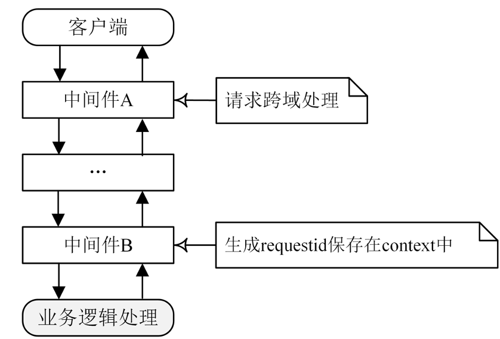
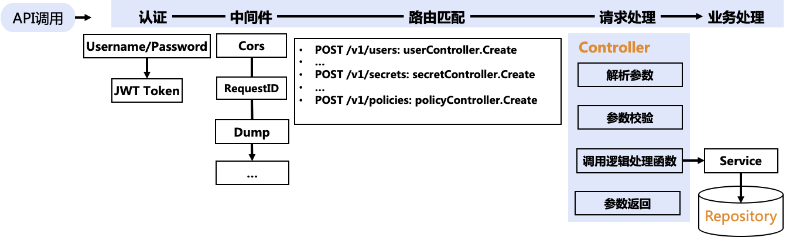
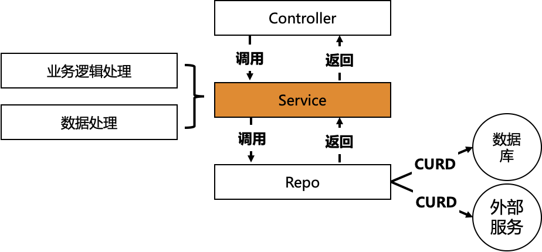
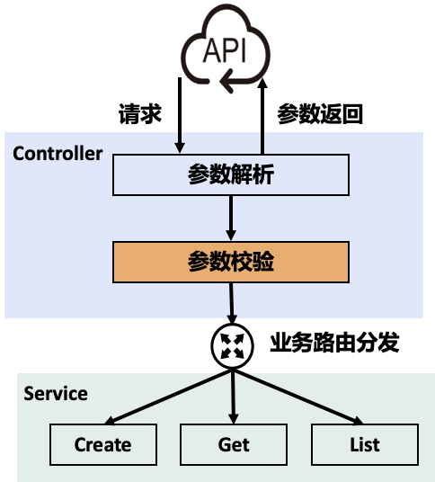

# Gin

## 简介

Gin 是 Go 语言写的一个 web 框架，它具有运行速度快，分组的路由器，良好的崩溃捕获和错误处理，非常好的支持中间件和 JSON。总之在 Go语言开发领域是一款值得好好研究的 Web 框架，[开源网址](https://github.com/gin-gonic/gin)。

Gin 核心的路由功能是通过一个定制版的 HttpRouter 来实现的，具有很高的路由性能，其主要功能包括：

- 支持 HTTP 方法：GET、POST、PUT、PATCH、DELETE、OPTIONS。
- 支持不同的 HTTP 参数：路径参数（path）、查询字符串参数（query）、表单参数（form）、HTTP 头参数（header）、消息体参数（body）。
- 支持 HTTP 路由和路由分组。
- 支持 middleware 和自定义 middleware。
- 支持自定义 Log。
- 支持 binding 和 validation，支持自定义 validator。可以 bind 如下参数：query、path、body、header、form。
- 支持重定向。
- 支持 basic auth middleware。
- 支持自定义 HTTP 配置。
- 支持优雅关闭。
- 支持 HTTP2。
- 支持设置和获取 cookie。

Installation: `go get -u github.com/gin-gonic/gin`

## 核心概念

在 Gin 的处理过程中，需要读取请求参数（消息体和 HTTP Header），经过业务处理后返回指定格式的消息。apiserver 也展示了如何进行参数的读取和返回，下面展示了如何读取和返回参数：

### HTTP Request 处理

**读取 HTTP 信息：** 在开发中需要读取的参数通常为：HTTP Header、路径参数、URL参数、消息体，读取这些参数可以直接使用 `Gin` 框架自带的函数：

- `Param()`：返回 URL 的参数值，例如

```go
 router.GET("/user/:id", func(c *gin.Context) {
     // a GET request to /user/john
     id := c.Param("id") // id == "john"
 })
```

- `Query()`：读取 URL 中的地址参数，例如

```go
   // GET /path?id=1234&name=Manu&value=
   c.Query("id") == "1234"
   c.Query("name") == "Manu"
   c.Query("value") == ""
   c.Query("wtf") == ""
```

- `DefaultQuery()`：类似 `Query()`，但是如果 key 不存在，会返回默认值，例如

```go
 //GET /?name=Manu&lastname=
 c.DefaultQuery("name", "unknown") == "Manu"
 c.DefaultQuery("id", "none") == "none"
 c.DefaultQuery("lastname", "none") == ""
```

- `Bind()`：检查 `Content-Type` 类型，将消息体作为指定的格式解析到 Go struct 变量中。通常采用的媒体类型是 JSON，所以 `Bind()` 是按 JSON 格式解析的。
- `GetHeader()`：获取 HTTP 头。

### HTTP Response 处理

**返回HTTP消息：** 因为要返回指定的格式，apiserver 封装了自己的返回函数，通过统一的返回函数 `SendResponse` 来格式化返回。

```go
func SendResponse(c *gin.Context, err error, data interface{}) {
    code, message := errno.DecodeErr(err)

    // always return http.StatusOK
    c.JSON(http.StatusOK, Response{
        Code:    code,
        Message: message,
        Data:    data,
    })
}
```

#### String()

返回的内容，可以是 String，也可以是 JSON

将 String 作为 Response 返回

#### JSON()

将 gin.H 结构体转化为 JSON 作为 Response 返回

### Context

context.Context 是 Go 中独特的涉及，可以用来用来设置截止日期、同步信号，传递请求相关值的结构体，与 Goroutine 有比较密切的关系。在 web 程序中，每个 Request 都需要开启一个 goroutine 做一些事情，这些 goroutine 又可能会开启其他的 goroutine 去访问后端资源：比如数据库、RPC 服务等。它们需要访问一些共享的资源，比如用户身份信息、认证token、请求截止时间等，这时候可以通过 Context 来跟踪这些 goroutine，并且通过 Context 来控制它们，这就是 Go 提供的 Context。

#### Context 定义

```go
type Context interface {
    Deadline() (deadline time.Time, ok bool)
    Done() <-chan struct{}
    Err() error
    Value(key interface{}) interface{}
}
```

1. Deadline方法：获取设置的截止时间。第一个返回值是截止时间，到了这个时间点，Context 会自动发起取消请求； 第二个返回值 ok==false 时表示没有设置截止时间，如果需要取消的话，需要调用取消函数进行取消。
2. Done方法：返回一个只读的 chan，类型为 struct{}。在 goroutine 中，如果该方法返回的 chan 可以读取，则意味着 parent context 已经发起了取消请求。通过 Done 方法收到这个信号后，就应该做清理操作，然后退出goroutine，释放资源。之后，Err 方法会返回一个错误，告知为什么 Context 被取消。
3. Err方法：返回取消的错误原因，因为什么 Context 被取消。
4. Value方法：获取该 Context 上绑定的值，是一个键值对，通过一个Key才可以获取对应的值，这个值一般是线程安全的。

#### 默认上下文

context 包中最常用的方法还是 context.Background()、context.TODO()，这两个方法都会返回预先初始化好的私有变量 background 和 todo， 它们会在同一个 Go 程序中被复用：

```go
func Background() Context {
 return background
}

func TODO() Context {
 return todo
}
```

这两个私有变量都是通过 new(emptyCtx) 语句初始化的，它们是指向私有结构体 context.emptyCtx 的指针。context.Background 是上下文的默认值，所有其他的上下文都应该从它衍生（Derived）出来。context.TODO 应该只在不确定应该使用哪种上下文时使用；在多数情况下，如果当前函数没有上下文作为入参，都会使用 context.Background 作为起始的上下文向下传递。

#### 使用原则

- 不要把 Context 放在结构体中，要以参数的方式传递，parent Context 一般为Background。
- 应该要把 Context 作为第一个参数传递给入口请求和出口请求链路上的每一个函数，放在第一位，变量名建议都统一，如 ctx。
- 给一个函数方法传递 Context 的时候，不要传递nil，否则在tarce追踪的时候，就会断了连接。
- Context 的 Value 相关方法应该传递必须的数据，不要什么数据都使用这个传递。
- Context 是线程安全的，可以放心的在多个 goroutine 中传递。
- 可以把一个 Context 对象传递给任意个数的 gorotuine，对它执行取消操作时，所有 goroutine 都会接收到取消信号。

### 路由

#### Group

可以分为多个 Route Group 分别对待

#### Embedded

还可以多级嵌套

#### Redirect

重定向

## Middleware

Go 的 `net/http` 设计的一大特点是特别容易构建中间件，Gin 框架也提供了类似的中间件。在中间件中，可以解析 HTTP 请求做一些逻辑处理，如：跨域处理或生成 X-Request-ID 并保存在 context 中，以便追踪某个请求。处理完之后，可以选择中断并返回这次请求，也可以选择将请求继续转交给下一个中间件处理。通过中间件，可以实现对所有请求都做统一的处理，提高开发效率，并使代码更简洁。但因为所有的请求都需要经过中间件的处理，可能会增加请求延时。对于如何使用中间件，建议如下：

- 中间件做成可加载的，通过配置文件指定程序启动时加载哪些中间件。
- 只将一些通用的、必要的功能做成中间件。
- 在编写中间件时，一定要保证中间件的代码质量和性能。



### 基本使用

在 gin 中，可以通过如下方法使用 middleware：

```go
g := gin.New()
g.Use(middleware.AuthMiddleware())
```

其中 `middleware.AuthMiddleware()` 是 `func(*gin.Context)` 类型的函数。中间件只对注册过的路由函数起作用。

#### Next()

在 middleware 代码中的该函数会先交由后续 middleware、handler 处理完后，再继续处理剩下的代码。

### 类型

在 gin 中可以设置 3 种类型的 middleware：

- 全局中间件：注册中间件的过程之前设置的路由，将不会受注册的中间件所影响。只有注册了中间件之后代码的路由函数规则，才会被中间件装饰。
- 单个路由中间件：需要在注册路由时注册中间件
  `r.GET("/benchmark", MyBenchLogger(), benchEndpoint)`
- 群组中间件：只要在群组路由上注册中间件函数即可。

Gin框架本身支持了一些中间件：

- gin.Logger()：Logger 中间件会将日志写到 gin.DefaultWriter，gin.DefaultWriter 默认为 os.Stdout。
- gin.Recovery()：Recovery 中间件可以从任何 panic 恢复，并且写入一个 500 状态码。
- gin.CustomRecovery(handle gin.RecoveryFunc)：类似Recovery 中间件，但是在恢复时还会调用传入的 handle 方法进行处理。
- gin.BasicAuth()：HTTP 请求基本认证，使用用户名和密码进行认证。

Gin 还支持自定义中间件。中间件其实是一个函数，函数类型为 `gin.HandlerFunc`，`HandlerFunc` 底层类型为 `func(*Context)`。

另外，还有很多开源的中间件可供选择，这些开源的中间件如：

| **中间件**        | **功能**                                                     |
| ----------------- | ------------------------------------------------------------ |
| gin-jwt           | JWT 中间件，实现JWT认证                                      |
| gin-swagger       | 自动生成 Swagger 2.0 格式的 RESTful API 文档                 |
| cors              | 实现 HTTP 请求跨域                                           |
| sessions          | 会话管理中间件                                               |
| authz             | 基于 Casbin 的授权中间件                                     |
| pprof             | gin  pprof 中间件                                            |
| go-gin-prometheus | Prometheus  metrics exporter                                 |
| gzip              | 支持 HTTP 请求和响应的gzip压缩                               |
| gin-limit         | HTTP 请求并发控制中间件                                      |
| requestid         | 给每个 Request 生成 uuid，并添加在返回的 X-Request-ID Header 中 |

## Lab

### Basics

- [HelloWorld](01_hello-world.go)

```shell
go run 01_hello-world.go
# 新建终端，并在新建的终端继续
curl http://127.0.0.1:8080
```

或者在同一个终端窗口中执行

```bash
go run 01_hello-world.go &
sleep 10
curl http://127.0.0.1:8080
```

- [Get with JSON response](10_get-json.go)

```shell
go run 10_get-json.go
# 新建终端，并在新建的终端继续
curl http://127.0.0.1:8080/pingHandler
```

或者在同一个终端窗口中执行

```bash
go run 10_get-json.go &
sleep 10
curl http://127.0.0.1:8080/pingHandler
```

- [Get with JSON response 2](11_get-json.go)

```shell
go run 11_get-json.go
# 新建终端，并在新建的终端继续
curl http://127.0.0.1:8080/ping
```

或者在同一个终端窗口中执行

```bash
go run 11_get-json.go &
sleep 10
curl http://127.0.0.1:8080/ping
```

- [Get with Parameter](13_get-param.go)

```shell
go run 13_get-param.go
# 新建终端，并在新建的终端继续
curl http://127.0.0.1:8080/users/xxx
```

或者在同一个终端窗口中执行

```bash
go run 13_get-param.go &
sleep 10
curl http://127.0.0.1:8080/users/xxx
```

- [Get with Path Parameter General](14_get-param.go)

```shell
go run 14_get-param.go
# 新建终端，并在新建的终端继续
curl http://127.0.0.1:8080/users/xxx/
curl http://127.0.0.1:8080/users/xxx/yyy/zzz
```

或者在同一个终端窗口中执行

```bash
go run 14_get-param.go &
sleep 10
curl http://127.0.0.1:8080/users/xxx/
curl http://127.0.0.1:8080/users/xxx/yyy/zzz
```

- [Get with Query](16_get-query.go)

```shell
go run 16_get-query.go
# 新建终端，并在新建的终端继续
curl http://127.0.0.1:8080/welcome
curl http://127.0.0.1:8080/welcome\?firstname\=中国
curl http://127.0.0.1:8080/welcome\?firstname\=中国\&lastname\=天朝
curl http://127.0.0.1:8080/welcome\?firstname\=\&lastname\=天朝
curl http://127.0.0.1:8080/welcome\?firstname\=%E4%B8%AD%E5%9B%BD
```

或者在同一个终端窗口中执行

```bash
go run 16_get-query.go &
sleep 10
curl http://127.0.0.1:8080/welcome
curl http://127.0.0.1:8080/welcome\?firstname\=中国
curl http://127.0.0.1:8080/welcome\?firstname\=中国\&lastname\=天朝
curl http://127.0.0.1:8080/welcome\?firstname\=\&lastname\=天朝
curl http://127.0.0.1:8080/welcome\?firstname\=%E4%B8%AD%E5%9B%BD
```

- [Post Body](21_post-form.go)

```shell
go run 21_post-form.go
# 新建终端，并在新建的终端继续
curl -X POST http://127.0.0.1:8080/form -H "Content-Type:application/x-www-form-urlencoded" -d "message=hello&nick=wukong"
```

或者在同一个终端窗口中执行

```bash
go run 21_post-form.go &
sleep 10
curl -X POST http://127.0.0.1:8080/form -H "Content-Type:application/x-www-form-urlencoded" -d "message=hello&nick=wukong"
```

- [Post File](23_post-file.go)

```shell
go run 23_post-file.go
# 新建终端，并在新建的终端继续
curl -X POST http://127.0.0.1:8080/upload \
  -F "file=@./23_post-file.go" \
  -H "Content-Type: multipart/form-data"
```

或者在同一个终端窗口中执行

```bash
go run 23_post-file.go &
sleep 10
curl -X POST http://127.0.0.1:8080/upload \
  -F "file=@./23_post-file.go" \
  -H "Content-Type: multipart/form-data"
```

- [Post File](24_post-multi-file.go)

```shell
go run 24_post-multi-file.go
# 新建终端，并在新建的终端继续
curl -X POST http://127.0.0.1:8080/upload \
  -F "file[]=@./23_post-file.go" \
  -F "file[]=@./24_post-multi-file.go" \
  -H "Content-Type: multipart/form-data"
```

或者在同一个终端窗口中执行

```bash
go run 24_post-multi-file.go &
sleep 10
curl -X POST http://127.0.0.1:8080/upload \
  -F "file[]=@./23_post-file.go" \
  -F "file[]=@./24_post-multi-file.go" \
  -H "Content-Type: multipart/form-data"
```

- [Post JSON](27_bind-json.go)

```shell
go run 27_bind-json.go
# 新建终端，并在新建的终端继续
curl -X POST http://127.0.0.1:8080/login \
  -H "Content-Type:application/json" \
  -d '{"username": "ruan", "passwd": "123", "age": 21}'
```

或者在同一个终端窗口中执行

```bash
go run 27_bind-json.go &
sleep 10
curl -X POST http://127.0.0.1:8080/login \
  -H "Content-Type:application/json" \
  -d '{"username": "ruan", "passwd": "123", "age": 21}'
```

> 注意引号的使用方式

- [Post JSON](28_bind-json.go)

```shell
go run 28_bind-json.go
curl -X POST http://127.0.0.1:8080/login \
  -H "Content-Type:application/json" \
  -d '{"username": "ruan", "passwd": "123", "age": 21}'
# 新建终端，并在新建的终端继续
```

或者在同一个终端窗口中执行

```bash
go run 28_bind-json.go &
sleep 10
curl -X POST http://127.0.0.1:8080/login \
  -H "Content-Type:application/json" \
  -d '{"username": "ruan", "passwd": "123", "age": 21}'
```

- [Redirect](31_redirect.go)

```shell
go run 31_redirect.go
# 新建终端，并在新建的终端继续
curl http://127.0.0.1:8080/redirect/google
```

或者在同一个终端窗口中执行

```bash
go run 31_redirect.go &
sleep 10
curl http://127.0.0.1:8080/redirect/google
```

- [Multiple Routes](35_route-multi.go)

```shell
go run 35_route-multi.go
# 新建终端，并在新建的终端继续
curl http://127.0.0.1:8080/v1/login
curl http://127.0.0.1:8080/v2/login
```

或者在同一个终端窗口中执行

```bash
go run 35_route-multi.go &
sleep 10
curl http://127.0.0.1:8080/v1/login
curl http://127.0.0.1:8080/v2/login
```

- [Embedded Routes](37_route-embedded.go)

```shell
go run 37_route-embedded.go
# 新建终端，并在新建的终端继续
curl http://127.0.0.1:8080/user/index
curl http://127.0.0.1:8080/user/login
curl http://127.0.0.1:8080/user/shop/index
```

或者在同一个终端窗口中执行

```bash
go run 37_route-embedded.go &
sleep 10
curl http://127.0.0.1:8080/user/index
curl http://127.0.0.1:8080/user/login
curl http://127.0.0.1:8080/user/shop/index
```

- [Middleware1](41_middleware.go)

/before 会通过 middleware1

/after 会同时通过 middleware1 和 middleware2

```shell
go run 41_middleware.go
# 新建终端，并在新建的终端继续
go run 41_middleware.go &
sleep 10
curl http://127.0.0.1:8080/before
```

或者在同一个终端窗口中执行

```bash
go run 41_middleware.go &
sleep 10
curl http://127.0.0.1:8080/before
curl http://127.0.0.1:8080/after
```

- [Middleware2](43_middleware.go)

/before 会只通过 middleware3

/after 会只通过 middleware4，所以会报错 request4 不存在

```shell
go run 43_middleware.go
# 新建终端，并在新建的终端继续
curl http://127.0.0.1:8080/before
curl http://127.0.0.1:8080/after
```

或者在同一个终端窗口中执行

```bash
go run 43_middleware.go &
sleep 10
curl http://127.0.0.1:8080/before
curl http://127.0.0.1:8080/after
```

- [Middleware with new Logger MW](45_middleware-logger.go)：自定义 logger middleware

Middleware c.next() 之前的代码会在调用前完成，之后的代码会在调用返回后完成。

```shell
go run 45_middleware-logger.go 
# 新建终端，并在新建的终端继续
sleep 10
curl http://127.0.0.1:8080/test
```

或者在同一个终端窗口中执行

```bash
go run 45_middleware-logger.go &
sleep 10
curl http://127.0.0.1:8080/test
```

### Middleware

生产环境可用的 middleware

#### Basic Auth

- [Middleware with Basic Auth](46_middleware-basic-auth.go)：使用现有 Basic Auth Middleware

Basic Auth 必须采用浏览器登录 `http://127.0.0.1:8080/auth`

```shell
go run 46_middleware-basic-auth.go
# 新建终端，并在新建的终端继续
curl http://127.0.0.1:8080/auth --user user:password
```

或者在同一个终端窗口中执行

```bash
go run 46_middleware-basic-auth.go &
sleep 10
curl http://127.0.0.1:8080/auth --user user:password
```

### Web Application

- [A Real Web Application with HTTP and HTTPS](80_app/80_bind-json.go)：通过 c.ShouldBindJSON 函数，将 Body 中的 JSON 格式数据解析到指定的 Struct 中，通过 c.JSON 函数返回 JSON 格式的数据。

主要做法是创建一个 struct，然后把 POST 的内容通过 c.ShouldBindJSON 添加到该 struct 的变量。
在给这个 struct 变量添加类似 Create()、Get() 等方法注册到 router 的 POST、GET 上。

```shell
go run 80_app/80_bind-json.go
# 新建终端，并在新建的终端继续
# 创建产品
curl -X POST -H"Content-Type: application/json" -d'{"username":"colin","name":"iphone12","category":"phone","price":8000,"description":"cannot afford"}' http://127.0.0.1:8080/v1/products
# {"username":"colin","name":"iphone12","category":"phone","price":8000,"description":"cannot afford","createdAt":"2021-06-20T11:17:03.818065988+08:00"}

# 获取产品信息
curl -X GET http://127.0.0.1:8080/v1/products/iphone12
# {"username":"colin","name":"iphone12","category":"phone","price":8000,"description":"cannot afford","createdAt":"2021-06-20T11:17:03.818065988+08:00"}
```

或者在同一个终端窗口中执行

```bash
go run 80_app/80_bind-json.go &
sleep 10
# 创建产品
curl -X POST -H"Content-Type: application/json" -d'{"username":"colin","name":"iphone12","category":"phone","price":8000,"description":"cannot afford"}' http://127.0.0.1:8080/v1/products
# {"username":"colin","name":"iphone12","category":"phone","price":8000,"description":"cannot afford","createdAt":"2021-06-20T11:17:03.818065988+08:00"}

# 获取产品信息
curl -X GET http://127.0.0.1:8080/v1/products/iphone12
# {"username":"colin","name":"iphone12","category":"phone","price":8000,"description":"cannot afford","createdAt":"2021-06-20T11:17:03.818065988+08:00"}
```

- [Middleware with Gin MW](80_app/82_bind-json-mw.go)：使用 Gin 现有的 middleware

```shell
go run 80_app/82_bind-json-mw.go
```

或者在同一个终端窗口中执行

```bash
go run 80_app/82_bind-json-mw.go &
sleep 5
```

### Advanced Topics

#### Cookie

Cookie 实际上就是服务器保存在浏览器上的一段信息。浏览器有了 Cookie 之后，每次向服务器发送请求时都会同时将该信息发送给服务器，服务器收到请求后，就可以根据该信息处理请求。Cookie 由服务器创建，并发送给浏览器，最终由浏览器保存。

- [Set and Get Cookie](90_advanced/19_cookie.go)

```shell
go run 90_advanced/19_cookie.go
# 新建终端，并在新建的终端继续
sleep 10
curl http://127.0.0.1:8080/login  # set the cookie for the browser
curl http://127.0.0.1:8080/home  # check the cookie value
```

或者在同一个终端窗口中执行

```bash
go run 90_advanced/19_cookie.go &
sleep 10
curl http://127.0.0.1:8080/login  # set the cookie for the browser
curl http://127.0.0.1:8080/home  # check the cookie value
```

#### Session

主要功能是：

- 简单的API：将其用作设置签名（以及可选的加密）cookie的简便方法。
- 内置的后端可将session存储在cookie或文件系统中。
- Flash消息：一直持续读取的session值。
- 切换session持久性（又称“记住我”）和设置其他属性的便捷方法。
- 旋转身份验证和加密密钥的机制。
- 每个请求有多个session，即使使用不同的后端也是如此。
- 自定义session后端的接口和基础结构：可以使用通用API检索并批量保存来自不同商店的session。

#### Async

- [Async](90_advanced/91_async.go)

```shell
go run 90_advanced/91_async.go
# 新建终端，并在新建的终端继续
curl http://127.0.0.1:8080/sync
curl http://127.0.0.1:8080/async
```

或者在同一个终端窗口中执行

```bash
go run 90_advanced/91_async.go &
sleep 10
curl http://127.0.0.1:8080/sync
curl http://127.0.0.1:8080/async
```

## apiserver 示例

我们的 apiserver 示例，基于之前的 App Option&Config，本例中需要添加上 Gin 的 HTTP 及 HTTPS 两个 web service。apiserver 实例是一个 Web Service，通过一个名为 apiserver 的进程，对外提供 RESTful API 接口，完成 User  REST 资源的增删改查。

### API 处理流程

apiserver 的 RESTFUL API请求处理流程如下：

- 通过 API 调用（<HTTP Method> + <HTTP Request Path>）请求 apiserver 提供的 RESTful API 接口。
- Gin 接收到 HTTP 请求后，会通过认证中间件完成请求的认证。
- 认证通过后，请求会被加载的一系列中间件所处理，例如跨域、RequestID、Dump等中间件。
- 根据 <HTTP Method> + <HTTP Request Path> 进行路由匹配。例如，我们请求的 RESTful API 是 POST + /v1/secrets，Gin 会根据 HTTP Method 和 HTTP Request Path，查找注册的 Controllers，最终匹配到secretController.Create Controller。在 Create Controller 中，会依次执行请求参数解析、请求参数校验、调用业务层的方法创建 Secret、处理业务层的返回结果，最后返回最终的 HTTP 请求结果。



### API 接口

User REST API 接口如下，其中 `DELETE /v1/users` 与 `PUT /v1/users/:name/change_password ` 接口暂不实现。

| **接口名称**                         | **接口功能** |
| ------------------------------------ | ------------ |
| POST /v1/users                       | 创建用户     |
| DELETE  /v1/users                    | 批量删除用户 |
| DELETE  /v1/users/:name              | 删除用户     |
| PUT  /v1/users/:name/change_password | 修改用户密码 |
| PUT  /v1/users/:name                 | 修改用户属性 |
| GET /v1/users/:name                  | 查询用户信息 |
| GET /v1/users                        | 查询用户列表 |

### Controller/Service/Repo

apiserver 代码架构分为：Models、Controller、Service、Repo，model 独立于其他，可供其他引用。


#### Models

model 在有些软件架构中也叫做实体层（Entities），model 会在每一层中使用，在这一层中存储对象的结构和它的方法。apiserver 中的 model 定义了 User、UserList、Secret、SecretList、Policy、PolicyList 模型及其方法。例如：

```go
type Secret struct {
  // May add TypeMeta in the future.
  // metav1.TypeMeta `json:",inline"`

  // Standard object's metadata.
  metav1.ObjectMeta `    json:"metadata,omitempty"`

  Username     string `json:"username"      gorm:"column:username" validate:"omitempty"`

  SecretID     string `json:"secretID"      gorm:"column:secretID" validate:"omitempty"`

  SecretKey     string `json:"secretKey"     gorm:"column:secretKey" validate:"omitempty"`

  // Required: true
  Expires   int64 `json:"expires"   gorm:"column:expires"   validate:"omitempty"`

  Description string `json:"description" gorm:"column:description" validate:"description"`
}
```

#### Repo

Repo 用来跟数据库/第三方服务进行 CURD 交互，作为应用程序的数据引擎进行应用数据的输入和输出。这里需要注意，Repo 仅对数据库/第三方服务执行CRUD操作，不封装任何业务逻辑。

Repo 也负责选择应用中将要使用什么样的数据库，可以是MySQL、MongoDB、MariaDB、Etcd等。无论使用哪种数据库，都要在这层决定。Repo 依赖于连接数据库或其他第三方服务（如果存在的话）。

这一层也会起到数据转换的作用：将从数据库/微服务中获取的数据转换为 Controller、Service 能识别的数据结构。

#### Service

Service 主要用来完成业务逻辑处理，可以把所有的业务逻辑处理代码放在 Service。Service 会处理来自控制层的请求，并根据需要请求仓库层完成数据的 CURD 操作。



#### Controller

Controller 接收 HTTP 请求，并进行参数解析、参数校验、逻辑分发处理、请求返回这些操作。Controller 会将逻辑分发给 Service，Service 处理后返回，返回数据在 Controller 中被整合再加工，最终返回给请求方。Controller 相当于实现了业务路由的功能。

controller 存放请求处理相关，service 存放具体的业务逻辑处理。如果是简单的业务可以放在 controller 中。因为这样，也仍然能够比较清晰的看到这个请求的处理流程。但是如果是比较复杂的业务，需要放在 service 中，因为如果放在 controller 中，请求参数的处理、校验还有业务逻辑混在一起，一个是不好维护，另一个是不好阅读。



例如 secret 生产，有以下操作：

- 解析 HTTP 请求参数。
- 调用 r.Validate() 进行参数验证，这里可以添加一些业务性质的参数校验，例如：secrets.TotalCount >= maxSecretCount。
- 生成密钥 ID 和密钥 Key 。
- 调用 Service s.srv 的 Create 方法，完成密钥的创建。
- 返回 HTTP 请求参数。

### 健康检查

通常我们会根据进程是否存在来判定 apiserver 是否健康，例如执行 `ps -ef | grep apiserver`。在实际开发中，会发现有时候服务进程仍然存在，但 HTTP 服务却不能接收和处理请求。所以更加靠谱的检查方法是，直接请求 apiserver 的健康检查接口。

在启动 apiserver 进程后，手动调用 apiserver 健康检查接口进行检查。但还有更方便的方法：启动服务后自动调用健康检查接口。这个方法的具体实现，可以查看 GenericAPIServer 提供的 ping 方法。在 ping 方法相关代码如下：

```go
url := fmt.Sprintf("http://%s/healthz", s.InsecureServingInfo.Address)
if strings.Contains(s.InsecureServingInfo.Address, "0.0.0.0") {
  url = fmt.Sprintf("http://127.0.0.1:%s/healthz", strings.Split(s.InsecureServingInfo.Address, ":")[1])
}
```

### Middleware 加载

apiserver 支持插件化地加载 Gin 中间件，通过这种插件机制，可以根据需要选择中间件。一方面，每个中间件都完成某种功能，这些功能不是所有情况下都需要的。另一方面，中间件是追加在 HTTP 请求链路上的一个处理函数，会影响 API 接口的性能。为了保证 API 接口的性能，也需要选择性地加载中间件。例如，在测试环境中为了方便 Debug，可以选择加载 dump 中间件。dump 中间件可以打印请求包和返回包信息，这些信息可以协助 Debug。但是在现网环境中，不需要 dump 中间件来协助 Debug，而且如果加载了 dump 中间件，请求时会打印大量的请求信息，严重影响 API 接口的性能。

apiserver 通过 InstallMiddlewares 函数来安装 Gin 中间件，函数代码如下：

```go
func (s *GenericAPIServer) InstallMiddlewares() {
  // necessary middlewares
  s.Use(middleware.RequestID())
  s.Use(middleware.Context())

  // install custom middlewares
  for _, m := range s.middlewares {
    mw, ok := middleware.Middlewares[m]
    if !ok {
      log.Warnf("can not find middleware: %s", m)
      continue
    }
    log.Infof("install middleware: %s", m)
    s.Use(mw)
  }
}
```

安装中间件时，不仅安装了一些必备的中间件，还安装了一些可配置的中间件。上述代码安装了两个默认的中间件 RequestID 和 Contex：

- RequestID 中间件主要用来在 HTTP 请求头和返回头中设置 X-Request-ID Header。如果 HTTP 请求头中没有 X-Request-ID HTTP 头，则创建 64 位的 UUID，如果有就复用。
- context中间件用来在 gin.Context 中设置 requestID 和 username 键，在打印日志时，将 gin.Context 类型的变量传递给 log.L() 函数，log.L() 函数会在日志输出中输出 requestID 和 username 域。

除了默认的中间件，apiserver 还支持一些可配置的中间件，可以通过配置 apiserver 配置文件中的 server.middlewares 配置项来配置。可配置以下中间件：

- recovery：捕获任何 panic，并恢复。
- secure：添加一些安全和资源访问相关的 HTTP 头。
- nocache：禁止客户端缓存 HTTP 请求的返回结果。
- cors：HTTP 请求跨域中间件。
- dump：打印出 HTTP 请求包和返回包的内容，方便 debug。注意，生产环境禁止加载该中间件。

### 统一元数据定义

apiserver 设计的一大亮点是像 k8s REST 资源一样，支持统一的资源元数据。apiserver 中所有的资源都是 REST 资源，apiserver 将 REST 资源的属性也进一步规范化了，这里的规范化是指所有的 REST 资源均支持两种属性：

- 公共属性。
- 资源自有的属性。

例如，Secret 资源的定义方式如下：

```go
type Secret struct {
    // May add TypeMeta in the future.
    // metav1.TypeMeta `json:",inline"`

    // Standard object's metadata.
    metav1.ObjectMeta `       json:"metadata,omitempty"`
    Username          string `json:"username"           gorm:"column:username"  validate:"omitempty"`
    SecretID          string `json:"secretID"           gorm:"column:secretID"  validate:"omitempty"`
    SecretKey         string `json:"secretKey"          gorm:"column:secretKey" validate:"omitempty"`

    // Required: true
    Expires     int64  `json:"expires"     gorm:"column:expires"     validate:"omitempty"`
    Description string `json:"description" gorm:"column:description" validate:"description"`
}
```

资源自有的属性，会因资源不同而不同。这里，我们来重点看一下公共属性 ObjectMeta，它的定义如下：

```go
type ObjectMeta struct {
    ID uint64 `json:"id,omitempty" gorm:"primary_key;AUTO_INCREMENT;column:id"`
    InstanceID string `json:"instanceID,omitempty" gorm:"unique;column:instanceID;type:varchar(32);not null"`
    Name string `json:"name,omitempty" gorm:"column:name;type:varchar(64);not null" validate:"name"`
    Extend Extend `json:"extend,omitempty" gorm:"-" validate:"omitempty"`
    ExtendShadow string `json:"-" gorm:"column:extendShadow" validate:"omitempty"`
    CreatedAt time.Time `json:"createdAt,omitempty" gorm:"column:createdAt"`
    UpdatedAt time.Time `json:"updatedAt,omitempty" gorm:"column:updatedAt"`
}
```

### 统一返回

要想返回一个固定格式的消息，最好的方式就是使用同一个返回函数。因为 API 接口都是通过同一个函数来返回的，其返回格式自然是统一的。apiserver 使用 WriteResponse函数来返回结果，WriteResponse 函数定义如下：

```go
func WriteResponse(c *gin.Context, err error, data interface{}) {
    if err != nil {
        log.Errorf("%#+v", err)
        coder := errors.ParseCoder(err)
        c.JSON(coder.HTTPStatus(), ErrResponse{
            Code:      coder.Code(),
            Message:   coder.String(),
            Reference: coder.Reference(),
        })

        return
    }

    c.JSON(http.StatusOK, data)
}
```

可以看到，WriteResponse 函数会判断 err 是否为 nil。如果不为 nil，则将 err 解析为 errors 包中定义的 Coder 类型的错误，并调用 Coder 接口提供的 Code()、String()、Reference() 方法，获取该错误的业务码、对外展示的错误信息和排障文档。如果 err 为 nil，则调用 c.JSON 返回 JSON 格式的数据。

### 操作

#### HTTP 操作

- Run：

```shell
go run cmd/apiserver.go -c configs/config.yaml
```

- create：

```shell
curl -X POST -H "Content-Type: application/json" \
-d '{"metadata":{"name":"user99", "password":"admin"},"description":"admin user"}' \
http://127.0.0.1:8080/v1/users
```

- list：

```shell
curl -X GET http://127.0.0.1:8080/v1/users
```

- get：

```shell
curl -X GET http://127.0.0.1:8080/v1/users/user99
```

- update：

```shell
curl -X PUT -H "Content-Type: application/json" \
-d '{"metadata":{"name":"user99"},"nickname":"xxx"}' \
http://127.0.0.1:8080/v1/users/user99
```

- delete：

```shell
curl -X DELETE http://127.0.0.1:8080/v1/users/user99
```

- 一次性测试所有命令

```bash
go run cmd/apiserver.go -c configs/config.yaml &
sleep 15
#create
curl -X POST -H "Content-Type: application/json" \
-d '{"metadata":{"name":"user99", "password":"admin"},"description":"admin user"}' \
http://127.0.0.1:8080/v1/users
# list
curl -X GET http://127.0.0.1:8080/v1/users
# get
curl -X GET http://127.0.0.1:8080/v1/users/user99
# update
curl -X PUT -H "Content-Type: application/json" \
-d '{"metadata":{"name":"user99"},"nickname":"xxx"}' \
http://127.0.0.1:8080/v1/users/user99
# delete
curl -X DELETE http://127.0.0.1:8080/v1/users/user99
```

> 执行完后使用`kill -9 $!`结束后台任务

#### HTTPS 操作

与 insecure server 唯一不同之处在于，curl 命令需要加上 --insecure flag

```shell
curl --insecure -X GET https://127.0.0.1:8443/v1/users
```

一次性测试所有命令

```bash
cat configs/config.yaml | sed "s#{{CERT-FILE}}#$(pwd)/configs/cert/server.pem#g" | sed "s#{{PRIVATE-KEY-FILE}}#$(pwd)/configs/cert/server.key#g"  > configs/config-out.yaml
go run cmd/apiserver.go -c configs/config-out.yaml
sleep 15
#create
curl --insecure -X POST -H "Content-Type: application/json" \
-d '{"metadata":{"name":"user99", "password":"admin"},"description":"admin user"}' \
http://127.0.0.1:8080/v1/users
# list
curl --insecure -X GET http://127.0.0.1:8080/v1/users
# get
curl --insecure -X GET http://127.0.0.1:8080/v1/users/user99
# update
curl --insecure -X PUT -H "Content-Type: application/json" \
-d '{"metadata":{"name":"user99"},"nickname":"xxx"}' \
http://127.0.0.1:8080/v1/users/user99
# delete
curl --insecure -X DELETE http://127.0.0.1:8080/v1/users/user99
```

> 执行完后使用`kill -9 $!`结束后台任务

### Question

根据代码，请描述当前应用中，如何实现多接口同时运行，采用了什么机制？并且给出代码予以说明。

## Ref

1. [Golang 微框架 Gin 简介](https://www.jianshu.com/p/a31e4ee25305)
