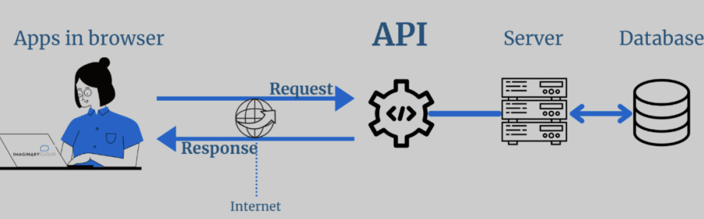
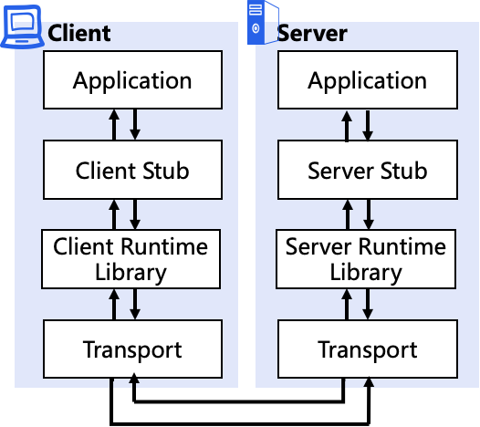
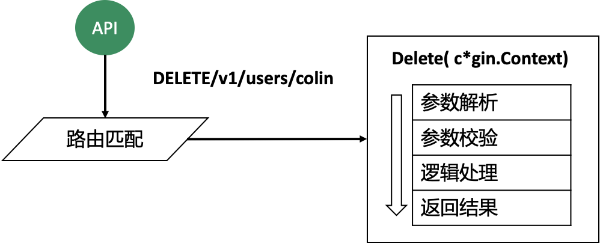

# Web 框架

## API 简介

API（Application Programming Interface）是一些预先定义的函数或者接口，目的是提供应用程序与开发人员基于某软件或硬件得以访问一组例程的能力，而又无须访问源码，或理解内部工作机制的细节。这些接口充当软件中介，为应用程序之间的交互和对话建立特定的定义和规则。API 负责将响应从用户传递到系统，然后从系统返回给用户。

假设我们正在预订一个酒店。我们在电脑上访问酒店预订页面，连接到互联网的这个页面会将数据（我们的请求）发送到服务器。然后，服务器检索数据、解析它，一旦所需的操作得到执行，它就会向我们发送一个响应，并在我们的界面上提供信息。这个过程需要 API 才能实现。API 指定了一个应用程序（网页或移动应用）可以向另一个应用程序发出的请求类型，并进一步确定：如何发出这些请求、使用哪些数据格式、以及用户必须遵循的实践。



要实现一个 API 服务器，首先要考虑两个方面：API 风格和媒体类型。Go 语言中常用的 API 风格是 RPC 和  REST，常用的媒体类型是 JSON、XML 和 Protobuf。在 Go API 开发中常用的组合是 gRPC + Protobuf 和 REST + JSON。

### REST

REST （REpresentational State Transfer）是由 Roy Fielding 在他的论文《Architectural Styles and the Design of Network-based Software  Architectures》里提出。REST 是一种软件架构风格，不是技术框架，REST 有一系列规范，满足这些规范的 API 均可称为 RESTful API。

REST 规范把所有内容都视为资源，也就是说网络上一切皆资源。REST 对资源的操作包括获取、创建、修改和删除，这些操作正好对应 HTTP 提供的 GET、POST、PUT 和 DELETE 方法。由于 REST 天生和 HTTP 相辅相成，因此 HTTP 协议已经成了实现 RESTful  API 事实上的标准。REST 风格虽然适用于很多传输协议，但在实际开发中，REST 由于天生和 HTTP 协议相辅相成，因此 HTTP 协议已经成了实现  RESTful API 事实上的标准。在 HTTP 协议中通过 POST、DELETE、PUT、GET 方法来对应 REST  资源的增、删、改、查操作，具体的对应关系如下：

|        | Collection资源（/users）                                   | Member资源(/users/:username) |
| ------ | ---------------------------------------------------------- | ---------------------------- |
| GET    | 获取一个Collection下所有Member的信息                       | 获取一个Member的状态表征     |
| PUT    | 用另外一个Collection替换这个Collection。不常用，不建议使用 | 更新一个Member的状态表征     |
| POST   | 在Collection中新建一个Member                               | 没有这类操作                 |
| DELETE | 删除整个Collection，可以用来批量删除资源                   | 删除这个Member               |

例如 User REST：

| HTTP 方法 | 行为                     | URI          | 示例说明                  |
| --------- | ------------------------ | ------------ | ------------------------- |
| GET       | 获取资源列表             | /users       | 获取用户列表              |
| GET       | 获取一个具体的资源       | /users/admin | 获取 admin 用户的详细信息 |
| POST      | 创建一个新的资源         | /users       | 创建一个新用户            |
| PUT       | 以整体的方式更新一个资源 | /users/1     | 更新 id 为 1 的用户       |
| DELETE    | 删除服务器上的一个资源   | /users/1     | 删除 id 为 1 的用户       |

REST 风格的 API 具有一些天然的优势，例如通过 HTTP 协议降低了客户端的耦合，具有极好的开放性。因此越来越多的开发者使用 REST 这种风格设计 API，REST 规范中有如下几个核心：

- 以资源（resource）为中心：所有的东西都抽象成资源，所有的行为都应该是在资源上的 CRUD 操作。资源对应着面向对象里的对象，资源使用 URI 标识，每个资源实例都有一个唯一的 URI 标识。如有一个用户，用户名是 admin，那么它的 URI 标识就可以是 /users/admin。
- 资源是有状态的：使用 JSON/XML 等在 HTTP Body 里表征资源的状态。
- 使用标准的方法来更改资源的状态：客户端通过四个 HTTP 动词对服务器端资源进行操作，实现“表现层状态转化”。
- 无状态：这里的无状态是指每个 RESTful API 请求都包含了所有足够完成本次操作的信息，服务器端无须保持 session 信息。无状态对于服务端的弹性扩容是很重要的。

### RPC

RPC（Remote Procedure Call）是一个计算机通信协议，该协议允许运行于一台计算机的程序调用另一台计算机的子程序，而程序员无须额外地为这个交互作用编程。通俗来讲，就是服务端实现了一个函数，客户端使用 RPC 框架提供的接口，调用这个函数的实现，并获取返回值。RPC 屏蔽了底层的网络通信细节，使得开发人员无须关注网络编程的细节，而将更多的时间和精力放在业务逻辑本身的实现上，从而提高开发效率。在 Go 中如果对性能要求比较高，并且需要提供给多种编程语言调用时，就可以考虑使用 RPC API 接口，RPC 在 Go 中用得也非常多。

RPC（Remote Procedure  Call）是一种通信协议，该协议允许运行于一台计算机的程序调用另一台计算机的子程序，而程序员不用额外地为这个交互作用编程。通俗来讲，就是服务端实现了一个函数，客户端使用 RPC 框架提供的接口像调用本地函数一样调用这个函数，并获取返回值。RPC 屏蔽了底层的网络通信细节，使得开发人员无需关注网络编程的细节，可以将更多的时间和精力放在业务逻辑本身的实现上，从而提高开发效率。

RPC 的调用过程如下：



1. Client 通过本地调用，调用 Client Stub
2. Client Stub 将参数打包（也叫 Marshalling）成一个消息，然后发送这个消息
3. Client 所在的 OS 将消息发送给 Server
4. Server 端接收到消息后，将消息传递给 Server Stub
5. Server Stub 将消息解包（Unmarshalling）得到参数
6. Server Stub 调用服务端的子程序（函数）处理完后，将最终结果按照相反的步骤返回给 Client

Client 端一般叫 Stub，Server 端一般叫 Skeleton。Stub 负责调用参数和返回值的流化（serialization）、参数的打包和解包，以及网络层的通信。

### REST vs RPC

在做 API 服务器开发时，都会遇到这个问题：选择 REST 还是 RPC。

RPC 相比 REST 的优点主要有 3 点：

1. RPC+Protobuf 采用的是 TCP 做传输协议，REST 直接使用 HTTP 做应用层协议，这种区别导致 REST 在调用性能上会比 RPC+Protobuf 低。
2. RPC 不像 REST 那样，每一个操作都要抽象成对资源的增删改查，在实际开发中，有很多操作很难抽象成资源，比如登录操作。所以在实际开发中并不能严格按照 REST 规范来写 API，RPC 就不存在这个问题。
3. RPC 屏蔽网络细节、易用，和本地调用类似。

> 这里的易用指的是调用方式上的易用性。在做 RPC 开发时，开发过程很烦琐，需要先写一个 DSL 描述文件，然后用代码生成器生成各种语言代码，当描述文件有更改时，必须重新定义和编译，维护性差。

但是 REST 相较 RPC 也有很多优势：

1. 轻量级、简单易用，维护性和扩展性都比较好。

2. REST 相对更规范、更标准、更通用，无论哪种语言都支持 HTTP 协议，可以对接外部很多系统，只要满足 HTTP 调用即可，更适合对外。RPC 会有语言限制，不同语言的 RPC 调用起来很麻烦。

3. JSON 格式可读性更强，开发调试都很方便。

4. 在开发过程中，如果严格按照 REST 规范来写 API，API 看起来更清晰，更容易被理解。

   > 在实际开发中，严格按照 REST 规范来写很难，只能尽可能 RESTful 化。

更多的时候，REST 和 gRPC 是一种合作的关系，内部系统之间使用 gRPC，对外使用 REST。因为内部系统之间可能调用很频繁，需要 RPC 的高性能支撑。对外用 REST 更易理解，更通用些。当然以现有的服务器性能，如果两个系统间调用不是特别频繁，对性能要求不是非常高，REST 的性能完全可以满足。总体来说，REST 因为规范、易理解、易用，所以适合用在需要对外提供 API 接口的场景中。而 RPC 因为性能比较高、调用方便，更适合用在内部业务中。


### 媒体类型选择

媒体类型是独立于平台的类型，设计用于分布式系统间的通信，媒体类型用于传递信息，一个正式的规范定义了这些信息应该如何表示。HTTP 的 REST 能够提供多种不同的响应形式，常见的是 XML 和 JSON。JSON 无论从形式上还是使用方法上都更简单。相比 XML，JSON 的内容更加紧凑，数据展现形式直观易懂，开发测试都非常方便，所以在媒体类型选择上，选择了 JSON 格式，这也是很多大公司所采用的格式。

## REST规范

REST 是一种规范，而 RESTful API 则是满足这种规范的 API 接口，其设计原则包括：

### 域名

API 的域名设置主要有两种方式，如：

- `https://rebirthmonkey.com/api`：这种方式适合 API 将来不会有进一步扩展的情况，比如 rebirthmonkey.com 域名下只会有一套 API。
- `https://iam.api.rebirthmonkey.com`：如果 rebirthmonkey.com 域名下会持续新增其他 API，这时最好的方式是每个系统的 API 拥有专有的 API 域名，如 `storage.api.rebirthmonkey.com`，`network.api.rebirthmonkey.com` 等。

### API 版本管理

随着时间的推移、需求的变更，一个 API 往往满足不了现有的需求，这时需要对 API 进行修改。对 API 进行修改时，不能影响其他调用系统的正常使用，这就要求 API 变更做到向下兼容，也就是新老版本共存。但在实际场景中，很可能会出现同一个 API 无法向下兼容的情况。这时候最好的解决办法是从一开始就引入 API 版本机制，当不能向下兼容时，就引入一个新的版本，老的版本则保留原样。这样既能保证服务的可用性和安全性，同时也能满足新需求。

API  版本有 3 中不同的标识方法：

- URL 中：如 `/v1/users`。
- HTTP Header 中：如 `Accept: vnd.example-com.foo+json; version=1.0`。
- Query 参数中：如 `/users?version=v1`。

推荐使用第一种，在 URL 中的 `/v1/users`，这种的好处是很直观，如 GitHub、Kubernetes、Etcd 等均采用这种方式。

### API 命名

API 通常的命名方式有 3 种：

- 驼峰命名法（serverAddress）
- 蛇形命名法（server_address）
- 脊柱命名法（server-address）

驼峰命名法和蛇形命名法都需要切换输入法，会增加操作的复杂性，也容易出错，所以建议用脊柱命名法。GitHub API 用的就是脊柱命名法，例如 selected-actions。

### URI 设计

资源都使用 URI 标识，需要按照一定的规范来设计 URI，通过规范化 URI 可以使 API 接口更加易读、易用。URI 设计时应该遵循以下规范：【1】

- 资源名使用名词而不是动词，并用名词复数表示：资源分为 Collection 和 Member 两种

  - Collection：一组资源的集合，如系统里有很多用户（User）, 这些用户的集合就是 Collection。Collection 的 URI 标识应该是“域名/资源名复数”，如 `https://iam.api.rebirthmonkey.com/users`。
  - Member：单个特定资源，如系统中特定名字的用户，也就是 Collection 中的一个 Member。Member 的 URI 标识应该是 “域名/资源名复数/资源名称”，如 `https:// iam.api.rebirthmonkey/users/admin`。
- URI 命名：
  - URI 结尾不应包含 `/`。
  - URI 中不能出现下划线 `_`，**必须用中杠线 - 代替**。
  - URI 路径用小写，不要用大写。
- URI 层级避免过深：超过 2 层的资源嵌套会很乱，建议将其他资源转化为“?参数：，如：

```text
/schools/tsinghua/classes/rooma/students/zhang # 不推荐
/students?school=qinghua&class=rooma # 推荐
```

- 在实际的 API 开发中，可能会发现有些操作不能很好地映射为一个 REST 资源，这时可以参考以下做法：
  - 将操作变成资源的属性：如想在系统中禁用某个用户，可以这么设计 URI：`/users/zhangsan?active=false`。
  - 将操作当作资源的嵌套资源：如一个 GitHub 的加星操作：加星 `PUT /gists/:id/star` 和去星 `DELETE /gists/:id/star`

### 资源操作映射

将 REST 资源操作映射为 HTTP 方法，基本上 REST 都是使用 HTTP 协议原生的 GET、PUT、POST、DELETE 来标识对资源的 CRUD 操作的，形成的规范如下：

| HTTP方法 | **行为**                 | **URI**      | **示例说明**              |
| -------- | ------------------------ | ------------ | ------------------------- |
| GET      | 获取资源列表             | /users       | 获取用户列表              |
| GET      | 获取一个具体的资源       | /users/admin | 获取 admin 用户的详细信息 |
| POST     | 创建一个新的资源         | /users       | 创建一个新用户            |
| PUT      | 以整体的方式更新一个资源 | /users/admin | 更新 user 为 admin 的用户 |
| DELETE   | 删除服务器上的一个资源   | /users/admin | 删除 user 为 admin 的用户 |

在使用 HTTP 时，有以下 2 点需要注意：

- GET 返回的结果，要尽量可用于 PUT、POST 操作中：如用 GET 方法获得了一个 user 的信息，调用者修改 user 的信息，然后将此结果再用 PUT 方法更新。这要求 GET、PUT、POST 操作的资源属性是一致的。
- 如果对资源进行状态/属性变更，要用 PUT 方法，POST 方法仅用来创建或批量删除这两种场景。
- 批量删除：需要在请求中携带多个需要删除的资源名，但 DELETE 方法不能携带多个资源名，这时可以通过下面三种方式来解决（推荐第 2 种）：
  - 发起多个 DELETE 请求。
  - 操作路径中带多个 id，id 之间用分隔符分隔，如 `DELETE /users?ids=1,2,3`。
  - 直接使用 POST 方式来批量删除，body 中传入需要删除的资源列表。

### 统一返回格式

一个系统的 REST 会向外界开放多个资源的接口，每个接口的返回格式要保持一致。另外，每个接口都会返回成功和失败两种消息，这两种消息的格式也要保持一致。不然，客户端要适配不同接口的返回格式，每个返回格式又要适配成功和失败两种消息格式。返回的格式没有强制的标准，可以根据实际的业务需要返回不同的格式。

### 分页/过滤/排序/搜索

REST 资源的查询接口，通常都需要实现分页、过滤、排序、搜索功能，因为这些功能是每个 REST 资源都能用到的，所以可以实现为一个公共的 API 组件。

- 过滤：如果用户不需要一个资源的全部状态属性，可以在 URI 参数里指定返回哪些属性，如 `/users?fields=email,username,address`。
- 分页：在列出一个 Collection 下所有的 Member 时，应该提供分页功能，如 `/users?offset=0&limit=20`（offset 指定返回记录的开始位置，limit 指定返回记录的数量）。引入分页功能可以减少 API 响应的延时，同时可以避免返回太多条目，导致响应特别慢，甚至导致 crash 情况。
- 排序：用户很多时候会根据创建时间或其他因素列出一个 Collection 中前 100 个 Member，这时可以在 URI 参数中指明排序参数，如 `/users?sort=age,`desc`。
- 搜索：当一个资源的 Member 太多时，可能想通过搜索快速找到所需要的 Member，或想搜有没有名字为 xxx 的某类资源，这时就需要提供搜索功能，搜索建议按模糊匹配来搜索。

## Web 框架

### 简介

一个 Web  程序的编写往往要涉及更多的方面，目前各种各样的中间件能够完成一些任务。但许多时候，我们总是希望他人帮我们完成更多的事情，于是就产生了许多的 Web 框架。根据架构的不同，这些框架大致可分为两大类：

- 微架构型框架：其核心框架只提供很少的功能，而更多的功能则需要组合各种中间件来提供，因此这种框架也可称为混搭型框架。它相当灵活，但相对来说需要使用者在组合使用各种中间件时花费更大的力气。像 [Echo](https://github.com/labstack/echo)、[Goji](https://github.com/goji/goji)、[Gin](https://github.com/gin-gonic/gin) 等都属于微架构型框架。
- 全能型架构：它基本上提供了编写 Web 应用时需要的所有功能，因此更加重型，多数使用 MVC 架构模式设计。在使用这类框架时感觉更轻省，但其做事风格一般不同于 Go 语言惯用的风格，也较难弄明白这些框架是如何工作的。像 [Beego](http://beego.me/)、[Revel](http://revel.github.io/) 等就属于全能型架构。

对于究竟该选择微架构还是全能型架构，仍有较多的争议。像 [The Case for Go Web Frameworks](https://medium.com/@richardeng/the-case-for-go-web-frameworks-a791fcd79d47#.7qe9n08aw) 一文就力挺全能型架构，并且其副标题就是“Idiomatic Go is not a religion”，但该文也收到了较多的反对意见。总体上来说，Go 语言社区已越来越偏向使用微架构型框架，当将来 `context` 包进入标准库后，`http.Handler` 本身就定义了较完善的中间件编写规范，这种使用微架构的趋势可能更加明显，并且各种微架构的实现方式有望进一步走向统一，这样其实 `http` 包就是一个具有庞大生态系统的微架构框架。

#### 参数类型

HTTP 具有以下 5 种参数类型：

- 路径参数（path）：例如 `gin.Default().GET("/user/:name", nil)`， name 就是路径参数。
- 查询字符串参数（query）：例如 `/welcome?firstname=Wukong&lastname=Sun`，firstname 和 lastname 就是查询字符串参数。
- 表单参数（form）：例如 `curl -X POST -F 'username=colin' -F  'password=colin1234' http://rebirthmonkey.com/login`，username 和 password 就是表单参数。
- HTTP 头参数（header）：例如 `curl -X POST -H 'Content-Type:  application/json' -d '{"username":"colin","password":"colin1234"}'  http://mydomain.com/login`，Content-Type 就是 HTTP 头参数。
- 消息体参数（body）：例如 `curl -X POST -H 'Content-Type: application/json' -d  '{"username":"colin","password":"colin1234"}'  http://mydomain.com/login`，username 和 password 就是消息体参数。

#### 核心功能


- 路由匹配：Web 服务最核心的功能是路由匹配，其实就是根据（HTTP方法、请求路径）匹配到处理这个请求的函数，最终由该函数处理这次请求，并返回结果。一次 HTTP 请求经过路由匹配，最终将请求交由 Delete(c *gin.Context) 函数来处理。变量 c 中存放了这次请求的参数，在 Delete 函数中，可以进行参数解析、参数校验、逻辑处理，最终返回结果。



- 路由分组：对于大型系统，可能会有很多个 API 接口，API 接口随着需求的更新迭代，可能会有多个版本，为了便于管理，需要对路由进行分组。
- 一进程多服务：有时候，需要在一个服务进程中，同时开启 HTTP 服务的 80 端口和 HTTPS 的 443 端口，这样就可以做到：对内的服务，访问 80 端口，简化服务访问复杂度；对外的服务，访问更为安全的 HTTPS 服务。显然，我们没必要为相同功能启动多个服务进程，所以这时候就需要 Web 服务能够支持一进程多服务的功能。
- 业务处理：开发 Web 服务最核心的诉求是：输入一些参数，校验通过后，进行业务逻辑处理，然后返回结果。所以 Web 服务还应该能够进行参数解析、参数校验、逻辑处理、返回结果。
- 中间件：在进行 HTTP 请求时，经常需要针对每一次请求都设置一些通用的操作，比如添加 Header、添加 RequestID、统计请求次数等，这就要求 Web 服务能够支持中间件特性。
- 认证：为了保证系统安全，对于每一个请求都需要进行认证。Web 服务中，通常有两种认证方式，一种是基于用户名和密码，一种是基于 Token。
- RequestID：为了方便定位和跟踪某一次请求，需要支持 RequestID，定位和跟踪 RequestID 主要是为了排障。
- 跨域：当前的软件架构很多采用了前后端分离的架构。在前后端分离的架构中，前端访问地址和后端访问地址往往是不同的，浏览器为了安全，会针对这种情况设置跨域请求，所以 Web 服务需要能够处理浏览器的跨域请求。

### net/http 框架

- [net/http](10_net-http/README.md)

### Gin 框架

- [Gin](20_gin/README.md)

### gRPC 框架

- [gRPC](30_grpc/README.md)：gRPC (Google Remote Procedure Call) 是基于 RCP 架构的变体。该技术遵循一个使用 HTTP 2.0 协议的 RPC API 实现，但 HTTP 不会呈现给 API 开发人员或服务器。因此，开发人员无需担心 RPC 概念如何映射到 HTTP，从而降低了复杂性。

## Ref

1. [GitHub 标准 RESTful API](https://docs.github.com/en/rest)
