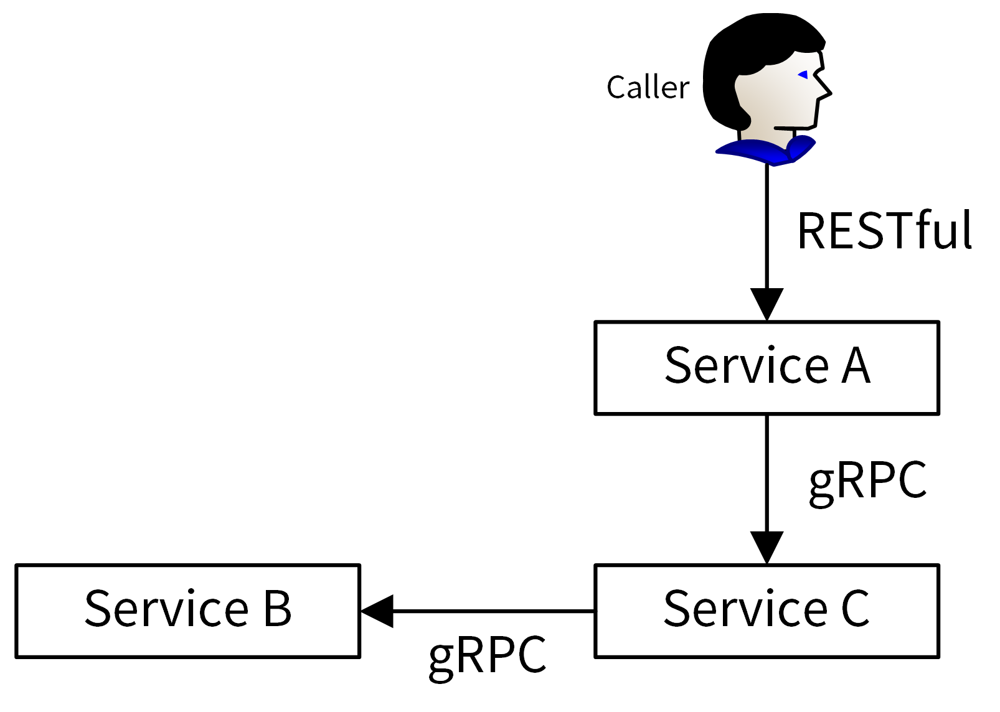

# API 接口规范

## 简介

一个好的 API 设计需要满足两个主要的目的：

- **平台独立性**。任何客户端都能消费 API，而不需要关注系统内部实现。API 应该使用标准的协议和消息格式对外部提供服务。传输协议和传输格式不应该侵入到业务逻辑中，也就是系统应该具备随时支持不同传输协议和消息格式的能力。
- **系统可靠性。**在 API 已经被发布和非 API 版本改变的情况下，API 应该对契约负责，不应该导致数据格式发生破坏性的修改。在 API 需要重大更新时，使用版本升级的方式修改，并对旧版本预留下线时间窗口。

### RESTful

RESTful 风格的 API 具有一些天然的优势，例如通过 HTTP 协议降低了客户端的耦合，具有极好的开放性。因此越来越多的开发者使用 RESTful  这种风格设计 API，但是 RESTful 只能算是一个设计思想或理念，不是一个 API 规范，没有一些具体的约束条件。


接口文档又称为 API 文档，一般由后台开发人员编写，用来描述组件提供的 API 接口，以及如何调用这些 API 接口。

- 在项目初期，接口文档可以解耦前后端，让前后端并行开发：前端只需要按照接口文档实现调用逻辑，后端只需要按照接口文档提供功能。当前后端都开发完成之后，就可以直接进行联调，提高开发效率。
- 在项目后期，接口文档可以提供给使用者，不仅可以降低组件的使用门槛，还能够减少沟通成本。

## 接口规范

API 接口应严格遵循 REST 标准进行设计，采用 JSON 格式进行数据传输，使用 JWT Token 进行 API 认证。

### 请求

#### 请求方法

本 API 接口文档中请求方法格式为：`HTTP方法 请求路径`，例如请求方法为：`GET /v1/users`，请求地址为：`xxx.io`，请求协议为：`HTTP`，则实际的请求格式为：`curl -XGET http://xxx.io/v1/users`

#### 认证

如采用 JWT Token 进行认证，具体操作步骤如下：

1. 获取系统创建的 secretKey 和 secretID
2. 通过 secretKey 和 secretID 生成 JWT Token，以下是一个可以生成 JWT Token 的 Go 源码（main.go）：

```go
package main

import (
	"fmt"
	"os"
	"time"

	"github.com/dgrijalva/jwt-go"
	"github.com/spf13/pflag"
)

var (
	cliAlgorithm = pflag.StringP("algorithm", "", "HS256", "Signing algorithm - possible values are HS256, HS384, HS512")
	cliTimeout   = pflag.DurationP("timeout", "", 2*time.Hour, "JWT token expires time")
	help         = pflag.BoolP("help", "h", false, "Print this help message")
)

func main() {
	pflag.Usage = func() {
		fmt.Println(`Usage: gentoken [OPTIONS] SECRETID SECRETKEY`)
		pflag.PrintDefaults()
	}
	pflag.Parse()

	if *help {
		pflag.Usage()
		return
	}

	if pflag.NArg() != 2 {
		pflag.Usage()
		os.Exit(1)
	}

	token, err := createJWTToken(*cliAlgorithm, *cliTimeout, os.Args[1], os.Args[2])
	if err != nil {
		fmt.Printf("Error: %s\n", err.Error())
		return
	}

	fmt.Println(token)
}

func createJWTToken(algorithm string, timeout time.Duration, secretID, secretKey string) (string, error) {
	expire := time.Now().Add(timeout)

	token := jwt.NewWithClaims(jwt.GetSigningMethod("HS256"), jwt.MapClaims{
		"kid": secretID,
		"exp": expire.Unix(),
		"iat": time.Now().Unix(),
	})

	return token.SignedString([]byte(secretKey))
}
```

在命令行执行如下命令，即可生成 JWT Token：

```bash
$  go run main.go <secretID> <secretKey>
```

默认会生成 HS256 算法签名、2 小时后过期的 Token。可以通过 `--algorithm` 指定签名算法，通过 `--timeout` 指定 token 过期时间。

3. 携带 Token，发送 HTTP 请求：

```bash
curl -XPOST -H'Content-Type: application/json' -H'Authorization: Bearer <Token>' -d'{"metadata":{"name":"secretdemo"},"expires":0,"description":"admin secret"}' http://iam.io:8080/v1/secrets
```

#### 请求参数

每个参数都属于不同的类型，根据参数位置不同，参数有如下类型：

- 请求头参数 (Header)：例如 `Content-Type: application/json`。
- 路径参数 (Path)：例如 `/user/:id` 中的 id 参数就位于 path 中。
- 查询参数 (Query)：例如 `users?username=xxx&pwd=yyy`。
- 请求体参数 (Body)：例如 `{"metadata":{"name":"secretdemo"},"expires":0,"description":"admin secret"}`。

例如，API 接口公共参数如下：

| 参数名称      | 位置   | 类型   | 必选 | 描述                                                 |
| ------------- | ------ | ------ | ---- | ---------------------------------------------------- |
| Content-Type  | Header | String | 是   | 固定值：application/json，统一使用 JSON 数据传输格式 |
| Authorization | Header | String | 是   | JWT Token，值以 `Bearer` 开头                        |

### 返回

#### 返回结果

一个 API 接口调用返回结果只会有 2 种结果：成功和失败。成功和失败返回结果的 header 中，还有一些其它返回信息，比如：`Cache-Control`、`Content-Type`、`Access-Control-Allow-Origin` 等，这些在非排障场景下，可以不用关注。

##### 成功返回结果

成功时，返回结果包含以下内容：

1. X-Request-Id：位于 HTTP 返回的请求头中，调用的请求 ID，用来唯一标识一次请求。
2. HTTP 状态码：HTTP 状态码，成功请求的状态码永远为 200。
3. 接口请求的数据：位于 HTTP 返回的 Body 中，API 请求需要的返回数据，JSON 格式。

成功时返回的 HTTP 状态码是 200，如下是创建密钥 API 接口返回结果的 Body 数据：

```json
{
  "metadata": {
    "id": 24,
    "name": "secretdemo",
    "createdAt": "2020-09-20T10:17:58.108812081+08:00",
    "updatedAt": "2020-09-20T10:17:58.108812081+08:00"
  },
  "username": "admin",
  "secretID": "k5jZYMJCAk4jGH1nqgszTn6hPaZ8aZbKO0ZO",
  "secretKey": "cKdfmDJlTELfumu3SpLPf0k0SXQDqvdJ",
  "expires": 0,
  "description": "admin secret"
}
```

##### 失败返回结果

失败时，返回结果包含以下内容：

1. X-Request-Id：位于 HTTP 返回的请求头中，调用的请求 ID，用来唯一标识一次请求。
2. HTTP 状态码：HTTP 状态码，不同的错误类型返回的 HTTP 状态码不同，可能的状态码为：400、401、403、404、500。
3. 业务错误码：返回格式为：`{"code":100101,"message":"Database error","reference":"https://github.com/xxx/iam/tree/master/docs/guide/faq"}`， `code` 表示业务错误码，`message` 表示该错误的具体信息，`reference` 表示参考文档（可选）。

失败时返回的 HTTP 状态码是 400、401、403、404、500 中的一个，如下是创建重复密钥时，API 接口返回的错误结果（Body 数据）：

```json
{
  "code": 100101,
  "message": "Database error",
  "reference": "https://github.com/xxx/iam/tree/master/docs/guide/faq"
}
```

#### HTTP 状态码

一般会返回 2 类错误码：HTTP 状态码和业务错误码。

HTTP 状态码包括：

- 4xx：响应失败，说明客户端发生错误
- 1XX：（指示信息）表示请求已接收，继续处理。
- 2XX：（请求成功）表示成功处理了请求的状态代码。
  - 200：代表成功响应
- 3XX：（请求被重定向）表示要完成请求，需要进一步操作。通常，这些状态代码用来重定向。
- 4XX ：（请求错误）这些状态代码表示请求可能出错，妨碍了服务器的处理，通常是客户端出错，需要客户端做进一步的处理。
  -  400：响应失败，客户端发生错误，如参数不合法、格式错误等
  -  401：认证失败
  -  403：授权失败
  -  404：页面或者资源不存在   
- 5XX：（服务器错误）这些状态代码表示服务器在尝试处理请求时发生内部错误。这些错误可能是服务器本身的错误，而不是客户端的问题。
  - 500：响应失败，说明服务端发生错误

业务错误码可见下文。

#### 返回参数类型

本文的数据传输格式为 JSON 格式，所以支持的数据类型就是 JSON 所支持的数据类型。在 JSON 中，有如下数据类型：string、number、array、boolean、null、object。JSON 中的 number 是数字类型的统称，但是在实际的 Go 开发中，需要知道更精确的 number 类型，来将 JSON 格式的数据解码（unmarshal）为 Go 的结构体类型。同时，Object 类型在 Go 中也可以直接用结构体名替代。所以具体返回参数支持的数据类型为：
`String、Int、Uint、Int8、Uint8、Int16、Uint16、Int32、Uint32、Int64、Uint64、Float、Float64、Array、Boolean、Null、Struct`。

另外请求的编码格式均为：`UTF-8` 格式。

## 配套文档

一个规范的 API 接口文档，还需要包含一个完整的 API 接口介绍文档、API 接口变更历史文档、通用说明、数据结构说明、错误码描述和 API 接口使用文档。API 接口使用文档中需要包含接口描述、请求方法、请求参数、输出参数和请求示例。当然，根据不同的项目需求，API 接口文档会有不同的格式和内容。一般在 docs/guide/api/ 目录下有如下文档：

### README.md

[README.md](10_README.md) ：某项目 API 接口整体介绍，相关参考标准、分类介绍支持的 API 接口，并会存放相关 API 接口文档的链接，方便开发者查看。

### CHANGELOG

[CHANGELOG.md](20_CHANGELOG.md) ：API 接口文档变更历史，方便进行历史回溯，也可以使调用者决定是否进行功能更新和版本更新。

### 数据结构

[struct.md](30_struct.md) 用来列出接口文档中使用的数据结构。这些数据结构可能被多个 API 接口使用，会在 user.md、secret.md、policy.md 文件中被引用。

### API 接口文档

显然，一个有固定格式、结构清晰、内容完善的接口文档，就非常重要了。接口文档有四种编写方式，包括编写 Word 格式文档、借助工具编写、通过注释生成和编写 Markdown 格式文档。


- Markdown：通过注释生成和编写 Markdown 格式文档这 2 种方式用得最多，本文推荐采用编写 Markdown 格式文档的方式，因为它能表达更丰富的内容和格式，不需要在代码中添加大量注释。相比 Word 格式的文档，Markdown  格式文档占用的空间更小，能够跟随代码仓库一起发布，方便 API 文档的分发和查找。相比在线 API 文档编写工具，Markdown 格式的文档免去了第三方平台依赖和网络的限制。
- Swagger

[user.md](32_user.md) 、[secret.md](34_secret.md) 、[policy.md](36_policy.md) ：API 接口文档，相同 REST 资源的接口会存放在一个文件中，以 REST 资源名命名文档名。文件记录了用户相关的接口，每个接口按顺序排列包含如下 5 部分：

- 接口描述：描述接口实现了什么功能。
- 请求方法：接口的请求方法，格式为：`HTTP方法 请求路径`，例如 `POST /v1/users`。在 **通用说明** 中的 **请求方法**部分，会说明接口的请求协议和请求地址。
- 输入参数：接口的输入字段，又分为：Header 参数、Query 参数、Body 参数、Path 参数。每个字段通过：**参数名称**、**必选**、**类型** 和 **描述** 4 个属性来描述。如果参数有限制或者默认值，可以在描述部分注明。
- 输出参数：接口的返回字段，每个字段通过 **参数名称**、**类型** 和 **描述** 3 个属性来描述。
- 请求示例：一个真实的 API 接口请求和返回示例。

## 风格

### REST

REST （REpresentational State Transfer）是由 Roy Fielding 在他的论文《Architectural Styles and the Design of Network-based Software  Architectures》里提出。REST 本身并没有创造新的技术、组件或服务，它只是一种软件架构风格，是一组架构约束条件和原则，而不是技术框架。REST 有一系列规范，满足这些规范的 API 均可称为 RESTful API。

REST 规范把所有内容都视为资源，也就是说网络上一切皆资源。REST 对资源的操作包括获取、创建、修改和删除，这些操作正好对应 HTTP 提供的 GET、POST、PUT 和 DELETE 方法。由于 REST 天生和 HTTP 相辅相成，因此 HTTP 协议已经成了实现 RESTful  API 事实上的标准。HTTP 动词与 REST 风格 CRUD 的对应关系见下表：


#### 特点

REST 有以下核心特点：

- 以资源（resource）为中心：所有的东西都抽象成资源，所有的行为都应该是在资源上的 CRUD 操作。资源对应着面向对象里的对象，资源使用 URI 标识，每个资源实例都有一个唯一的 URI 标识。如有一个用户，用户名是 admin，那么它的 URI 标识就可以是 /users/admin。
- 资源是有状态的：使用 JSON/XML 等在 HTTP Body 里表征资源的状态。客户端通过四个 HTTP 动词对服务器端资源进行操作，实现“表现层状态转化”。
- 无状态：这里的无状态是指每个 RESTful API 请求都包含了所有足够完成本次操作的信息，服务器端无须保持 session 信息。无状态对于服务端的弹性扩容是很重要的。

#### RESTful API 设计原则

REST 是一种规范，而 RESTful API 则是满足这种规范的 API 接口，其设计原则包括：

##### 域名

API  的域名设置主要有两种方式：

- https://rebirthmonkey.com/api：这种方式适合 API 将来不会有进一步扩展的情况，比如 rebirthmonkey.com 域名下只会有一套 API。
- https://iam.api.rebirthmonkey.com：如果 rebirthmonkey.com 域名下会持续新增其他 API，这时最好的方式是每个系统的 API 拥有专有的 API  域名，如 storage.api.rebirthmonkey.com，network.api.rebirthmonkey.com 等。

##### API 版本管理

随着时间的推移、需求的变更，一个 API 往往满足不了现有的需求，这时需要对 API 进行修改。对 API 进行修改时，不能影响其他调用系统的正常使用，这就要求 API 变更做到向下兼容，也就是新老版本共存。但在实际场景中，很可能会出现同一个 API 无法向下兼容的情况。这时候最好的解决办法是从一开始就引入 API 版本机制，当不能向下兼容时，就引入一个新的版本，老的版本则保留原样。这样既能保证服务的可用性和安全性，同时也能满足新需求。

API  版本有 3 中不同的标识方法：

- URL 中：如 `/v1/users`。
- HTTP Header 中：如 `Accept: vnd.example-com.foo+json; version=1.0`。
- Query 参数中：如 `/users?version=v1`。

推荐使用第一种，URL 中的 `/v1/users`，这种的好处是很直观，GitHub、Kubernetes、Etcd 等均采用这种方式。

##### API 命名

API 通常的命名方式有 3 种：

- 驼峰命名法（serverAddress）
- 蛇形命名法（server_address）
- 脊柱命名法（server-address）

驼峰命名法和蛇形命名法都需要切换输入法，会增加操作的复杂性，也容易出错，所以建议用脊柱命名法。GitHub API 用的就是脊柱命名法，例如  selected-actions。

##### URI 设计

资源都是使用 URI 标识，需要按照一定的规范来设计 URI，通过规范化 URI 可以使 API 接口更加易读、易用。URI 设计时应该遵循以下规范：【1】

- 资源名使用名词而不是动词，并且用名词复数表示：资源分为 Collection 和 Member 两种

  - Collection：一组资源的集合，如系统里有很多用户（User）, 这些用户的集合就是 Collection。Collection 的 URI 标识应该是“域名/资源名复数”，如 `https://iam.api.rebirthmonkey.com/users`。
  - Member：单个特定资源，如系统中特定名字的用户，也就是 Collection 中的一个 Member。Member 的 URI 标识应该是 “域名/资源名复数/资源名称”，如 `https:// iam.api.rebirthmonkey/users/admin`。
- URI 命名：
  - URI 结尾不应包含/。
  - URI 中不能出现下划线 _，必须用中杠线 - 代替。
  - URI 路径用小写，不要用大写。
- URI 层级避免过深：超过 2 层的资源嵌套会很乱，建议将其他资源转化为“?参数：，如：

```
/schools/tsinghua/classes/rooma/students/zhang # 不推荐
/students?school=qinghua&class=rooma # 推荐
```

- 在实际的 API 开发中，可能会发现有些操作不能很好地映射为一个 REST 资源，这时可以参考以下做法：
  - 将操作变成资源的属性：如想在系统中禁用某个用户，可以这么设计 URI：`/users/zhangsan?active=false`。
  - 将操作当作资源的嵌套资源：如一个 GitHub 的加星操作：加星 `PUT /gists/:id/star` 和去星 `DELETE /gists/:id/star`

##### 资源操作映射

将 REST 资源操作映射为 HTTP 方法，基本上 RESTful API 都是使用 HTTP 协议原生的 GET、PUT、POST、DELETE 来标识对资源的 CRUD 操作的，形成的规范如下：


在使用 HTTP 时，有以下 2 点需要注意：

- GET 返回的结果，要尽量可用于 PUT、POST 操作中：如用 GET 方法获得了一个 user 的信息，调用者修改 user 的邮件，然后将此结果再用 PUT 方法更新。这要求 GET、PUT、POST 操作的资源属性是一致的。
- 如果对资源进行状态/属性变更，要用 PUT 方法，POST 方法仅用来创建或批量删除这两种场景。
- 批量删除：需要在请求中携带多个需要删除的资源名，但 DELETE 方法不能携带多个资源名，这时可以通过下面三种方式来解决（推荐第 2 种）：
  - 发起多个 DELETE 请求。
  - 操作路径中带多个 id，id 之间用分隔符分隔，如 `DELETE /users?ids=1,2,3`。
  - 直接使用 POST 方式来批量删除，body 中传入需要删除的资源列表。

##### 统一返回格式

一个系统的 RESTful API 会向外界开放多个资源的接口，每个接口的返回格式要保持一致。另外，每个接口都会返回成功和失败两种消息，这两种消息的格式也要保持一致。不然，客户端要适配不同接口的返回格式，每个返回格式又要适配成功和失败两种消息格式。返回的格式没有强制的标准，你可以根据实际的业务需要返回不同的格式。


##### 分页/过滤/排序/搜索

REST 资源的查询接口，通常都需要实现分页、过滤、排序、搜索功能，因为这些功能是每个 REST 资源都能用到的，所以可以实现为一个公共的 API 组件。

- 过滤：如果用户不需要一个资源的全部状态属性，可以在 URI 参数里指定返回哪些属性，如 `/users?fields=email,username,address`。
- 分页：在列出一个 Collection 下所有的 Member 时，应该提供分页功能，如 `/users?offset=0&limit=20`（offset 指定返回记录的开始位置，limit 指定返回记录的数量）。引入分页功能可以减少 API 响应的延时，同时可以避免返回太多条目，导致响应特别慢，甚至导致 crash 情况。
- 排序：用户很多时候会根据创建时间或其他因素列出一个 Collection 中前 100 个 Member，这时可以在 URI 参数中指明排序参数，如 `/users?sort=age,`desc`。
- 搜索：当一个资源的 Member 太多时，可能想通过搜索快速找到所需要的 Member，或想搜有没有名字为 xxx 的某类资源，这时就需要提供搜索功能。搜索建议按模糊匹配来搜索。

### RPC

在 Go 中如果对性能要求比较高，并且需要提供给多种编程语言调用时，就可以考虑使用 RPC API 接口，RPC 在 Go 中用得也非常多。

RPC（Remote Procedure  Call）是一种通信协议，该协议允许运行于一台计算机的程序调用另一台计算机的子程序，而程序员不用额外地为这个交互作用编程。通俗来讲，就是服务端实现了一个函数，客户端使用 RPC 框架提供的接口像调用本地函数一样调用这个函数，并获取返回值。RPC 屏蔽了底层的网络通信细节，使得开发人员无需关注网络编程的细节，可以将更多的时间和精力放在业务逻辑本身的实现上，从而提高开发效率。

RPC 调用具体流程如下：

- Client 通过本地调用，调用 Client Stub。
- Client Stub 将参数打包（Marshalling）成一个消息，然后发送该消息。
- Client 所在的 OS 将消息发送给 Server。
- Server 接收到消息后，将消息传递给 Server Stub/Skeleton。
- Server Stub/Skeleton 将消息解包（ Unmarshalling）得到参数。
- Server Stub/Skeleton 调用服务端的子程序（函数），处理完后将最终结果按照相反的步骤返回给 Client。

Stub 负责调用参数和返回值的流化（serialization）、参数的打包和解包，以及网络层的通信。Client 端一般叫 Stub，Server 端一般叫 Skeleton。


### REST vs. RPC


更多的时候，RESTful API 和 gRPC API 是一种合作的关系，对内业务使用 gRPC API，对外业务使用 RESTful API。RESTful API 风格因为规范、易理解、易用，所以适合用在需要对外提供 API 接口的场景中。而 RPC API 因为性能比较高、调用方便，更适合用在内部业务中。




## Ref

1. [GitHub 标准 RESTful API](https://docs.github.com/en/rest)


