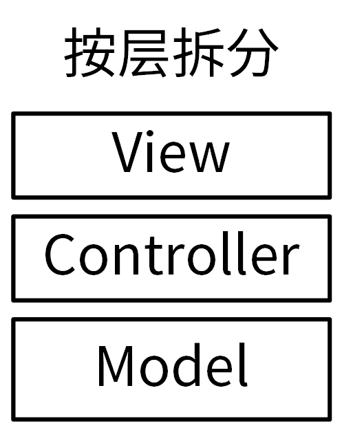
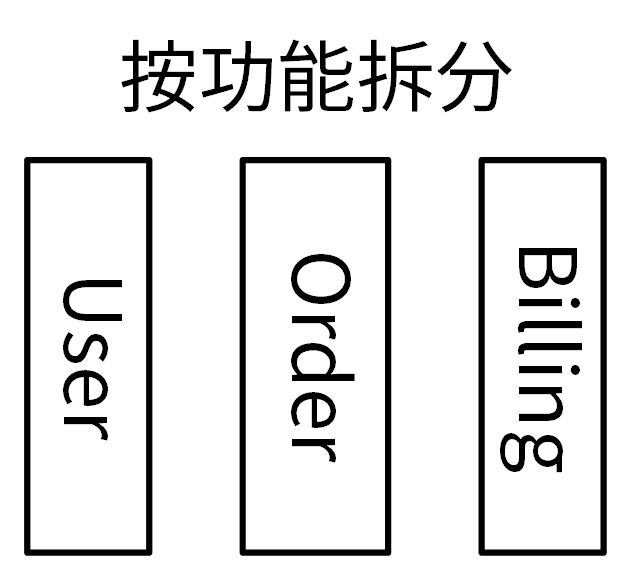

# 代码

## 代码结构

### 分层 MVC

按层拆分和按功能拆分：

按层拆分 MVC：在 MVC 架构中，将服务中的不同组件按访问顺序，拆分成了 Model、View 和 Controller 三层。每层完成不同的功能：

- View（视图）：提供给用户的操作界面，用来处理数据的显示。
- Controller（控制器）：负责根据用户从 View 层输入的指令，选取 Model  层中的数据，然后对其进行相应的操作，产生最终结果。
- Model（模型）：应用程序中用于处理数据逻辑的部分。



在 Go 项目中，按层拆分会带来很多问题。最大的问题是循环引用：相同功能可能在不同层被使用到，而这些功能又分散在不同的层中，很容易造成循环引用，所以不推荐。

### 按功能拆分

比如，一个订单系统，可以根据不同功能将其拆分成用户（user）、订单（order）和计费（billing）3 个模块，每一个模块提供独立的功能，功能更单一。



其目录结构如下：

```shell
$ tree --noreport -L 2 pkg
pkg
├── billing
├── order
│   └── order.go
└── user
```

相较于按层拆分，按功能拆分模块带来的好处也很好理解：不同模块，功能单一，可以实现高内聚低耦合。因为所有的功能只需要实现一次，引用逻辑清晰，会大大减少出现循环引用的概率。所以，有很多优秀的 Go 项目采用的都是按功能拆分的模块拆分方式，例如 Kubernetes、Docker、Helm、Prometheus 等。

## 代码规范

除了组织合理的代码结构这种方式外，编写高质量 Go 应用的另外一个行之有效的方法，是遵循 Go  语言代码规范来编写代码。

### 编码规范


### 最佳实践


### 静态代码检查

golangci-lint

虽然 Go 提供了 go vet 和 go tool vet 来做静态代码检查，但它们检查的内容还不够全面。golangci-lint 是目前使用最多，也最受欢迎的静态代码检查工具。选择 golangci-lint，是因为它具有其他静态代码检查工具不具备的一些优点：

- 速度非常快：golangci-lint 是基于 gometalinter 开发的，但是平均速度要比 gometalinter 快 5 倍。golangci-lint  速度快的原因有三个：可以并行检查代码；可以复用 go build 缓存；会缓存分析结果。
- 可配置：支持 YAML 格式的配置文件，让检查更灵活、更可控。
- IDE 集成：可以集成进多个主流的 IDE，如 VS Code、GNU Emacs、Sublime  Text、Goland 等。
- linter 聚合器：1.41.1 版的 golangci-lint 集成了 76 个 linter，不需要再单独安装这 76 个 linter。并且 golangci-lint 还支持自定义 linter。
- 最小的误报数：golangci-lint 调整了所集成 linter 的默认设置，大幅度减少了误报。
- 良好的输出：输出的结果带有颜色、代码行号和 linter 标识，易于查看和定位。

#### Install

```shell
$ go get github.com/golangci/golangci-lint/cmd/golangci-lint@v1.41.1
$ golangci-lint version # 输出 golangci-lint 版本号，说明安装成功
$ golangci-lint -h # 查看其用法
```

#### run

run 命令执行 golangci-lint 对代码进行检查，是 golangci-lint 最为核心的一个命令。

- `golangci-lint run`：对当前目录及子目录下的所有 Go 文件进行静态代码检查
- `golangci-lint run dir1 dir2/... dir3/file1.go`：对指定的 Go 文件或者指定目录下的 Go 文件进行静态代码检查
- `golangci-lint -c .golangci.yaml ./...`：指定配置文件
- `golangci-lint run --no-config --disable-all -E errcheck ./...`：指定 linter。golangci-lint 默认会从当前目录一层层往上寻找配置文件名 .golangci.yaml、.golangci.toml、.golangci.json 直到根（/）目录。如果找到，就以找到的配置文件作为本次运行的配置文件，所以为了防止读取到未知的配置文件，可以用 --no-config 参数使 golangci-lint 不读取任何配置文件。
- `golangci-lint run --no-config -D godot,errcheck`：禁用某些 linter

#### cache 

cache 命令用来进行缓存控制，并打印缓存的信息。它包含两个子命令：

- clean 用来清除 cache，当觉得 cache 的内容异常，或 cache 占用空间过大时，可以通过 `golangci-lint cache clean 清除` cache。
- status 用来打印 cache 的状态，比如 cache 的存放目录和 cache 的大小，如：`golangci-lint cache status`

#### config

config 命令可以打印 golangci-lint 当前使用的配置文件路径，例如：`golangci-lint config path`

#### linters

可以打印出 golangci-lint 所支持的 linter，并将这些 linter 分成两类，分别是配置为启用的 linter 和配置为禁用的 linter，例如：`golangci-lint linters`

#### .golangci.yaml

