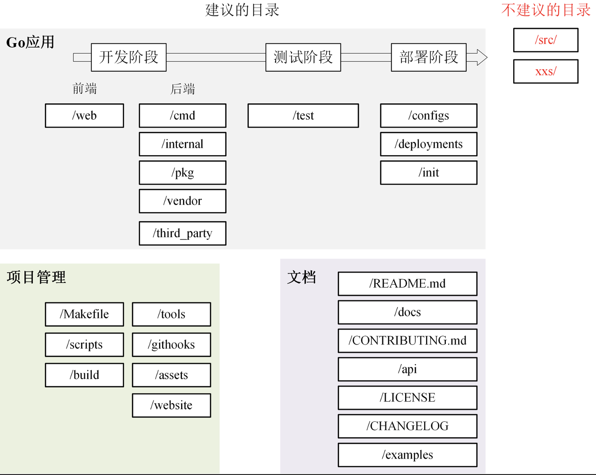

# 代码规范

## 目录规范

目录结构是一个项目的门面。很多时候，根据目录结构就能看出开发者对这门语言的掌握程度。所以，遵循一个好的目录规范，把代码目录设计的可维护、可扩展，甚至比文档规范、Commit Message 规范都要重要。

本章会从两个维度来介绍一个好的目录规范：首先，会介绍组织目录的一些基本原则，这些原则可以指导去组织一个好的代码目录。然后，会向你介绍一些具体的、优秀的目录结构。通过学习它们，你可以提炼总结出自己的目录结构设计方法，也可以直接用它们作为你的目录结构规范。

### 简介

#### 包名

- 包名可以与目录名不同，但尽量相同。
- 每个包开始于一个与目录同名的 .go 文件：如 http 包应该在一个http目录下的http.go文件中定义。
- 不同的功能分布在不同的文件中：如 message.go 包含Request 和 Response 类型，client.go 包含 Client类型， server.go 包含 Server 类型。
- 不同的文件应具备不同的职责：如 message.go 应该负责 HTTP 序列化请求和响应，http.go 应该包含底层网络处理逻辑，client.go 和 server.go 实现 HTTP 业务逻辑，请求路由等。
- 根据目录路径导入：同一子目录下所有源文件的包声明必须一致。

#### 原则

目录规范通常是指项目由哪些目录组成，每个目录下存放什么文件、实现什么功能，以及各个目录间的依赖关系是什么等。一个好的目录结构至少要满足以下条件：

- 命名清晰：目录命名要清晰、简洁，不要太长，也不要太短，目录名要能清晰地表达出该目录实现的功能，并且目录名最好用单数。一方面是因为单数足以说明这个目录的功能，另一方面可以统一规范，避免单复混用的情况。
- 功能明确：一个目录所要实现的功能应该是明确的、并且在整个项目目录中具有很高的辨识度。当需要新增一个功能时，能够非常清楚地知道把这个功能放在哪个目录下。
- 全面性：目录结构应该尽可能全面地包含研发过程中需要的功能，例如文档、脚本、源码管理、API  实现、工具、第三方包、测试、编译产物等。
- 可预测性：项目规模一定是从小到大的，所以一个好的目录结构应该能够在项目变大时，仍然保持之前的目录结构。
- 可扩展性：每个目录下存放了同类的功能，在项目变大时，这些目录应该可以存放更多同类功能。

#### 类型

根据功能，可以将目录结构分为结构化目录结构和平铺式目录结构两种。平铺式目录结构主要用在 Go 包中，相对来说比较简单；结构化目录结构主要用在 Go 应用中，相对来说比较复杂。

- 平铺式目录结构：一个 Go 项目可以是一个应用，也可以是一个代码框架 /  库，当项目是代码框架 /  库时，比较适合采用平铺式目录结构。平铺方式就是在项目的根目录下存放项目代码，整个目录结构看起来更像是一层的，这种方式在很多框架 /  库中存在，使用这种方式的好处是引用路径长度明显减少，例如 log 包 github.com/golang/glog  就是平铺式的，目录如下：

```shell
$ ls glog/
glog_file.go  glog.go  glog_test.go  LICENSE   README
```

- 结构化目录结构：当前 Go 社区比较推荐的结构化目录结构是  project-layout 。虽然它并不是官方和社区的规范，但因为组织方式比较合理，被很多 Go 开发人员接受，所以是一个事实上的规范。首结合 Go 项目通常应该包含的功能，总结出了一套 Go  的代码结构组织方式，也就是 Lab-IAM 应用使用的目录结构。它保留了 project-layout  优势的同时，还加入了一些个人的理解。

```text
├── api
│   ├── openapi
│   └── swagger
├── build
│   ├── ci
│   ├── docker
│   │   ├── iam-apiserver
│   │   ├── iam-authz-server
│   │   └── iam-pump
│   ├── package
├── CHANGELOG
├── cmd
│   ├── iam-apiserver
│   │   └── apiserver.go
│   ├── iam-authz-server
│   │   └── authzserver.go
│   ├── iamctl
│   │   └── iamctl.go
│   └── iam-pump
│       └── pump.go
├── configs
├── CONTRIBUTING.md
├── deployments
├── docs
│   ├── devel
│   │   ├── en-US
│   │   └── zh-CN
│   ├── guide
│   │   ├── en-US
│   │   └── zh-CN
│   ├── images
│   └── README.md
├── examples
├── githooks
├── go.mod
├── go.sum
├── init
├── internal
│   ├── apiserver
│   │   ├── api
│   │   │   └── v1
│   │   │       └── user
│   │   ├── apiserver.go
│   │   ├── options
│   │   ├── service
│   │   ├── store
│   │   │   ├── mysql
│   │   │   ├── fake
│   │   └── testing
│   ├── authzserver
│   │   ├── api
│   │   │   └── v1
│   │   │       └── authorize
│   │   ├── options
│   │   ├── store
│   │   └── testing
│   ├── iamctl
│   │   ├── cmd
│   │   │   ├── completion
│   │   │   ├── user
│   │   └── util
│   ├── pkg
│   │   ├── code
│   │   ├── options
│   │   ├── server
│   │   ├── util
│   │   └── validation
├── LICENSE
├── Makefile
├── _output
│   ├── platforms
│   │   └── linux
│   │       └── amd64
├── pkg
│   ├── util
│   │   └── genutil
├── README.md
├── scripts
│   ├── lib
│   ├── make-rules
├── test
│   ├── testdata
├── third_party
│   └── forked
└── tools
```

### 应用

一个 Go 应用包含 3 大部分：Go 应用、项目管理和文档。所以，本项目目录也可以分为这 3 大类。同时，Go 应用又贯穿开发阶段、测试阶段和部署阶段，相应的应用类的目录，又可以按开发流程分为更小的子类。当然了，这些我建议的目录，Go 项目目录中还有一些不建议的目录。所以整体来看，目录结构可以按下图的方式来分类。



#### 开发

##### web/

前端代码存放目录，主要用来存放 Web 静态资源，服务端模板和单页应用（SPAs）。

##### cmd/

一个项目有很多组件，可以把每个组件 main 函数所在的文件夹统一放在 /cmd 目录下，例如：

```shell
$ ls cmd/
gendocs  geniamdocs  genman  genswaggertypedocs  genyaml  iam-apiserver  iam-authz-server  iamctl  iam-pump

$ ls cmd/iam-apiserver/
apiserver.go
```

这里要保证 /cmd/<组件名> 目录下不要存放除了 main.go 之外的代码。如果其他代码可以导入并在其他项目中使用，那么它应该位于 /pkg 目录中。如果代码不是可重用的，或不希望其他人重用它，则将该代码放到 /internal 目录中。

##### internal/

存放项目的私有代码。如果一些代码，不希望在其他应用和库中被导入，则可将这部分代码放在 internal/ 目录下。它等同于 pkg/，但只对内部不对外。

当其他项目引入 internal/ 下的包时，Go 语言会在编译时报错：

```text
An import of a path containing the element “internal” is disallowed
if the importing code is outside the tree rooted at the parent of the
"internal" directory.
```

internal/ 目录建议包含如下目录：

- internal/apiserver/：该目录中存放真实的模块代码。而所有模块的共享代码存放在 internal/pkg/  目录下。
- internal/pkg/：存放项目内可共享，项目外不共享的包。这些包提供了比较基础、通用的功能，例如工具、错误码、用户验证等功能。

建议在项目的一开始将所有的共享代码存放在 internal/pkg/ 目录下，当该共享代码做好了对外开发的准备后，再转存到 pkg/ 目录下。

###### 模块内部结构

每个模块下的目录结构如下：

- /internal/apiserver/api/v1：HTTP API 接口的具体实现，主要用来做 HTTP 请求的解包、参数校验、业务逻辑处理、返回。注意这里的业务逻辑处理应该是轻量级的，如果业务逻辑比较复杂，代码量比较多，建议放到  /internal/apiserver/service  目录下。该源码文件主要用来串流程。
  - svc1_handler.go
  - svc1_handler_test.go

- /internal/apiserver/options：应用的 command  flag。
- /internal/apiserver/config：根据命令行参数创建应用配置。
- /internal/apiserver/service：存放应用复杂业务处理代码。
  - service.go：接口
  - svc1_service.go：实现

  - svc1_service_test.go：测试
- /internal/apiserver/store/mysql：一个应用可能要持久化的存储一些数据，这里主要存放跟数据库交互的代码，比如 Create、Update、Delete、Get、List 等。？？？或者叫 repo？
  - repo.go：接口
  - svc1_repo.go：实现

  - svc1_repo_test.go：测试

###### /internal/pkg

/internal/pkg  目录存放项目内可共享的包，通常可以包含如下目录：

- /internal/pkg/code：项目业务 Code  码。
- /internal/pkg/validation：一些通用的验证函数。
- /internal/pkg/middleware：HTTP 处理链。

##### pkg/

pkg/ 目录是 Go 语言项目中非常常见的目录，几乎能在所有知名的开源项目（非框架）中找到，例如  Kubernetes、Prometheus、Moby、Knative 等。该目录中存放可以被外部应用使用的代码库，其他项目可以直接通过 import 导入这里的代码。所以，在将代码库放入该目录时一定要慎重。

##### vender/

项目依赖，可通过 `go mod vendor` 创建。需要注意的是，如果是一个 Go 库，不要提交 vendor 依赖包。

##### third_party/

外部帮助工具，分支代码或其他第三方应用（例如  Swagger UI）。比如 fork 了一个第三方 go 包，并做了一些小的改动，可以放在目录 third_party/forked/ 下。一方面可以很清楚的知道该包是 fork 第三方的，另一方面又能够方便地和 upstream 同步。

#### 测试

##### test/

用于存放其他外部测试应用和测试数据。test/ 目录的构建方式比较灵活：对于大的项目，有一个数据子目录是有意义的。例如，如果需要 Go 忽略该目录中的内容，可以使用 test/data/ 或 test/testdata/ 目录。

##### mock/

因为 mock 是统一被调用，不能一级级下去查

#### 部署

##### configs/

这个目录用来配置文件模板或默认配置。例如，可以在这里存放 confd 或 consul-template 模板文件。这里有一点要注意，配置中不能携带敏感信息，这些敏感信息，可以用占位符来替代。配置文件类型往往包括：json、toml、yaml 等。

##### deploy/

用来存放 Iaas、PaaS 和容器编排部署配置和模板（Docker-Compose、Kubernetes/Helm、Terraform 等）。在一些项目，特别是用 Kubernetes 部署的项目中，这个目录可能命名为 deploy。

##### init/

存放初始化系统（systemd，upstart，sysv）和进程管理配置文件（runit，supervisord）。比如 sysemd 的 unit 文件。这类文件，在非容器化部署的项目中会用到。

### 项目管理

#### Makefile

Go 项目在其根目录下应该有一个 Makefile 工具，用来对项目进行管理，Makefile 通常用来执行静态代码检查、单元测试、编译等功能。其常见管理内容包括：

- 静态代码检查(lint)：推荐用 golangci-lint。
- 单元测试(test)：运行 go test ./...。
- 编译(build)：编译源码，支持不同的平台、不同的 CPU 架构。
- 镜像打包和发布(image/image.push)：现在的系统比较推荐用 Docker/Kubernetes 进行部署，所以一般也要有镜像构建功能。
- 清理（clean）：清理临时文件或者编译后的产物。
- 代码生成（gen）：比如要编译生成 protobuf pb.go 文件。
- 部署（deploy，可选）：一键部署功能，方便测试。
- 发布（release）：发布功能，比如：发布到 Docker Hub、github 等。
- 帮助（help）：告诉 Makefile 有哪些功能，如何执行这些功能。
- 版权声明（add-copyright）：如果是开源项目，可能需要在每个文件中添加版权头，这可以通过 Makefile 来添加。
- API 文档（swagger）：如果使用 swagger 来生成 API 文档，这可以通过 Makefile 来生成。

直接执行 make 时，执行如下各项  format -> lint -> test -> build，如果是有代码生成的操作，还可能需要首先生成代码 gen  -> format -> lint -> test ->  build。在实际开发中，可以将一些重复性的工作自动化，并添加到 Makefile 文件中统一管理。

#### scripts/

有些地方也被称为 hack/，该目录主要用来存放脚本文件，实现构建、安装、分析等不同功能。不同项目，里面可能存放不同的文件，但通常可以考虑包含以下 3 个目录：

- /scripts/make-rules：用来存放 makefile 文件，实现 /Makefile  文件中的各个功能。Makefile 有很多功能，为了保持它的简洁，我建议你将各个功能的具体实现放在/scripts/make-rules  文件夹下。
- /scripts/lib：shell 库，用来存放 shell  脚本。一个大型项目中有很多自动化任务，比如发布、更新文档、生成代码等，所以要写很多 shell 脚本，这些 shell  脚本会有一些通用功能，可以抽象成库，存放在/scripts/lib 目录下，比如 logging.sh，util.sh  等。
- /scripts/install：如果项目支持自动化部署，可以将自动化部署脚本放在此目录下。如果部署脚本简单，也可以直接放在  /scripts 目录下。

另外，shell 脚本中的函数名，建议采用语义化的命名方式，例如 apiserver::log::info  这种语义化的命名方式，可以使调用者轻松的辨别出函数的功能类别，便于函数的管理和引用。在 Kubernetes 的脚本中，就大量采用了这种命名方式。

#### build/

这里存放安装包和持续集成相关的文件。这个目录下有 3 个大概率会使用到的目录，在设计目录结构时可以考虑进去：

- /build/package：存放容器（Docker）、系统（deb, rpm,  pkg）的包配置和脚本。
- /build/ci：存放  CI（travis，circle，drone）的配置文件和脚本。
- /build/docker：存放子项目各个组件的 Dockerfile 文件。

#### tools/

存放这个项目的支持工具。这些工具可导入来自 /pkg 和 /internal 目录的代码。

#### githooks/

Git 钩子，可以将 commit-msg 存放在该目录。

### 文档

文档属于软件交付的一个重要组成部分，没有文档的项目很难理解、部署和使用。因此，编写文档是一个必不可少的开发工作。工作中，很多开发者非常注重代码产出，但不注重文档产出。他们觉得，即使没有软件文档也没太大关系，不影响软件交付。但这种看法是错误的，因为文档属于软件交付的一个重要组成部分，没有文档的项目很难理解、部署和使用。好的文档规范有 2 个优点：易读和可以快速定位文档。

#### README.md

项目的 README  文件是开发者学习项目时第一个阅读的文档，会放在项目的根目录下。因为它主要是用来介绍项目的功能、安装、部署和使用的，所以是可以规范化的，一般包含了项目的介绍、功能、快速安装和使用指引、详细的文档链接以及开发指引等。有时候 README 文档会比较长，为了能够快速定位到所需内容，需要添加 markdown toc 索引，可以借助工具 tocenize 来完成索引的添加。

```markdown
# 项目名称

<!-- 写一段简短的话描述项目 -->

## 功能特性

<!-- 描述该项目的核心功能点 -->

## 软件架构(可选)

<!-- 可以描述下项目的架构 -->

## 快速开始

### 依赖检查

<!-- 描述该项目的依赖，比如依赖的包、工具或者其他任何依赖项 -->

### 构建

<!-- 描述如何构建该项目 -->

### 运行

<!-- 描述如何运行该项目 -->

## 使用指南

<!-- 描述如何使用该项目 -->

## 如何贡献

<!-- 告诉其他开发者如果给该项目贡献源码 -->

## 社区(可选)

<!-- 如果有需要可以介绍一些社区相关的内容 -->

## 关于作者

<!-- 这里写上项目作者 -->

## 谁在用(可选)

<!-- 可以列出使用本项目的其他有影响力的项目，算是给项目打个广告吧 -->

## 许可证

<!-- 这里链接上该项目的开源许可证 -->
```

#### CONTRIBUTING.md

如果是开源项目，还要有一个 CONTRIBUTING.md 文件，用来说明如何贡献代码，如何开源协同等等。CONTRIBUTING.md 不仅能够规范协同流程，还能降低第三方开发者贡献代码的难度。

#### LICENSE

版权文件可以是私有的，也可以是开源的。常用的开源协议有：Apache  2.0、MIT、BSD、GPL、Mozilla、LGPL。

为了声明版权，可能会需要将 LICENSE 头添加到源码文件或者其他文件中，这部分工作可以通过工具实现自动化，推荐工具：addlicense 。当代码中引用了其它开源代码时，需要在 LICENSE 中说明对其它源码的引用，这就需要知道代码引用了哪些源码，以及这些源码的开源协议，可以借助工具来进行检查，推荐工具：glice。至于如何说明对其它源码的引用，可以参考下 IAM 项目的 LICENSE 文件。

#### CHANGELOG/

当项目有更新时，为了方便了解当前版本的更新内容或历史更新内容，需要将更新记录存放到 CHANGELOG/ 目录。编写 CHANGELOG/ 是一个复杂、繁琐的工作，可以结合 Angular 规范和 git-chglog 来自动生成 CHANGELOG。

#### api/

接口规范文档一般放在 `api/` 目录中，它存放的是当前项目对外提供的各种不同类型的 API 接口定义文件，其中可能包含类似  /api/protobuf-spec、/api/thrift-spec、/api/http-spec、openapi、swagger 的目录，这些目录包含了当前项目对外提供和依赖的所有 API 文件。

#### docs/

项目文档包括一切需要文档化的内容，它们通常集中放在 `/docs` 目录下。在制定文档规范时，可以考虑包含两类文档：

- 开发文档：用来说明项目的开发流程，比如如何搭建开发环境、构建二进制文件、测试、部署等。
- 用户文档：软件的使用文档，对象一般是软件的使用者，内容可根据需要添加。比如，可以包括 API 文档、SDK 文档、安装文档、功能介绍文档、最佳实践、操作指南、常见问题等。

同时还可以考虑中英文双语，推荐存放以下几个子目录：

- docs/devel/：存放开发文档、hack  文档等。
- docs/guide/：存放用户手册，安装、quickstart、产品文档等。
- docs/images/：存放图片文件。

```markdown
docs
├── devel                        # 开发文档
│   └── development.md           # 开发手册，说明如何编译、构建、运行
├── guide                        # 用户文档
│   ├── api/                     # API文档
│   ├── best-practice/           # 最佳实践，存放一些比较重要的实践文章
│   │   └── authorization.md
│   ├── faq/                     # 常见问题
│   │   ├── iam-apiserver
│   │   └── installation
│   ├── installation/            # 安装文档
│   │   └── installation.md
│   ├── introduction/            # 产品介绍文档
│   ├── operation-guide/         # 操作指南，里面可以根据REST资源再划分为更细的子目录，用来存放系统核心/全部功能的操作手册
│   │   ├── policy.md
│   │   ├── secret.md
│   │   └── user.md
│   ├── quickstart/              # 快速入门
│   │   └── quickstart.md
│   ├── README.md                # 用户文档入口文件
│   └── sdk/                     # SDK文档
│       └── golang.md
└── images/                      # 图片存放目录
    └── 部署架构v1.png
```

#### examples/

存放应用程序或者公共包的示例代码。这些示例代码可以降低使用者的上手门槛。

### 不建议目录

除了上面这些建议的目录，在 Go 项目中，还有一些目录是不建议包含的，这些目录不符合 Go 的设计哲学。

#### src/

一些开发语言，例如 Java 项目中会有 src 目录。在  Java 项目中， src 目录是一种常见的模式，但在 Go 项目中，不建议使用 src 目录。其中一个重要的原因是：在默认情况下，Go 语言的项目都会被放置到 $GOPATH/src 目录下。这个目录中存放着所有代码，如果在自己的项目中使用 /src/ 目录，这个包的导入路径中就会出现两个 /src/，这样的目录结构看起来非常怪。

#### XXs/

在 Go 项目中，要避免使用带复数的目录或者包。建议统一使用单数。

## 代码规范

除了组织合理的代码结构这种方式外，编写高质量 Go 应用的另外一个行之有效的方法，是遵循 Go  语言代码规范来编写代码。

### 代码格式

- 运算符和操作数之间要留空格。
- 建议一行代码不超过 120 个字符，超过部分采用合适的换行方式换行。但也有些例外场景，例如 import 行、工具自动生成的代码、带 tag 的 struct 字段。
- 文件长度不能超过 800 行。
- 函数长度不能超过 80 行。
- import：
  - 不要使用相对路径引入包，例如 import …/util/net。
  - 包名称与导入路径的最后一个目录名不匹配时，或者多个相同包名冲突时，则必须使用导入别名。
  - 导入的包建议进行分组（标准包、第三方包、匿名包、内部包），匿名包的引用使用一个新的分组，并对匿名包引用进行说明。

```go
  import (
    // go 标准包
    "fmt"

    // 第三方包
      "github.com/jinzhu/gorm"
      "github.com/spf13/cobra"
      "github.com/spf13/viper"

    // 匿名包单独分组，并对匿名包引用进行说明
      // import mysql driver
      _ "github.com/jinzhu/gorm/dialects/mysql"

    // 内部包
      v1 "github.com/marmotedu/api/apiserver/v1"
      metav1 "github.com/marmotedu/apimachinery/pkg/meta/v1"
      "github.com/marmotedu/iam/pkg/cli/genericclioptions"
  )
```

### 命名规范

命名规范是代码规范中非常重要的一部分，一个统一的、短小的、精确的命名规范可以大大提高代码的可读性，也可以借此规避一些不必要的 Bug。

#### 包命名

- 包名必须和目录名一致，尽量采取有意义、简短的包名，不要和标准库冲突。
- 包名全部小写，没有大写或下划线，使用多级目录来划分层级。
- 项目名可以通过中划线来连接多个单词。
- 包名以及包所在的目录名，不要使用复数，例如，是net/url，而不是net/urls。
- 不要用 common、util、shared 或者 lib 这类宽泛的、无意义的包名。
- 包名要简单明了，例如 net、time、log。

#### 文件命名

- 文件名要简短有意义。
- 文件名应小写，并使用下划线分割单词。

#### 接口命名

接口命名的规则，基本和结构体命名规则保持一致

- 单个函数的接口名以 “er"”作为后缀（例如  Reader，Writer），有时候可能导致蹩脚的英文，但是没关系。
- 两个函数的接口名以两个函数名命名，例如  ReadWriter。
- 三个以上函数的接口名，类似于结构体名。

```go
  type Seeker interface {
      Seek(offset int64, whence int) (int64, error)
  }

  // ReadWriter is the interface that groups the basic Read and Write methods.
  type ReadWriter interface {
      Reader
      Writer
  }
```

#### 结构体命名

- 采用驼峰命名方式，首字母根据访问控制决定使用大写或小写，例如 MixedCaps 或 mixedCaps。
- 结构体名不应该是动词，应该是名词，比如 Node、NodeSpec。
- 避免使用 Data、Info 这类无意义的结构体名。
- 结构体的声明和初始化应采用多行

```go
// User 多行声明
type User struct {
    Name  string
    Email string
}

// 多行初始化
u := User{
    UserName: "colin",
    Email:    "colin404@foxmail.com",
}
```

#### 函数命名

- 函数名采用驼峰式，首字母根据访问控制决定使用大写或小写，例如：MixedCaps 或者 mixedCaps。
- 代码生成工具自动生成的代码  (如 xxxx.pb.go) 和为了对相关测试用例进行分组，而采用的下划线 (如  TestMyFunction_WhatIsBeingTested) 排除此规则。

#### 变量命名

- 变量名必须遵循驼峰式，首字母根据访问控制决定使用大写或小写。
- 在相对简单（对象数量少、针对性强）的环境中，可以将一些名称由完整单词简写为单个字母，例如：user 可以简写为 u；userID 可以简写 uid。
- 特有名词时，需要遵循以下规则：如果变量为私有，且特有名词为首个单词，则使用小写，如 apiClient。其他情况都应当使用该名词原有的写法，如 APIClient、repoID、UserID。
- 若变量类型为 bool 类型，则名称应以 Has，Is，Can 或 Allow 开头

```go
var hasConflict bool
var isExist bool
var canManage bool
var allowGitHook bool
```

- 局部变量应当尽可能短小，比如使用 buf 指代 buffer，使用 i 指代 index。
- 代码生成工具自动生成的代码可排除此规则（如 xxx.pb.go 里面的 Id）

#### 常量命名

- 常量名必须遵循驼峰式，首字母根据访问控制决定使用大写或小写。
- 如果是枚举类型的常量，需要先创建相应类型：

```go
// Code defines an error code type.
type Code int

// Internal errors.
const (
    // ErrUnknown - 0: An unknown error occurred.
    ErrUnknown Code = iota
    // ErrFatal - 1: An fatal error occurred.
    ErrFatal
)
```

#### Error的命名

- Error 类型应该写成 FooError 的形式。

```go
type ExitError struct {
  // ....
}
```

- Error 变量写成 ErrFoo 的形式。

```go
var ErrFormat = errors.New("unknown format")
```

### 注释规范

- 每个可导出的名字都要有注释，该注释对导出的变量、函数、结构体、接口等进行简要介绍。
- 全部使用单行注释，禁止使用多行注释。
- 和代码的规范一样，单行注释不要过长，禁止超过 120 字符，超过的请使用换行展示，尽量保持格式优雅。
- 注释必须是完整的句子，以需要注释的内容作为开头，句点作为结尾，格式为“// 名称 描述.”。

```go
// bad
// logs the flags in the flagset.
func PrintFlags(flags *pflag.FlagSet) {
  // normal code
}

// good
// PrintFlags logs the flags in the flagset.
func PrintFlags(flags *pflag.FlagSet) {
  // normal code
}
```

- 所有注释掉的代码在提交 code review 前都应该被删除，否则应该说明为什么不删除，并给出后续处理建议。
- 在多段注释之间可以使用空行分隔加以区分

```go
// Package superman implements methods for saving the world.
//
// Experience has shown that a small number of procedures can prove
// helpful when attempting to save the world.
package superman
```

#### 包注释

- 每个包都有且仅有一个包级别的注释。
- 包注释统一用 // 进行注释，格式为“// Package 包名 包描述”

```go
// Package genericclioptions contains flags which can be added to you command, bound, completed, and produce useful helper functions.
package genericclioptions
```

#### 结构体

- 注释每个需要导出的结构体或者接口都必须有注释说明，格式为“// 结构体名 结构体描述.”。
- 结构体内的可导出成员变量名，如果意义不明确，必须要给出注释，放在成员变量的前一行或同一行的末尾。

```go
// User represents a user restful resource. It is also used as gorm model.
type User struct {
    // Standard object's metadata.
    metav1.ObjectMeta `json:"metadata,omitempty"`

    Nickname string `json:"nickname" gorm:"column:nickname"`
    Password string `json:"password" gorm:"column:password"`
    Email    string `json:"email" gorm:"column:email"`
    Phone    string `json:"phone" gorm:"column:phone"`
    IsAdmin  int    `json:"isAdmin,omitempty" gorm:"column:isAdmin"`
}
```

#### 方法注释

- 每个需要导出的函数或者方法都必须有注释，格式为“// 函数名 函数描述.”。

```go
// BeforeUpdate run before update database record.
func (p *Policy) BeforeUpdate() (err error) {
  // normal code
  return nil
}
```

#### 类型注释

- 每个需要导出的类型定义和类型别名都必须有注释说明，格式为“// 类型名 类型描述.”。

```go
// Code defines an error code type.
type Code int
```

#### 变量/常量注释

- 每个可导出的变量 / 常量都必须有注释说明，格式为“// 变量名 变量描述”

```go
// ErrSigningMethod defines invalid signing method error.
var ErrSigningMethod = errors.New("Invalid signing method")
```

- 出现大块常量或变量定义时，可在前面注释一个总的说明，然后在每一行常量的前一行或末尾详细注释该常量的定义

```go
// Code must start with 1xxxxx.    
const (                         
    // ErrSuccess - 200: OK.          
    ErrSuccess int = iota + 100001    
                                                   
    // ErrUnknown - 500: Internal server error.    
    ErrUnknown    

    // ErrBind - 400: Error occurred while binding the request body to the struct.    
    ErrBind    
                                                  
    // ErrValidation - 400: Validation failed.    
    ErrValidation 
)
```

### 声明/初始化/定义

- 当函数中需要使用到多个变量时，可以在函数开始处使用 var 声明。在函数外部声明必须使用 var ，不要采用 := ，容易踩到变量的作用域的问题。

```go
var (
  Width  int
  Height int
)
```

- 在初始化结构引用时，请使用 &T{} 代替 new(T)，以使其与结构体初始化一致。

```go
// bad
sptr := new(T)
sptr.Name = "bar"

// good
sptr := &T{Name: "bar"}
```

- struct 声明和初始化格式采用多行，定义如下。

```go
type User struct{
    Username  string
    Email     string
}

user := User{
  Username: "colin",
  Email: "colin404@foxmail.com",
}
```

- 相似的声明放在一组，同样适用于常量、变量和类型声明。
- 尽可能指定容器容量，以便为容器预先分配内存

```go
v := make(map[int]string, 4)
v := make([]string, 0, 4)
```

- 对于未导出的顶层常量和变量，使用 _ 作为前缀。

```go
// bad
const (
  defaultHost = "127.0.0.1"
  defaultPort = 8080
)

// good
const (
  _defaultHost = "127.0.0.1"
  _defaultPort = 8080
)
```

- 嵌入式类型（例如 mutex）应位于结构体内的字段列表的顶部，并且必须有一个空行将嵌入式字段与常规字段分隔开。

```go
// bad
type Client struct {
  version int
  http.Client
}

// good
type Client struct {
  http.Client

  version int
}
```

- type assertion 的单个返回值针对不正确的类型将产生 panic。请始终使用 “comma ok”的惯用法。

```go
// bad
t := n.(int)

// good
t, ok := n.(int)
if !ok {
  // error handling
}
// normal code
```

### 类型

#### 字符串

- 空字符串判断

```go
// bad
if s == "" {
    // normal code
}

// good
if len(s) == 0 {
    // normal code
}
```

- []byte/string 相等比较。

```go
// bad
var s1 []byte
var s2 []byte
...
bytes.Equal(s1, s2) == 0
bytes.Equal(s1, s2) != 0

// good
var s1 []byte
var s2 []byte
...
bytes.Compare(s1, s2) == 0
bytes.Compare(s1, s2) != 0
```

#### 切片

- 空 slice 判断，同样适用于 map、channel

```go
// bad
if len(slice) == 0 {
    // normal code
}

// good
if slice != nil && len(slice) == 0 {
    // normal code
}
```

- 声明 slice

```go
// bad
s := []string{}
s := make([]string, 0)

// good
var s []string
```

- slice 复制

```go
// bad
var b1, b2 []byte
for i, v := range b1 {
   b2[i] = v
}
for i := range b1 {
   b2[i] = b1[i]
}

// good
copy(b2, b1)
```

- slice 新增

```go
// bad
var a, b []int
for _, v := range a {
    b = append(b, v)
}

// good
var a, b []int
b = append(b, a...)
```

#### 结构体

- struct 初始化：struct 以多行格式初始化。

```go
type user struct {
  Id   int64
  Name string
}

u1 := user{100, "Colin"}

u2 := user{
    Id:   200,
    Name: "Lex",
}
```

### 控制结构

#### if

- if 接受初始化语句，约定如下方式建立局部变量。

```go
if err := loadConfig(); err != nil {
  // error handling
  return err
}
```

- if 对于 bool 类型的变量，应直接进行真假判断

```go
var isAllow bool
if isAllow {
  // normal code
}
```

#### for

- 采用短声明建立局部变量

```go
sum := 0
for i := 0; i < 10; i++ {
    sum += 1
}
```

- 不要在 for 循环里面使用 defer，defer 只有在函数退出时才会执行

```go
// bad
for file := range files {
  fd, err := os.Open(file)
  if err != nil {
    return err
  }
  defer fd.Close()
  // normal code
}

// good
for file := range files {
  func() {
    fd, err := os.Open(file)
    if err != nil {
      return err
    }
    defer fd.Close()
    // normal code
  }()
}
```

#### range

- 如果只需要第一项（key），就丢弃第二个。

```go
for key := range keys {
// normal code
}
```

- 如果只需要第二项，则把第一项置为下划线

```go
sum := 0
for _, value := range array {
    sum += value
}
```

#### switch

- 必须要有 default

```go
switch os := runtime.GOOS; os {
    case "linux":
        fmt.Println("Linux.")
    case "darwin":
        fmt.Println("OS X.")
    default:
        fmt.Printf("%s.\n", os)
}
```

#### goto

- 业务代码禁止使用 goto 。
- 框架或其他底层源码尽量不用。

### 函数

- 传入变量和返回变量以小写字母开头。
- 函数参数个数不能超过 5 个。
- 函数分组与顺序

  - 函数应按粗略的调用顺序排序。
  - 同一文件中的函数应按接收者分组。
- 尽量采用值传递，而非指针传递。
- 传入参数是 map、slice、chan、interface ，不要传递指针。

#### 函数参数

- 传入变量和返回变量都以小写字母开头。
- 尽量用值传递，非指针传递。
- 参数数量均不能超过 5 个。
- 多返回值最多返回三个，超过三个请使用 struct。

#### defer

- 当存在资源创建时，应紧跟 defer 释放资源（可以大胆使用 defer，defer 在 Go1.14 版本中，性能大幅提升，defer 的性能损耗即使在性能敏感型的业务中，也可以忽略）。
- 先判断是否错误，再 defer 释放资源

```go
rep, err := http.Get(url)
if err != nil {
    return err
}

defer resp.Body.Close()
```

#### 方法的接收器

- 推荐以类名第一个英文首字母的小写作为接收器的命名。
- 接收器的命名在函数超过 20 行的时候不要用单字符。
- 接收器的命名不能采用 me、this、self 这类易混淆名称。

#### 嵌套

- 嵌套深度不能超过 4 层。

#### 变量命名

- 变量声明尽量放在变量第一次使用的前面，遵循就近原则。
- 如果某数字出现超过两次，则禁止使用，改用一个常量代替

```go
// PI ...
const Prise = 3.14

func getAppleCost(n float64) float64 {
  return Prise * n
}

func getOrangeCost(n float64) float64 {
  return Prise * n
}
```

### 设置规范

#### GOPATH

- Go 1.11  之后，弱化了 GOPATH 规则，已有代码（很多库肯定是在 1.11 之前建立的）肯定符合这个规则，建议保留 GOPATH 规则，便于维护代码。
- 建议只使用一个 GOPATH，不建议使用多个 GOPATH。如果使用多个 GOPATH，编译生效的 bin 目录是在第一个  GOPATH 下。

#### 依赖管理

- Go 1.11 以上必须使用 Go Modules。
- 使用 Go Modules 作为依赖管理的项目时，不建议提交 vendor 目录。
- 使用 Go Modules 作为依赖管理的项目时，必须提交 go.sum 文件。

### 单元测试

- 单元测试文件名命名规范为 example_test.go。
- 每个重要的可导出函数都要编写测试用例。
- 因为单元测试文件内的函数都是不对外的，所以可导出的结构体、函数等可以不带注释。
- 如果存在 func (b *Bar) Foo ，单测函数可以为 func TestBar_Foo。

### 整体

- 尽量少用全局变量，而是通过参数传递，使每个函数都是“无状态”的。这样可以减少耦合，也方便分工和单元测试。
- 在编译时验证接口的符合性

```go
type LogHandler struct {
  h   http.Handler
  log *zap.Logger
}
var _ http.Handler = LogHandler{}
```

- 编译过程无法检查 interface{}  的转换，只能在运行时检查，小心引起 panic。
- 服务器处理请求时，应该创建一个 context，保存该请求的相关信息（如 requestID），并在函数调用链中传递。
- string 表示的是不可变的字符串变量，对 string 的修改是比较重的操作，基本上都需要重新申请内存。所以，如果没有特殊需要，需要修改时多使用 []byte。
- 优先使用 strconv 而不是 fmt。
- append 要小心自动分配内存，append 返回的可能是新分配的地址。如果要直接修改 map 的 value 值，则 value 只能是指针，否则要覆盖原来的值。
- map 在并发中需要加锁。

## 版本规范

业界使用最普遍的是语义化版本规范（SemVer，Semantic  Versioning），它是 GitHub 起草的一个具有指导意义的、统一的版本号表示规范。它规定了版本号的表示、增加和比较方式，以及不同版本号代表的含义。在这套规范下，版本号及其更新方式包含了相邻版本间的底层代码和修改内容的信息。【6】

### 格式

语义化版本格式为：主版本号.次版本号.修订号（X.Y.Z），其中 X、Y 和 Z 禁止在数字前方补零。版本号可按以下规则递增：

- 主版本号（MAJOR）：当做了不兼容的 API 修改。
- 次版本号（MINOR）：当做了向下兼容的功能性新增及修改。这里有个不成文的约定需要你注意，偶数为稳定版本，奇数为开发版本。
- 修订号（PATCH）：当做了向下兼容的问题修正。

例如 v1.2.3 是一个语义化版本号，版本号中每个数字的具体含义见下图：


可能还看过这么一种版本号：v1.2.3-alpha，这其实是把先行版本号（Pre-release）和版本编译元数据，作为延伸加到了主版本号.次版本号.修订号的后面，格式为  X.Y.Z`-先行版本号`+`版本编译元数据`，如下图所示：


- 先行版本号：意味着该版本不稳定，可能存在兼容性问题，格式为：X.Y.Z-[一连串以`.`分隔的标识符]  ，如下例：

```text
1.0.0-alpha
1.0.0-alpha.1
1.0.0-0.3.7
1.0.0-x.7.z.92
```

- 编译版本号：一般是编译器在编译过程中自动生成的，只定义其格式，并不进行人为控制，如下例：

```text
1.0.0-alpha+001
1.0.0+20130313144700
1.0.0-beta+exp.sha.5114f85
```

注意，先行版本号和编译版本号只能是字母、数字，且不可以有空格。

### 控制规范

重点规则介绍：

- 标记版本号的软件发行后，禁止改变该版本软件的内容，任何修改都必须以新版本发行。
- 主版本号为零（0.y.z）的软件处于开发初始阶段，一切都可能随时被改变，这样的公共 API 不应该被视为稳定版。1.0.0 的版本号被界定为第一个稳定版本，之后的所有版本号更新都基于该版本进行修改。
- 修订号 Z（x.y.Z | x >  0）必须在只做了向下兼容的修正时才递增，这里的修正其实就是 Bug 修复。
- 次版本号 Y（x.Y.z | x >  0）必须在有向下兼容的新功能出现时递增，在任何公共 API 的功能被标记为弃用时也必须递增，当有改进时也可以递增。其中可以包括修订级别的改变。每当次版本号递增时，修订号必须归零。
- 主版本号 X（X.y.z | X > 0）必须在有任何不兼容的修改被加入公共 API 时递增。其中可以包括次版本号及修订级别的改变。每当主版本号递增时，次版本号和修订号必须归零。

### 增长规则

- 在实际开发的时候，建议从 0.1.0 作为第一个开发版本号，并在后续的每次发行时递增次版本号。
- 当版本是一个稳定的版本，且第一次对外发布时，版本号可以定为 1.0.0。
- 当严格按照 Angular commit message 规范提交代码时，版本号可以这么来确定：
  - fix 类型的 commit：可以将修订号 +1。
  - feat 类型的 commit：可以将次版本号 +1。
  - 带有 BREAKING CHANGE 的 commit 可以将主版本号 +1。

## 接口规范

接口文档又称为 API 文档，一般由后台开发人员编写，用来描述组件提供的 API 接口，以及如何调用这些 API 接口。

- 在项目初期，接口文档可以解耦前后端，让前后端并行开发：前端只需要按照接口文档实现调用逻辑，后端只需要按照接口文档提供功能。当前后端都开发完成之后，就可以直接进行联调，提高开发效率。
- 在项目后期，接口文档可以提供给使用者，不仅可以降低组件的使用门槛，还能够减少沟通成本。

一个好的 API 设计需要满足两个主要的目的：

- 平台独立性：任何客户端都能消费 API，而不需要关注系统内部实现。API 应该使用标准的协议和消息格式对外部提供服务。传输协议和传输格式不应该侵入到业务逻辑中，也就是系统应该具备随时支持不同传输协议和消息格式的能力。
- 系统可靠性：在 API 已经被发布和非 API 版本改变的情况下，API 应该对契约负责，不应该导致数据格式发生破坏性的修改。在 API 需要重大更新时，使用版本升级的方式修改，并对旧版本预留下线时间窗口。

API 接口应严格遵循 REST 标准进行设计，采用 JSON 格式进行数据传输，使用 JWT Token 进行 API 认证。

### 请求

#### 请求方法

API 接口文档中请求方法格式为：`HTTP方法+请求路径`，例如请求方法为：`GET /v1/users`，请求地址为：`xxx.io`，请求协议为：`HTTP`，则实际的请求格式为：`curl -X GET http://xxx.io/v1/users`

#### 认证

如采用 JWT Token 进行认证，具体操作步骤如下：

1. 获取系统创建的 secretKey 和 secretID
2. 通过 secretKey 和 secretID 生成 JWT Token，以下是一个可以生成 JWT Token 的 Go 源码（main.go）：

    ```go
    package main

    import (
      "fmt"
      "os"
      "time"

      "github.com/dgrijalva/jwt-go"
      "github.com/spf13/pflag"
    )

    var (
      cliAlgorithm = pflag.StringP("algorithm", "", "HS256", "Signing algorithm - possible values are HS256, HS384, HS512")
      cliTimeout   = pflag.DurationP("timeout", "", 2*time.Hour, "JWT token expires time")
      help         = pflag.BoolP("help", "h", false, "Print this help message")
    )

    func main() {
      pflag.Usage = func() {
      fmt.Println(`Usage: gentoken [OPTIONS] SECRETID SECRETKEY`)
      pflag.PrintDefaults()
      }
      pflag.Parse()

      if *help {
        pflag.Usage()
        return
      }

      if pflag.NArg() != 2 {
        pflag.Usage()
        os.Exit(1)
      }
      
      token, err := createJWTToken(*cliAlgorithm, *cliTimeout, os.Args[1], os.Args[2])
      if err != nil {
        fmt.Printf("Error: %s\n", err.Error())
        return
      }

      fmt.Println(token)
    }

    func createJWTToken(algorithm string, timeout time.Duration, secretID, secretKey string) (string, error) {
      expire := time.Now().Add(timeout)

      token := jwt.NewWithClaims(jwt.GetSigningMethod("HS256"), jwt.MapClaims{
        "kid": secretID,
        "exp": expire.Unix(),
        "iat": time.Now().Unix(),
      })

      return token.SignedString([]byte(secretKey))
    }
    ```

    在命令行执行如下命令，即可生成 JWT Token：

    ```shell
    go run main.go <secretID> <secretKey>
    ```

    默认会生成 HS256 算法签名、2 小时后过期的 Token。可以通过 `--algorithm` 指定签名算法，通过 `--timeout` 指定 token 过期时间。

3. 携带 Token，发送 HTTP 请求：

    ```shell
    curl -XPOST -H'Content-Type: application/json' -H'Authorization: Bearer <Token>' -d'{"metadata":{"name":"secretdemo"},"expires":0,"description":"admin secret"}' http://xxx.io:8080/v1/secrets
    ```

#### 请求参数

每个参数都属于不同的类型，根据参数位置不同，参数有如下类型：

- 请求头参数 (Header)：例如 `Content-Type: application/json`。
- 路径参数 (Path)：例如 `/user/:id` 中的 id 参数就位于 path 中。
- 查询参数 (Query)：例如 `users?username=xxx&pwd=yyy`。
- 请求体参数 (Body)：例如 `{"metadata":{"name":"secretdemo"},"expires":0,"description":"admin secret"}`。

例如，API 接口公共参数如下：

| 参数名称      | 位置   | 类型   | 必选 | 描述                                                 |
| ------------- | ------ | ------ | ---- | ---------------------------------------------------- |
| Content-Type  | Header | String | 是   | 固定值：application/json，统一使用 JSON 数据传输格式 |
| Authorization | Header | String | 是   | JWT Token，值以 `Bearer` 开头                        |

### 返回

#### 返回结果

一个 API 接口调用返回结果只会有 2 种结果：成功和失败。成功和失败返回结果的 header 中，还有一些其它返回信息，比如：`Cache-Control`、`Content-Type`、`Access-Control-Allow-Origin` 等，这些在非排障场景下，可以不用关注。

##### 成功返回结果

成功时，返回结果包含以下内容：

1. X-Request-Id：位于 HTTP 返回的请求头中，调用的请求 ID，用来唯一标识一次请求。
2. HTTP 状态码：HTTP 状态码，成功请求的状态码永远为 200。
3. 接口请求的数据：位于 HTTP 返回的 Body 中，API 请求需要的返回数据，JSON 格式。

成功时返回的 HTTP 状态码是 200，如下是创建密钥 API 接口返回结果的 Body 数据：

```json
{
  "metadata": {
    "id": 24,
    "name": "secretdemo",
    "createdAt": "2020-09-20T10:17:58.108812081+08:00",
    "updatedAt": "2020-09-20T10:17:58.108812081+08:00"
  },
  "username": "admin",
  "secretID": "k5jZYMJCAk4jGH1nqgszTn6hPaZ8aZbKO0ZO",
  "secretKey": "cKdfmDJlTELfumu3SpLPf0k0SXQDqvdJ",
  "expires": 0,
  "description": "admin secret"
}
```

##### 失败返回结果

失败时，返回结果包含以下内容：

1. X-Request-Id：位于 HTTP 返回的请求头中，调用的请求 ID，用来唯一标识一次请求。
2. HTTP 状态码：HTTP 状态码，不同的错误类型返回的 HTTP 状态码不同，可能的状态码为：400、401、403、404、500。
3. 业务错误码：返回格式为：`{"code":100101,"message":"Database error","reference":"https://github.com/xxx/iam/tree/master/docs/guide/faq"}`， `code` 表示业务错误码，`message` 表示该错误的具体信息，`reference` 表示参考文档（可选）。如下是创建重复密钥时，API 接口返回的错误结果（Body 数据）：

```json
{
  "code": 100101,
  "message": "Database error",
  "reference": "https://github.com/xxx/iam/tree/master/docs/guide/faq"
}
```

#### HTTP 状态码

一般会返回 2 类错误码：HTTP 状态码和业务错误码。

HTTP 状态码包括：

- 4xx：响应失败，说明客户端发生错误
- 1XX：（指示信息）表示请求已接收，继续处理。
- 2XX：（请求成功）表示成功处理了请求的状态代码。
  - 200：代表成功响应
- 3XX：（请求被重定向）表示要完成请求，需要进一步操作。通常，这些状态代码用来重定向。
- 4XX ：（请求错误）这些状态代码表示请求可能出错，妨碍了服务器的处理，通常是客户端出错，需要客户端做进一步的处理。
  -  400：响应失败，客户端发生错误，如参数不合法、格式错误等
  -  401：认证失败
  -  403：授权失败
  -  404：页面或者资源不存在
- 5XX：（服务器错误）这些状态代码表示服务器在尝试处理请求时发生内部错误。这些错误可能是服务器本身的错误，而不是客户端的问题。
  - 500：响应失败，说明服务端发生错误

#### 返回参数类型

本文的数据传输格式为 JSON 格式，所以支持的数据类型就是 JSON 所支持的数据类型。在 JSON 中，有如下数据类型：string、number、array、boolean、null、object。JSON 中的 number 是数字类型的统称，但是在实际的 Go 开发中，需要知道更精确的 number 类型，来将 JSON 格式的数据解码（unmarshal）为 Go 的结构体类型。同时，Object 类型在 Go 中也可以直接用结构体名替代。所以具体返回参数支持的数据类型为：
`String、Int、Uint、Int8、Uint8、Int16、Uint16、Int32、Uint32、Int64、Uint64、Float、Float64、Array、Boolean、Null、Struct`。另外请求的编码格式均为：`UTF-8` 格式。

### 配套文档

一个规范的 API 接口文档目录，还需要包含一个完整的 API 接口介绍文档、API 接口变更历史文档、通用说明、数据结构说明、错误码描述和 API 接口使用文档。API 接口使用文档中需要包含接口描述、请求方法、请求参数、输出参数和请求示例。当然，根据不同的项目需求，API 接口文档会有不同的格式和内容。一般在 XXXXXX docs/guide/api/ 目录下有如下文档：

#### README.md

[README.md](10_README.md) ：某项目 API 接口整体介绍，相关参考标准、分类介绍支持的 API 接口，并会存放相关 API 接口文档的链接，方便开发者查看。

#### CHANGELOG

[CHANGELOG.md](20_CHANGELOG.md) ：API 接口文档变更历史，方便进行历史回溯，也可以使调用者决定是否进行功能更新和版本更新。

#### 数据结构

[struct.md](30_struct.md) 用来列出接口文档中使用的数据结构。这些数据结构可能被多个 API 接口使用，会在 user.md、secret.md、policy.md 文件中被引用。

#### MD接口文档

一个有固定格式、结构清晰、内容完善的接口文档，就非常重要了。接口文档有四种编写方式，包括编写 Word 格式文档、借助工具编写、通过注释生成和编写 Markdown 格式文档。

通过注释生成和编写 Markdown 格式文档这 2 种方式用得最多，推荐采用编写 Markdown 格式文档的方式，因为它能表达更丰富的内容和格式，不需要在代码中添加大量注释。相比 Word 格式的文档，Markdown  格式文档占用的空间更小，能够跟随代码仓库一起发布，方便 API 文档的分发和查找。相比在线 API 文档编写工具，Markdown 格式的文档免去了第三方平台依赖和网络的限制。

如 user.md 接口文档，相同 REST 资源的接口会存放在一个文件中，以 REST 资源名命名文档名。文件记录了用户相关的接口，每个接口按顺序排列包含如下 5 部分：

- 接口描述：描述接口实现了什么功能。
- 请求方法：接口的请求方法，格式为：`HTTP方法 请求路径`，例如 `POST /v1/users`。在“通用说明”中的“请求方法”部分，会说明接口的请求协议和请求地址。
- 输入参数：接口的输入字段，又分为 Header 参数、Query 参数、Body 参数、Path 参数。每个字段通过参数名称、必选、类型和描述 4 个属性来描述。如果参数有限制或者默认值，可以在描述部分注明。
- 输出参数：接口的返回字段，每个字段通过参数名称、类型和描述 3 个属性来描述。
- 请求示例：一个真实的 API 接口请求和返回示例。

## 开源规范

其实业界并没有一个官方的开源规范，实际开发中也很少有人提这个。但在实际项目中，开源规范主要有以下两个方面优势：

- 开源项目在代码质量、代码规范、文档等方面，要比非开源项目要求更高，在项目开发中按照开源项目的要求来规范自己的项目，可以更好地驱动项目质量的提高；
- 一些大公司为了不重复造轮子，会要求公司团队能够将自己的项目开源，所以提前按开源规范来驱动 Go 项目开发，也会为日后代码开源省去不少麻烦。

### 开源协议

一个开源项目一定需要一个开源协议，开源协议规定了在使用开源软件时的权利和责任，也就是规定了可以做什么，不可以做什么。业界有上百种开源协议，每种开源协议的要求不一样，有的协议对使用条件要求比较苛刻，有的则相对比较宽松。我们没必要全都记住，只需要知道经常使用的 6 种开源协议，也就是 GPL、MPL、LGPL、Apache、BSD 和 MIT 即可。

| **开源协议** | **介绍**                                                     |
| ------------ | ------------------------------------------------------------ |
| GPL          | GPL（General Public License）是开源项目最常用的许可证，衍生代码的分发需开源并且也要遵守此协议。该协议也有很多变种，不同变种要求会略微不同 |
| MPL          | MPL  协议允许免费重发布、免费修改，但要求修改后的代码版权归软件的发起者，这种授权维护了商业软件的利益，它要求基于这种软件的修改无偿贡献版权给该软件 |
| LGPL         | LGPL（Lesser General Public Licence）是 GPL 的一个为主要为类库使用设计的开源协议。LGPL 允许商业软件通过类库引用的方式使用 LGPL 类库而不需要开源商业软件的代码。但是如果修改 LGPL 协议的代码或者衍生，则所有修改的代码，涉及修改部分的额外代码和衍生的代码都必须采用 LGPL 协议 |
| Apache       | Apache  协议是 Apache 软件基金会发布的一个自由软件许可证，Apache 2.0 协议除了为用户提供版权许可之外，还有专利许可，非常适合涉及专利内容的项目 |
| BSD          | BSD（Berkeley Software Distribution，伯克利软件发行版）。BSD 协议在软件分发方面，除需要包含一份版权提示和免责声明之外，没有任何限制，该协议还禁止用开源代码的作者/机构名字和原来产品的名字做市场推广 |
| MIT          | 协议的主要内容为该软件及其相关文档对所有人免费，可以任意处置，包括使用，复制，修改，合并，发表，分发，再授权，或者销售。唯一的限制是，软件中必须包含上述版权和许可提示。MIT 协议是所有开源许可中最宽松的一个，除了必须包含许可声明外，再无任何限制 |

所以，开源规范的第一条规范就是选择一个合适的开源协议，乌克兰程序员 Paul Bagwell 画的一张图。右边的协议比左边的协议宽松，在选择时，可以根据菱形框中的选择项从上到下进行选择。为了能够毫无负担地使用本项目提供的源码，本项目选择了最宽松的 MIT 协议。另外，因为 Apache 是对商业应用友好的协议，使用者也可以在需要的时候修改代码来满足需要，并作为开源或商业产品发布/销售，所以大型公司的开源项目通常会采用 Apache 2.0 开源协议。


### 具体规范

- 项目结构：一个开源项目应该有一个合理、专业的、符合语言特色的项目结构。
- 严格遵循代码规范：开源的代码，面向的人群是所有的开发者，一个不规范的代码，可读性差，不利于其他开发者阅读和贡献代码。
- 代码质量：开源的代码，一定要保证代码的质量，一个低质量的代码，不仅隐藏了很多性能和功能缺陷，而且还会影响开源项目的品牌，进而影响开源效果。
- 单元测试覆盖率：一个开源的 Go 项目，要保证整个项目的单元测试覆盖率，这样一方面可以保证代码的质量，另一方面可以使开源项目更专业，也能让你更加安心的发布版本。
- 版本发布规范：开源项目要遵循既定的版本规范，整个项目的更新迭代，要有版本号，目前用的比较多的是语义化的版本规范。
- 向下兼容：代码要做到向下兼容，这样可以尽可能减少发布变更的影响，遵循语义化的版本规范，可以在一定程度上保证代码的向下兼容能力。
- 详细的文档说明：要保证代码能够被其他开发者很容易的阅读和贡献代码，所以不仅要保证文档的质量和数量，还要确保有某些需要的文档：
  - LICENSE（如果是开源项目，LICENSE 是必选的）：软件协议，声明该开源项目遵循什么软件协议。
  - README.md：README 文件，放在项目的根目录下，包含项目的描述、依赖项、安装方法、使用方法、贡献方法、作者和遵循的软件协议等。
  - CHANGELOG：目录，用来存放版本的变更历史，方便其他开发者了解新版本或旧版本的变更内容。
  - Makefile：对于一个复杂的项目，通常也会包含一个 Makefile 文件，用来对项目进行构建、测试、安装等操作。
  - CONTRIBUTING.md：用来说明如何给本项目贡献代码，包含贡献流程和流程中每个环节的详细操作。
  - docs：目录，用来存放本项目所有文档，例如：安装文档、使用文档、开发文档等。一些重要的文档，可以链接到项目根目录的 README.md 文档中。这些文档要确保开发者能够轻松的理解、部署和使用该项目。
  - examples：存放一些示例代码。
- 安全：开源的代码，要保证整个代码库和提交记录中，不能出现类似内部 IP、内部域名、密码、密钥这类信息。
- 完善的 examples：完善的 examples，可以帮助用户快速学习和使用开源项目。
- 好的 Commit Message 记录：开源项目在 commit 时，要遵循一定的规范，这样其他开发者才能够快速浏览和理解变更历史，减小学习成本，本项目遵循 Angular commit message 规范。
- 发布可用的版本：要确保每一次发布都经过充分的测试，每一个发布的版本都是可用的。
- 及时的处理 pull request、issue、评论等：当项目被别的开发者提交 pull request、issue、评论时，要及时的处理，一方面可以确保项目不断被更新，另一方面也可以激发其他开发者贡献代码的积极性。
- 持续的更新：一个好的开源项目，应该能够持续的更新功能，修复 Bug。对于一些已经结项、不维护的开源项目，需要及时的对项目进行归档，并在项目描述中加以说明。
- 建立讨论小组：如果条件允许，最好和贡献者建立讨论小组，每周或每月组织讨论，共同维护。
- 做好推广：如果有条件，可以宣传运营开源项目，让更多的人知道，更多的人用，更多的人贡献代码。例如：在掘金、简书等平台发表文章，创建 QQ、微信交流群等。
- Git 工作流：选择合适的 Git 工作流，并遵循 GIt 工作流使用规范，例如 Gitflow 工作流。

## apiserver

apiserver 实例前期在代码规范上完全没有按照标准，在新的代码中，在代码规范方面额外做了加强，具体添加内容如下。

### 目录规范

#### 添加配套文档

- [README.md](80_server/README.md) 及 [doc/ 相关文档](80_server/doc)

#### 添加doc.go

##### 安装

```shell
go get -v golang.org/x/tools/cmd/godoc
go install -v golang.org/x/tools/cmd/godoc
```

##### Pkg

- 为每个 pkg 添加 `doc.go` 注释
- 通过 `go doc .` 命令展示本 pkg 的注释

```shell
cd apiserver/user/repo
go doc .
```

##### Type/Interface/Func

- 在每个 type/interface/func 上添加 `// func-name ...` 注释
- 通过 `go doc func-name` 展示该 type/interface/func 的详细注释

```shell
cd apiserver/user/repo
go doc SetClient
```

### 代码规范

#### lint 静态扫描

虽然 Go 提供了 go vet 和 go tool vet 来做静态代码检查，但它们检查的内容还不够全面。golangci-lint 是目前使用最多，也最受欢迎的静态代码检查工具。[golangci-lint](https://github.com/golangci/golangci-lint) 是一个 linter 聚合器，它的速度很快，平均速度是 gometalinter 的 5 倍。它易于集成和使用，具有良好的输出并且具有最小数量的误报，支持 YAML 配置。目前是 Go 项目静态代码检查的最佳工具。golangci-lint 虽然可以灵活的通过 YAML 文件配置检查和不检查哪些规则，但这里建议每个项目，起初都开启最严的检查配置，不要随意忽略某个检查项。

> golangci-lint官方文档，请参考：[golangci-lint官方文档](https://golangci-lint.run/)

选择 golangci-lint，是因为它具有其他静态代码检查工具不具备的一些优点：

- 速度非常快：golangci-lint 是基于 gometalinter 开发的，但是平均速度要比 gometalinter 快 5 倍。golangci-lint  速度快的原因有三个：可以并行检查代码；可以复用 go build 缓存；会缓存分析结果。
- 可配置：支持 YAML 格式的配置文件，让检查更灵活、更可控。
- IDE 集成：可以集成进多个主流的 IDE，如 VS Code、GNU Emacs、Sublime  Text、Goland 等。
- linter 聚合器：1.41.1 版的 golangci-lint 集成了 76 个 linter，不需要再单独安装这 76 个 linter。并且 golangci-lint 还支持自定义 linter。
- 最小的误报数：golangci-lint 调整了所集成 linter 的默认设置，大幅度减少了误报。
- 良好的输出：输出的结果带有颜色、代码行号和 linter 标识，易于查看和定位。

##### Install

```shell
go get github.com/golangci/golangci-lint/cmd/golangci-lint@v1.46
go install github.com/golangci/golangci-lint/cmd/golangci-lint@v1.46
golangci-lint version # 输出 golangci-lint 版本号，说明安装成功
golangci-lint -h # 查看其用法
```

##### run

run 命令执行 golangci-lint 对代码进行检查，是 golangci-lint 最为核心的一个命令。

- `golangci-lint run`：对当前目录及子目录下的所有 Go 文件进行静态代码检查
- `golangci-lint run dir1 dir2/... dir3/file1.go`：对指定的 Go 文件或者指定目录下的 Go 文件进行静态代码检查
- `golangci-lint run -c .golangci.yaml ./...`：指定配置文件。golangci-lint 默认会从当前目录一层层往上寻找配置文件名 **.golangci.yaml**、**.golangci.toml**、**.golangci.json** 直到根（/）目录。如果找到，就以找到的配置文件作为本次运行的配置文件，所以为了防止读取到未知的配置文件，可以用 --no-config 参数使 golangci-lint 不读取任何配置文件。
- `golangci-lint run --no-config --disable-all -E errcheck ./...`：指定 linter。
- `golangci-lint run --no-config -D godot,errcheck`：禁用某些 linter

### 版本规范

#### CHANGELOG

- [CHANGELOG](80_server/CHANGELOG)

### 接口规范

#### 添加接口文档

- [API 定义](80_server/api)：API 定义文档，包含 OpanAPI 3.0 规范
- [用户 API 接口文档](80_server/docs/guide/api)：用于展示对应 REST 资源接口

### 开源规范

#### LICENSE 文件

- [LICENSE 文件](80_server/LICENSE)

#### addlicense

##### Install

```shell
go get -u github.com/marmotedu/addlicense
go install github.com/marmotedu/addlicense
```

##### Check

```shell
addlicense --check -f ./scripts/boilerplate.txt . --skip-dirs=third_party
```

##### Add License

```shell
addlicense -v -f ./scripts/boilerplate.txt . --skip-dirs=third_party
```

## Ref

1. [Go编码规范](https://time.geekbang.org/column/article/385440)
2. [Uber Go 语言编码规范](https://github.com/xxjwxc/uber_go_guide_cn)
3. [Effective Go](https://go.dev/doc/effective_go)
4. [CodeReviewComments](https://github.com/golang/go/wiki/CodeReviewComments)
5. [Style guideline for Go packages](https://rakyll.org/style-packages/#:~:text=Package%20Organization%201%20Use%20multiple%20files%20A%20package,gaps%20...%206%20Don%E2%80%99t%20export%20from%20main%20)：包含了如何组织 Go 包、如何命名 Go 包、如何写 Go 包文档的一些建议。
6. [语义化版本控制规范](https://semver.org/lang/zh-CN/)
