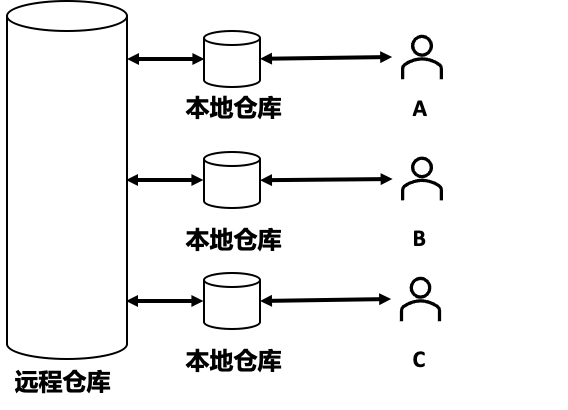
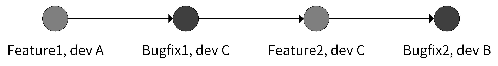
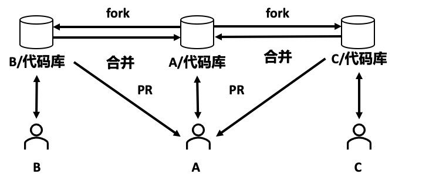

# Git 工作流

## 集中式工作流

集中式工作流是最简单的一种开发方式。集中式工作流的工作模式如下图所示：A、B、C 为 3 位开发者都在本地有一份远程仓库的拷贝：本地仓库。A、B、C 在本地的 master 分支开发完代码之后，将修改后的代码 commit 到远程仓库，如果有冲突就先解决本地的冲突再提交。



在进行了一段时间的开发之后，远程仓库 master  分支的日志可能如下图所示：



集中式工作流是最简单的开发模式，但它的缺点也很明显：不同开发人员的提交日志混杂在一起，难以定位问题。如果同时开发多个功能，不同功能同时往 master 分支合并，代码之间也会相互影响，从而产生代码冲突。和其他工作流相比，集中式工作流程的代码管理较混乱，容易出问题，因此适合用在团队人数少、开发不频繁、不需要同时维护多个版本的小项目中。

## 功能分支工作流

功能分支工作流在开发新功能时，基于 master 分支新建一个功能分支，在功能分支上进行开发，而不是直接在本地的 master 分支开发，开发完成之后合并到 master 分支，如下图所示：


相较于集中式工作流，这种工作流让不同功能在不同的分支进行开发，只在最后一步合并到 master 分支，不仅可以避免不同功能之间的相互影响，还可以使提交历史看起来更加简洁。

在合并到 master 分支时，需要提交 PR（pull  request），而不是直接将代码 merge 到 master 分支。PR 流程不仅可以把分支代码提供给团队其他开发人员进行 CR（Code  Review），还可以在 PR 页面讨论代码。通过 CR ，可以确保合并到 master 的代码是健壮的；通过 PR 页面的讨论，可以使开发者充分参与到代码的讨论中，有助于提高代码的质量，并且提供了一个代码变更的历史回顾途径。

功能分支的具体流程为：

- 基于 master 分支新建一个功能分支，功能分支可以取一些有意义的名字，便于理解，例如 feature/rate-limiting。

```shell
$ git checkout -b feature/rate-limiting
```

- 在功能分支上进行代码开发，开发完成后 commit 到功能分支。

```shell
$ git add limit.go
$ git commit -m "add rate limiting"
```

- 将本地功能分支代码 push 到远程仓库。

```shell
$ git push origin feature/rate-limiting
```

- 在远程仓库上创建 PR：进入 GitHub 平台上的项目主页，点击 Compare & pull request 提交 PR


- 代码管理员收到 PR 后，可以 CR 代码，CR 通过后，再点击 Merge pull request 将 PR 合并到 master


Merge pull request 提供了 3 种 merge 方法：

- Create a merge commit：GitHub 的底层操作是 git merge  --no-ff。feature 分支上所有的 commit 都会加到 master 分支上，并且会生成一个 merge commit。这种方式可以清晰地知道是谁做了提交，做了哪些提交，回溯历史的时候也会更加方便。
- Squash and merge：GitHub 的底层操作是 git merge --squash。Squash and merge 会使该 pull request 上的所有 commit 都合并成一个 commit ，然后加到 master 分支上，但原来的 commit 历史会丢失。如果开发人员在 feature 分支上提交的 commit 非常随意，没有规范，那么可以选择这种方法来丢弃无意义的 commit。但是在大型项目中，每个开发人员都应该是遵循  commit 规范的，因此不建议在团队开发中使用 Squash and merge。
- Rebase and merge：GitHub  的底层操作是 git rebase。这种方式会将 pull request 上的所有提交历史按照原有顺序依次添加到 master  分支的头部（HEAD）。因为 git rebase 有风险，在不完全熟悉 Git 工作流时，不建议 merge  时选择这个。

在实际的项目开发中，推荐你使用 Create a merge commit 方式。

## Git Flow 工作流

Git Flow 工作流是一个非常成熟的方案，也是非开源项目中最常用到的工作流。它定义了一个围绕项目发布的严格分支模型，通过为代码开发、发布和维护分配独立的分支来让项目的迭代流程更加顺畅，比较适合大型的项目或者迭代速度快的项目。

Git Flow 中定义了 5 种分支，分别是 master、develop、feature、release 和 hotfix。其中，master 和 develop 为常驻分支，其他为非常驻分支，不同的研发阶段会用到不同的分支。

| **分支名** | **描述**                                                     |
| ---------- | ------------------------------------------------------------ |
| master     | 该分支上的最新代码永远是发布状态，不能直接在该分支上开发。master 分支每合并一个 hotfix/release 分支，都会打一个版本标签。 |
| develop    | 该分支上的代码是开发中的最新代码，该分支只做合并操作，不能直接在该分支上开发。 |
| feature    | 在研发阶段用来做功能开发。一个新功能会基于 develop 分支新建一个 feature 分支，分支名建议命名为：feature/xxxx-xxx。功能开发完成之后，会合并到 develop 分支并删除。这里有一点需要注意，feature 分支在申请合并之前，最好是先 pull 一下 develop 分支，看一下有没有冲突，如果有就先解决冲突，然后再申请合并。 |
| release    | 在发布阶段用作版本发布的预发布分支，基于 develop 分支创建，分支名建议命名为：release/xxxx-xxx。例如：v1.0.0 版本的功能全部开发测试完成后，提交到 develop 分支，然后基于 develop 分支创建 release/1.0.0 分支，并提交测试，测试中遇到的问题在 release 分支修改。最终通过测试后，将 release 分支合并到 master 和 develop，并在 master 分支打上 v1.0.0 的版本标签，最后删除 release/1.0.0 分支。 |
| hotfix     | 在维护阶段用作紧急 bug 修复分支，在 master 分支上创建，修复完成后合并到 master。分支名建议命名为 hotfix/xxxx-xxx。例如：当线上某个版本出现 Bug 后，从 master 检出对应版本的代码，创建 hotfix 分支，并在 hotfix 分支修复问题。问题修复后，将 hotfix 分支合并到 master 和 develop分支，并在 master 分支打上修复后的版本标签，最后删除 hotfix 分支。 |

这里用一个实际的例子来演示下 Git  Flow 的开发流程。场景如下：

- a. 当前版本为：0.9.0。
- b. 需要新开发一个功能，使程序执行时向标准输出输出“hello  world”字符串。
- c. 在开发阶段，线上代码有 Bug 需要紧急修复。

假设 Git 项目名为 gitflow-demo，项目目录下有 2 个文件，分别是 README.md 和 main.go，内容如下：

```go
package main

import "fmt"

func main() {
  fmt.Println("callmainfunction")
}
```

- 创建一个常驻的分支：develop

```shell
$ git checkout -b develop master
```

- 基于 develop 分支，新建一个功能分支：feature/print-hello-world

```shell
$ git checkout -b feature/print-hello-world develop
```

- 在 feature/print-hello-world 分支中，在 main.go 文件中添加一行代码 fmt.Println("Hello")。

```go
package main

import "fmt"

func main() {
  fmt.Println("callmainfunction")
  fmt.Println("Hello")
}
```

- 紧急修复 Bug

```shell
$ git stash # 1. 开发工作只完成了一半，还不想提交，可以临时保存修改至堆栈区
$ git checkout -b hotfix/print-error master # 2. 从 master 建立 hotfix 分支
$ vi main.go # 3. 修复 bug，callmainfunction -> call main function
$ git commit -a -m 'fix print message error bug' # 4. 提交修复
$ git checkout develop # 5. 切换到 develop 分支
$ git merge --no-ff hotfix/print-error # 6. 把 hotfix 分支合并到 develop 分支
$ git checkout master # 7. 切换到 master 分支
$ git merge --no-ff hotfix/print-error # 8. 把 hotfix 分支合并到 master
$ git tag -a v0.9.1 -m "fix log bug" # 9. master 分支打 tag
$ go build -v . # 10. 编译代码，并将编译好的二进制更新到生产环境
$ git branch -d hotfix/print-error # 11. 修复好后，删除 hotfix/xxx 分支
$ git checkout feature/print-hello-world # 12. 切换到开发分支下
$ git merge --no-ff develop # 13. 因为 develop 有更新，这里最好同步更新下
$ git stash pop # 14. 恢复到修复前的工作状态
```

- 继续开发：在 main.go 中加入 fmt.Println("Hello World")。
- 提交代码到 feature/print-hello-world 分支

```shell
$ git commit -a -m "print 'hello world'"
```

- 在 feature/print-hello-world 分支上做 code review
  - 将 feature/print-hello-world push 到代码托管平台，例如 GitHub 上。
```shell
$ git push origin feature/print-hello-world
```

  - 在 GitHub 上，基于 feature/print-hello-world 创建 pull request
  - code review 通过后，由代码仓库 matainer 将功能分支合并到 develop 分支。

```shell
$ git checkout develop
$ git merge --no-ff feature/print-hello-world
```

- 基于 develop 分支，创建 release 分支，测试代码

```shell
$ git checkout -b release/1.0.0 develop
$ go build -v . # 构建后，部署二进制文件，并测试
```

- 测试失败，因为要求打印“hello world”，但打印的是“Hello World”，修复时直接在 release/1.0.0 分支修改代码，修改完成后，提交并编译部署。

```shell
$ git commit -a -m "fix bug"
$ go build -v .
```

- 测试通过后，将功能分支合并到 master 分支和 develop 分支。

```shell
$ git checkout develop
$ git merge --no-ff release/1.0.0
$ git checkout master
$ git merge --no-ff release/1.0.0
$ git tag -a v1.0.0 -m "add print hello world" # master 分支打 tag
```

- 删除 feature/print-hello-world 分支，也可以选择性删除 release/1.0.0 分支。

```shell
$ git branch -d feature/print-hello-world
```

Git Flow 工作流的优点是：Git Flow 工作流的每个分支分工明确，这可以最大程度减少它们之间的相互影响。因为可以创建多个分支，所以也可以并行开发多个功能。另外，和功能分支工作流一样，它也可以添加 code review，保障代码质量。因此，Git Flow 工作流比较适合开发团队相对固定，规模较大的项目。

## Forking 工作流

Git Flow 是非开源项目中最常用的，而在开源项目中，最常用到的是 Forking 工作流，例如 Kubernetes、Docker 等项目用的就是这种工作流。

fork 操作是在个人远程仓库新建一份目标远程仓库的副本，比如在 GitHub 上操作时，在项目的主页点击 fork 按钮，即可拷贝该目标远程仓库。

Forking 工作流的流程如下：



假设开发者 A 拥有一个远程仓库，如果开发者 B 也想参与 A 项目的开发，B 可以 fork 一份 A 的远程仓库到自己的 Github 账号下。后续 B 可以在自己的项目进行开发，开发完成后，B 可以给 A 提交一个 PR。这时候 A 会收到通知，得知有新的 PR 被提交，A 会去查看 PR 并 code review。如果有问题，A 会直接在 PR 页面提交评论，B 看到评论后会做进一步的修改。最后 A 通过 B 的 PR  请求，将代码合并进了 A 的仓库。这样就完成了 A 代码仓库新特性的开发。如果有其他开发者想给 A 贡献代码，也会执行相同的操作。

GitHub 中的 Forking 工作流有 6 步：

- Fork 远程仓库到自己的账号下
- 克隆 fork 的仓库到本地

```shell
$ git clone https://github.com/colin404fork/gitflow-demo
$ cd gitflow-demo
$ git remote add upstream https://github.com/marmotedu/gitflow-demo
$ git remote set-url --push upstream no_push # Never push to upstream master
$ git remote -v # Confirm that your remotes make sense
origin  https://github.com/colin404fork/gitflow-demo (fetch)
origin  https://github.com/colin404fork/gitflow-demo (push)
upstream  https://github.com/marmotedu/gitflow-demo (fetch)
upstream  https://github.com/marmotedu/gitflow-demo (push)
```

- 创建功能分支

  - 要同步本地仓库的 master 分支为最新的状态（跟 upstream master 分支一致）。通过rebase upstream/master 这个操作，可以确保本地仓库跟远程仓库的master分支保持一致。然后再基于本地的master分支创建一个功能分支，基于这个功能分支进行开发。如果没有 rebase upstream/master 这步操作，本地创建的功能分支可能是基于本地比较老的代码来创建的，这样最终在合并到 upstream 的 master 分支时，可能会有冲突。

  ```shell
  $ git fetch upstream
  $ git checkout master
  $ git rebase upstream/master
  ```

  - 创建功能分支。

  ```shell
  $ git checkout -b feature/add-function
  ```

- 提交 commit

```shell
$ git fetch upstream # commit 前需要再次同步 feature 跟 upstream/master
$ git rebase upstream/master
$ git add <file>
$ git status
$ git commit
```

分支开发完成后，可能会有一堆 commit，但是合并到主干时，希望只有一个commit，便于后面的阅读和维护。这时，可以用 git rebase 来合并和修改 commit：

```shell
$ git rebase -i origin/master
```

- push 功能分支到个人远程仓库

```shell
$ git push -f origin feature/add-function
```

- 在个人远程仓库页面创建 pull request：提交到远程仓库以后，就可以创建 pull request，然后请求 reviewers 进行代码 review，确认后合并到 master。这里要注意，创建 pull request 时，base 通常选择目标远程仓库的 master 分支。

Forking 工作流中，项目远程仓库和开发者远程仓库完全独立，开发者通过提交 Pull Request 的方式给远程仓库贡献代码，项目维护者选择性地接受任何开发者的提交。通过这种方式，可以避免授予开发者项目远程仓库的权限，从而提高项目远程仓库的安全性，这也使得任意开发者都可以参与项目的开发。但 Forking 工作流也有局限性，就是对于职能分工明确且不对外开源的项目优势不大。Forking  工作流比较适用于以下三种场景：

- 开源项目中
- 开发者有衍生出自己的衍生版的需求
- 开发者不固定，可能是任意一个能访问到项目的开发者

## 总结

集中式工作流是最早的 Git 工作流，功能分支工作流以集中式工作流为基础，Git Flow 工作流又是以功能分支工作流为基础，Forking 工作流在 Git Flow 工作流基础上，解耦了个人远端仓库和项目远端仓库。每种开发模式各有优缺点，适用于不同的场景：

| **工作流**      | **优点**                                                     | **缺点**                                   | **使用场景**                                                 |
| --------------- | ------------------------------------------------------------ | ------------------------------------------ | ------------------------------------------------------------ |
| 集中式工作流    | 上手最简单                                                   | 代码管理较混乱，容易出问题                 | 团队人数少，开发不频繁，不需要同时维护多个版本的小项目       |
| 功能分支工作流  | 上手比较简单，支持并行开发，支持Code Review                  | 无法给分支分配明确的目的，不利于团队配合   | 开发团队相对固定、规模较小的项目                             |
| Git  Flow工作流 | 每个分支分工明确，这可以最大程度减少它们之间的相互影响，可以并行开发，支持Code Review | 一定的上手难度                             | 比较适合开发团队相对固定，规模较大的项目                     |
| Forking工作流   | 完全解耦个人远端仓库和项目远端仓库，最大程度上保证项目远端仓库的安全 | 对于职能分工明确且不对外开源的项目优势不大 | 比较适用于开源项目中，或者开发者有衍生出自己的衍生版的需求，或者开发者不固定，可能是任意一个能访问到项目的开发者 |
