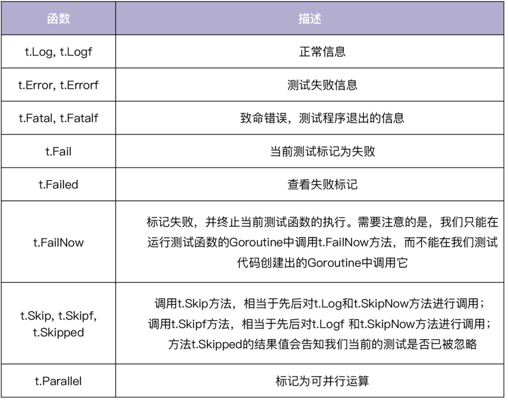

# 测试

## testing包

### 命名规范

testing 包需要在编写测试文件、测试函数、测试变量时遵循一定的规范。这些规范有些来自于官方，有些则来自于社区。

- 测试文件的命名规范：Go 的测试文件名必须以 _test.go 结尾。例如，如果有一个名为 person.go 的文件，那它的测试文件必须命名为 person_test.go。这样做是因为，Go 需要区分哪些文件是测试文件。这些测试文件可以被 go test 命令行工具加载，用来测试编写的代码，但会被 Go 的构建程序忽略掉，因为 Go 程序的运行不需要这些测试代码。
- 包的命名规范：Go 的测试可以分为白盒测试和黑盒测试。
  - 白盒测试：将测试和生产代码放在同一个 Go 包中，这使我们可以同时测试 Go 包中可导出和不可导出的标识符。当编写的单元测试需要访问 Go 包中不可导出的变量、函数和方法时，就需要编写白盒测试用例。在白盒测试中，Go 的测试包名称需要跟被测试的包名保持一致，例如：person.go 定义了一个 person 包，则 person_test.go 的包名也要为 person，这也意味着 person.go 和 person_test.go 都要在同一个目录中。
  - 黑盒测试：将测试和生产代码放在不同的 Go 包中。这时，仅可以测试 Go 包的可导出标识符。这意味着测试包将无法访问生产代码中的任何内部函数、变量或常量。在黑盒测试中，Go 的测试包名称需要跟被测试的包名不同，但仍然可以存放在同一个目录下。比如，person.go 定义了一个 person 包，则 person_test.go 的包名需要跟 person 不同，通常命名为 person_test 。如果不是需要使用黑盒测试，在做单元测试时要尽量使用白盒测试。一方面，这是 go test 工具的默认行为；另一方面，使用白盒测试，可以测试和使用不可导出的标识符。
- 函数的命名规范：测试用例函数必须以 Test、Benchmark、Example 开头，例如 TestXxx、BenchmarkXxx、ExampleXxx，Xxx部分为任意字母数字的组合，首字母大写。这是由 Go 语言和 go test 工具来进行约束的，Xxx一般是需要测试的函数名。
- 变量的命名规范：Go 语言和 go test 没有对变量的命名做任何约束。但是，在编写单元测试用例时，还是有一些规范值得去遵守。单元测试用例通常会有一个实际的输出，在单元测试中，会将预期的输出跟实际的输出进行对比，来判断单元测试是否通过。为了清晰地表达函数的实际输出和预期输出，可以将这两类输出命名为expected/actual，或者 got/want。

## 单元测试

开发完一段代码后，第一个执行的测试就是单元测试。它可以保证代码是符合预期的，一些异常变动能够被及时感知到。进行单元测试，不仅需要编写单元测试用例，还需要确保代码是可测试的，以及具有一个高的单元测试覆盖率。

### go test

单元测试用例函数以 Test 开头，例如 TestXxx 或 Test_xxx（ Xxx 部分为任意字母数字组合，首字母大写）。函数参数必须是 *testing.T，可以使用该类型来记录错误或测试状态。可以调用 testing.T 的 Error 、Errorf 、FailNow  、Fatal 、FatalIf 方法，来说明测试不通过。调用 Log 、Logf 方法来记录测试信息。



go test 命令自动搜集所有的测试文件，也就是格式为 *_test.go 的文件，从中提取全部测试函数并执行。go test 还支持下面三个参数。

- -v：显示所有测试函数的运行细节

```shell
$ go test -v
=== RUN   TestAbs
--- PASS: TestAbs (0.00s)
=== RUN   TestMax
--- PASS: TestMax (0.00s)
PASS
ok      github.com/marmotedu/gopractise-demo/31/test    0.002s
```

- -run < regexp>：指定要执行的测试函数

```shell
$ go test -v -run='TestA.*'
=== RUN   TestAbs
--- PASS: TestAbs (0.00s)
PASS
ok      github.com/marmotedu/gopractise-demo/31/test    0.001s
```

- -count N：指定执行测试函数的次数

```shell
$ go test -v -run='TestA.*' -count=2
=== RUN   TestAbs
--- PASS: TestAbs (0.00s)
=== RUN   TestAbs
--- PASS: TestAbs (0.00s)
PASS
ok      github.com/marmotedu/gopractise-demo/31/test    0.002s
```

#### TestMain()

有时候，在做测试的时候，可能会在测试之前做些准备工作，例如创建数据库连接等；在测试之后做些清理工作，例如关闭数据库连接、清理测试文件等。这时，可以在 _test.go 文件中添加 TestMain 函数，其入参为 *testing.M。

TestMain 是一个特殊的函数（相当于 main  函数），测试用例在执行时，会先执行 TestMain 函数，然后可以在 TestMain 中调用 m.Run() 函数执行普通的测试函数。在 m.Run() 函数前，可以编写准备逻辑，在 m.Run() 后面可以编写清理逻辑。

### Mock测试

一般来说，单元测试中是不允许有外部依赖的，那么也就是说，这些外部依赖都需要被模拟。在 Go 中，一般会借助各类 Mock  工具来模拟一些依赖。

#### GoMock

GoMock 是由 Golang 官方开发维护的测试框架，实现了较为完整的基于 interface 的 Mock  功能，能够与 Golang 内置的 testing 包良好集成，也能用于其他的测试环境中。GoMock 测试框架包含了 GoMock 包和  mockgen 工具两部分，其中 GoMock 包用来完成对象生命周期的管理，mockgen 工具用来生成 interface 对应的 Mock 类源文件。

gomock  支持以下输入参数匹配：

- gomock.Any()：可以用来表示任意的入参。
- gomock.Eq(value)：用来表示与 value  等价的值。
- gomock.Not(value)：用来表示非 value 以外的值。
- gomock.Nil()：用来表示 None 值。

如下例，GetBody 接收 2 个入参

```go
mockSpider.EXPECT().GetBody(gomock.Any(), gomock.Eq("admin")).Return("go1.8.3")
```

gomock 的返回值如下：

```go
func (c *Call) After(preReq *Call) *Call // After声明调用在preReq完成后执行
func (c *Call) AnyTimes() *Call // 允许调用次数为 0 次或更多次
func (c *Call) Do(f interface{}) *Call // 声明在匹配时要运行的操作
func (c *Call) MaxTimes(n int) *Call // 设置最大的调用次数为 n 次
func (c *Call) MinTimes(n int) *Call // 设置最小的调用次数为 n 次
func (c *Call) Return(rets ...interface{}) *Call //  // 声明模拟函数调用返回的值
func (c *Call) SetArg(n int, value interface{}) *Call // 声明使用指针设置第 n 个参数的值
func (c *Call) Times(n int) *Call // 设置调用次数为 n 次
```

#### 其他mock工具

- sqlmock：可以用来模拟数据库连接。数据库是项目中比较常见的依赖，在遇到数据库依赖时都可以用它。
- httpmock：可以用来 Mock HTTP 请求。
- bouk/monkey：猴子补丁，能够通过替换函数指针的方式来修改任意函数的实现。如果 golang/mock、sqlmock 和 httpmock 这几种方法都不能满足需求，可以尝试用猴子补丁的方式来 Mock 依赖。可以这么说，猴子补丁提供了单元测试 Mock 依赖的最终解决方案。

### 覆盖率

检查单元测试覆盖率

- 生成测试覆盖率数据 coverage.out

```shell
$ go test -coverprofile=coverage.out
```

-  分析覆盖率文件

```shell
$ go tool cover -func=coverage.out
```

- 生成HTML格式的分析文件

```shell
$ go tool cover -html=coverage.out -o coverage.html
```

### 自从生成

使用 gotests 工具自动生成单元测试代码，减少编写单元测试用例的工作量，从重复的劳动中解放出来。通过 gotests 可以自动生成单元测试文件及测试函数。

```shell
$ gotests -all -w .
```

## 示例测试

### go test

示例测试以 Example 开头，没有输入和返回参数，通常保存在 example_test.go 文件中。示例测试可能包含以 Output: 或者 Unordered output: 开头的注释，这些注释放在函数的结尾部分。Unordered output: 开头的注释会忽略输出行的顺序。

执行 go  test 命令时，会执行这些示例测试，并且 go test  会将示例测试输出到标准输出的内容，跟注释作对比。如果相等，则示例测试通过测试；如果不相等，则示例测试不通过测试。

```go
func ExampleMax() {
    fmt.Println(Max(1, 2))
    // Output: 2
}
```

#### 命名规范

示例测试需要遵循一些命名规范，因为只有这样，Godoc 才能将示例测试和包级别的标识符进行关联。

- 测试函数名：以 Example 开头，后面可以不跟任何字符串，也可以跟函数名、类型名或者类型_方法名，中间用下划线_连接。

## 接口测试

### 接口 Mock

- [golang/mock](https://github.com/golang/mock) 是官方提供的 Mock  框架。它实现了基于 interface 的 Mock 功能，能够与 Golang 内置的 testing 包做很好的集成，是最常用的 Mock  工具。golang/mock 提供了 mockgen 工具用来生成 interface 对应的 Mock  源文件。
- [sqlmock](https://github.com/DATA-DOG/go-sqlmock) 可以用来模拟数据库连接。数据库是项目中比较常见的依赖，在遇到数据库依赖时都可以用它。
- [httpmock](https://github.com/jarcoal/httpmock) 可以用来 Mock HTTP 请求。
- [bouk/monkey](https://github.com/bouk/monkey) 猴子补丁，能够通过替换函数指针的方式来修改任意函数的实现。如果 golang/mock、sqlmock 和 httpmock 这几种方法都不能满足我们的需求，我们可以尝试通过猴子补丁的方式来 Mock 依赖。可以这么说，猴子补丁提供了单元测试  Mock 依赖的最终解决方案。

### 接口性能 wrk

在 API 上线之前，需要知道 API 的性能，以便摸清所能承载的最大请求量、性能瓶颈，再根据业务对性能的要求，来对 API 进行性能调优或扩缩容。通过这些，可以使 API 稳定地对外提供服务，并且让请求在合理的时间内返回。当前主要通过 wrk 工具来测试 API 接口的性能。

#### 接口性能

API 接口性能与 API 具体的实现，如有无数据库连接、有无复杂的逻辑处理等有关。用来衡量 API 接口性能的指标主要有 3 个指标：

- 并发数（Concurrent）：并发数是指某个时间范围内，同时在使用系统的用户个数。广义上的并发数是指同时使用系统的用户个数，这些用户可能调用不同的 API。严格意义上的并发数是指同时请求同一个 API 的用户个数。
- 请求响应时间（TTLB）：请求响应时间指的是从客户端发出请求到得到响应的整个时间。这个过程从客户端发起的一个请求开始，到客户端收到服务器端的响应结束。在一些工具中，请求响应时间通常会被称为TTLB（Time to last byte，意思是从发送一个请求开始，到客户端收到最后一个字节的响应为止所消费的时间）。请求响应时间的单位一般为"秒”或“毫秒”。
- 每秒查询数（QPS）：每秒查询数 QPS 是对一个特定的查询 API 在规定时间内所处理流量多少的衡量标准。QPS = 并发数 / 平均请求响应时间。

这 3 个指标中，衡量 API 性能的最主要指标是 QPS，但是在说明 QPS 时，需要指明是多少并发数下的 QPS，否则毫无意义，因为不同并发数下的 QPS 是不同的。举个例子，单用户100 QPS 和 100 用户 100 QPS 是两个不同的概念，前者说明 API 可以在一秒内串行执行 100 个请求，而后者说明在并发数为 100 的情况下，API 可以在一秒内处理 100 个请求。当 QPS 相同时，并发数越大，说明 API 性能越好，并发处理能力越强。

在并发数设置过大时，API 同时要处理很多请求，会频繁切换上下文，而真正用于处理请求的时间变少，反而使得 QPS 会降低。并发数设置过大时，请求响应时间也会变长。API 会有一个合适的并发数，在该并发数下，API 的 QPS 可以达到最大，但该并发数不一定是最佳并发数，还要参考该并发数下的平均请求响应时间。

此外，在有些 API 接口中，也会测试 API 接口的 TPS（Transactions Per Second）。一个事务是指客户端向服务器发送请求，然后服务器做出反应的过程。客户端在发送请求时开始计时，收到服务器响应后结束计时，以此来计算使用的时间和完成的事务个数。那么，TPS 和 QPS 有什么区别呢？如果是对一个单一查询接口（单场景）压测，且这个接口内部不会再去请求其他接口，那么 TPS=QPS。如果是对多个接口（混合场景）压测，假设 N 个接口都是查询接口，且这个接口内部不会再去请求其他接口，QPS=N*TPS。

不同项目对 API 接口的性能要求不同，同一项目对每个 API 接口的性能要求也不同，所以并没有一个统一的数值标准来衡量 API 接口的性能。但可以肯定的是，性能越高越好。根据自己的研发经验，在这里给出一个参考值（并发数可根据需要选择）：

| **指标名称** | **要求**                                                     |
| ------------ | ------------------------------------------------------------ |
| 响应时间     | 小于 500 ms，如果大于 500ms 的 API 接口通常需要优化          |
| 请求成功率   | 99.95%                                                       |
| QPS          | 在满足预期要求的情况下，服务器状态稳定，单台服务器 QPS 要求在 1000+ |

#### wrk

wrk 的常用参数列举如下：

- -t：线程数。线程数不要太多，是核数的 2 到 4 倍就行，多了反而会因为线程切换过多造成效率降低。
- -c：并发数。
- -d：测试的持续时间，默认为10s。
- -T：请求超时时间。
- -H：指定请求的 HTTP Header，有些 API 需要传入一些Header，则可以通过 wrk 的 -H 参数来传入。
- --latency：打印响应时间分布。
- -s：指定 Lua 脚本，Lua 脚本可以实现更复杂的请求。

例子

```shell
wrk -t4 -c300 -d10s -T5s --latency http://127.0.0.1:8080/healthz
```

```shell
Running 10s test @ http://127.0.0.1:8080/healthz
  4 threads and 300 connections
  Thread Stats   Avg      Stdev     Max   +/- Stdev
    Latency     2.69ms    5.04ms 109.58ms   94.29%
    Req/Sec    27.24k     9.65k   58.16k    68.86%
  Latency Distribution
     50%    1.68ms
     75%    2.22ms
     90%    4.89ms
     99%   24.67ms
  1085953 requests in 10.08s, 122.21MB read
  Socket errors: connect 51, read 49, write 0, timeout 0
Requests/sec: 107712.76
Transfer/sec:     12.12MB
```

下面是对测试结果的解析。

- 4 threads and 300 connections：用 4 个线程模拟 300 个连接，分别对应 -t 和 -c 参数。
- Thread Stats：线程统计，包括 Latency 和 Req/Sec。
  - Latency：响应时间，有平均值、标准偏差、最大值、正负一个标准差占比。
  - Req/Sec：每个线程每秒完成的请求数，同样有平均值、标准偏差、最大值、正负一个标准差占比。
- Latency Distribution：响应时间分布。
  - 50%：50% 的响应时间为 1.68ms。
  - 75%：75% 的响应时间为 2.22ms。
  - 90%：90% 的响应时间为 4.80ms。
  - 99%：99% 的响应时间为 24.67ms。
- 1085953 requests in 10.08s, 122.21MB read：10.08s 完成的总请求数（1085953 ）和数据读取量（122.21MB）。
- Socket errors: connect 51, read 49, write 0, timeout 0：错误统计，会统计 connect 连接失败请求个数（51）、读失败请求个数、写失败请求个数、超时请求个数。
- Requests/sec：107712.76 QPS。
- Transfer/sec：平均每秒读取 12.12MB 数据（吞吐量）。

### wrktest.sh脚本

在做 API 接口的性能测试时，需要先执行 wrk，生成性能测试数据。为了能够更直观地查看性能数据，还需要以图表的方式展示这些性能数据。[本脚本](18_api/scripts/wrktest.sh)使用 gnuplot 工具来自动化地绘制这些性能图，为此需要确保已经安装了 gnuplot 工具。

为了方便测试 API 接口性能，脚本将性能测试和绘图逻辑封装在一起，可以在目录下执行如下命令，生成性能测试数据和性能图表：

```shell
scripts/wrktest.sh http://127.0.0.1:8080/healthz
```

上面的命令会执行性能测试，记录性能测试数据，并根据这些性能测试数据绘制出 QPS 和成功率图。

wrktest.sh 也可以对比前后两次的性能测试结果，并将对比结果通过图表展示出来。wrktest.sh 会启动 4 个线程数（-t），默认会测试多个并发下的API性能，默认测试的并发数为 20 50 100 300，根据自己的服务器配置选择测试的最大并发数。

上面的命令默认会在 `_output/wrk/` 目录下生成 3 个文件：

- apiserver.dat：wrk 性能测试结果，每列含义分别为并发数、QPS 平均响应时间、成功率。
- apiserver_qps_ttlb.png：QPS&TTLB 图。
- apiserver_successrate.png：成功率图。

## 性能测试

### go test

性能测试的用例函数必须以 Benchmark 开头，例如 BenchmarkXxx 或 Benchmark_Xxx（ Xxx  部分为任意字母数字组合，首字母大写）。函数参数必须是 *testing.B，函数内以 b.N 作为循环次数，其中 N 会在运行时动态调整，直到性能测试函数可以持续足够长的时间，以便能够可靠地计时。

go test 命令默认不会执行性能测试函数，需要通过指定参数 -bench 来运行性能测试函数。-bench 后可以跟正则表达式，选择需要执行的性能测试函数，例如 go test -bench=".*" 表示执行所有的压力测试函数。

- benchmem：输出内存分配统计。指定了-benchmem 参数后，执行结果中又多了两列： 0 B/op，表示每次执行分配了多少内存（字节），该值越小，说明代码内存占用越小；0  allocs/op，表示每次执行分配了多少次内存，该值越小，说明分配内存次数越少，意味着代码性能越高。
- benchtime：指定测试时间和循环执行次数（格式需要为 Nx，例如 100x）。
- cpu：指定 GOMAXPROCS。
- timeout：指定测试函数执行的超时时间。

## 代码可测试性

如果要对函数 A 进行测试，并且 A 中的所有代码均能够在单元测试环境下按预期被执行，那么函数 A 的代码块就是可测试的。

但在单元测试环境中：1/ 可能无法连接数据库；2/ 可能无法访问第三方服务。如果函数 A 依赖数据库连接、第三方服务，那么在单元测试环境下执行单元测试就会失败，函数就没法测试，函数是不可测的。解决方法是将依赖的数据库、第三方服务等抽象成接口，在被测代码中调用接口的方法，在测试时传入 mock 类型，从而将数据库、第三方服务等依赖从具体的被测函数中解耦出去。


为了提高代码的可测性，降低单元测试的复杂度，对 function 和 mock 的要求是：

- 要尽可能减少 function 中的依赖，让 function 只依赖必要的模块。编写一个功能单一、职责分明的函数，会有利于减少依赖。
- 依赖模块应该是易 Mock 的。

举个简单的例子：

- 不可测试代码：ListPosts 函数是不可测试的。因为 ListPosts 函数中调用了client.ListPosts() 方法，该方法依赖于一个 gRPC 连接。

```go
package post

import "google.golang.org/grpc"

type Post struct {
  Name    string
  Address string
}

func ListPosts(client *grpc.ClientConn) ([]*Post, error) {
  return client.ListPosts()
}
```

- 可测试代码：ListPosts 函数入参为 Service 接口类型，只要我们传入一个实现了 Service 接口类型的实例，ListPosts 函数即可成功运行。

```go
package main

type Post struct {
  Name    string
  Address string
}

type Service interface {
  ListPosts() ([]*Post, error)
}

func ListPosts(svc Service) ([]*Post, error) {
  return svc.ListPosts()
}
```

测试代码如下：

```go
package main

import "testing"

type fakeService struct {
}

func NewFakeService() Service {
  return &fakeService{}
}

func (s *fakeService) ListPosts() ([]*Post, error) {
  posts := make([]*Post, 0)
  posts = append(posts, &Post{
    Name:    "colin",
    Address: "Shenzhen",
  })
  posts = append(posts, &Post{
    Name:    "alex",
    Address: "Beijing",
  })
  return posts, nil
}

func TestListPosts(t *testing.T) {
  fake := NewFakeService()
  if _, err := ListPosts(fake); err != nil {
    t.Fatal("list posts failed")
  }
}
```

## Lab

### 单元测试

- [HelloWorld](10_unit/10_hello/equal_test.go)：

```bash
cd 10_unit/10_hello
go test
```

- [Struct-based](10_unit/11_struct-based/sqrt_test.go)：内部建立 struct list 统一测试

```bash
cd 10_unit/11_struct-based
go test
echo $?
```

- [Math Test](10_unit/12_math-test/math_test.go)：使用 TestMain() 函数做 test 前后准备

```bash
cd 10_unit/12_math-test/
go test
```

- `mock`：为接口 Spider 创建一个 mock

```shell
$ mockgen -destination spider/mock/mock_spider.go -package spider -source spider/spider.go
# 或者
$ cd spider
$ go generate # 通过 spider.go 的注释 //go:generate mockgen -destination ... 生成mock
$ cd .. 
$ go test
```

- [自动生成测试文件](10_unit/90_gotests/math_test.go)：通过 gotests 自动生成测试文件

```bash
cd 10_unit/90_gotests/
gotests -all -w .
# 在 math_test.go 中补全数据，添加测试内容
go test
```

### 示例测试

- [math示例测试](13_example/10_math/example_test.go)：示例测试只对比输出结果

```bash
cd 13_example/10_math/
go test
```

- [大型App示例测试](13_example/20_app/example_app_test.go)：

```bash
cd 13_example/20_app/
go test
```

### 性能测试

- [math性能测试](20_benchmark/12_math-test/math_test.go)：测试 math 函数性能

```bash
cd 20_benchmark/12_math-test/
go test -bench=".*"
```

## apierver 示例

在本章，会为 apiserver 示例添加额外的测试，具体包容“单元测试”和“接口测试”两部分。

### 单元测试

- 在 `Service` 内添加单元测试
- 运行单元测试

```shell
cd 80_server/apiserver/user/service/v1
go test
```

### 接口测试

- 添加接口测试脚本到[此处](80_server/test/api)
- 运行接口测试脚本

```bash
cd 80_server/
./test/api/test.sh api::test::user
```

### 接口性能测试

在测试之前，需要关闭一些 Debug 选项，以免影响性能测试。执行下面这两步操作，修改 apiserver 的配置文件：

- 将 server.mode 设置为 release，server.middlewares 去掉 dump、logger 中间件。
- 将 log.level 设置为 info，log.output-paths 去掉 stdout。

修改完之后，重新启动 apiserver。

```shell
cd 18_api
./scripts/wrktest.sh http://127.0.0.1:8080/v1/policies
```

