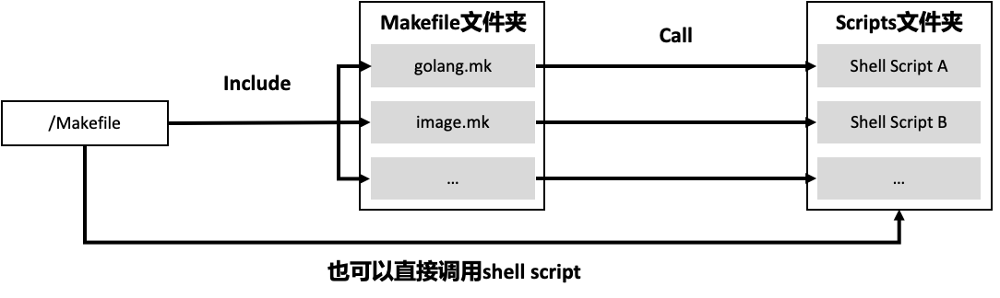

# Makefile

## 简介

Makefile 是高效管理项目的有效手段之一，可以通过 Makefile 来管理项目的启动、编译、打包、部署，为此需要编写 Makefile 文件。通常而言，Go 项目的 Makefile 应该实现以下功能：格式化代码、静态代码检查、单元测试、代码构建、文件清理、帮助等。如果通过 Docker 部署，还需要实现 Docker 镜像打包功能。因为 Go 是跨平台的语言，所以构建和 Docker 打包命令还需要支持不同的 CPU 架构和平台。为了能够更好地控制 Makefile 命令的行为，还需要支持 Options。

## 功能

- 代码生成类：
  - gen: Generate all necessary files, such as error code files.  
- 格式化类：
  - format: Gofmt (reformat) package sources (exclude vendor dir if existed). 
- 静态代码检查：
  - lint: Check syntax and styling of  go sources.
- 测试类：

  - test: Run unit test.  
  - cover: Run unit test and get test coverage. 
- 构建类

  - build: Build source code for host platform. 
  - build.multiarch: Build source  code for multiple platforms.
- Docker类

  - image: Build docker images for host arch.  

  - image.multiarch: Build docker images for multiple platforms. 

  - push: Build docker images for host arch and push images to  registry.  

  - push.multiarch: Build docker images for multiple platforms and push images to registry.  
- 部署类
  - deploy: Deploy  updated components to development env.  
- 清理类
  - clean: Remove all files that are created by building.  

## 目录结构

对于大型项目来说，需要管理的内容很多，所有管理功能都集成在一个 Makefile 中，可能会导致 Makefile 很大，难以阅读和维护，所以建议采用分层的设计方法。

根目录下的 Makefile 聚合所有的 Makefile 命令，具体实现则按功能分类，放在另外的 Makefile 中。经常会在 Makefile 命令中集成 shell 脚本，但如果 shell 脚本过于复杂，也会导致 Makefile 内容过多，难以阅读和维护。并且在 Makefile 中集成复杂的 shell 脚本，编写体验也很差。对于这种情况，可以将复杂的 shell 命令封装在 shell 脚本中，供 Makefile 直接调用，而一些简单的命令则可以直接集成在 Makefile 中。

在如下的 Makefile 组织方式中，根目录下的 Makefile 聚合了项目所有的管理功能。同时，还将这些功能进行分类，把相同类别的放在同一个 Makefile 中，这样可以使得 Makefile  更容易维护。对于复杂的命令，则编写成独立的 shell 脚本，并在 Makefile 命令中调用这些 shell 脚本。



具体目录结构如下：

```text
├── Makefile
├── scripts
│   ├── gendoc.sh
│   ├── make-rules
│   │   ├── gen.mk
│   │   ├── golang.mk
│   │   ├── image.mk
│   │   └── ...
    └── ...
```

## 规则

Makefile 的规则一般由 target、prerequisites 和 command 组成，用来指定源文件编译的先后顺序。Makefile 之所以受欢迎，核心原因就是 Makefile 规则，因为 Makefile 规则可以自动判断是否需要重新编译某个目标，从而确保目标仅在需要时编译。

```makefile
target ...: prerequisites ...
    command
    ...
    ...
```

### target

可以是一个 object file（目标文件），也可以是一个执行文件，还可以是一个标签（label）。target  可使用通配符，当有多个目标时，目标之间用空格分隔。

### prerequisites

代表生成该 target 所需要的依赖项。当有多个依赖项时，依赖项之间用空格分隔。

### command

代表该 target 要执行的命令（可以是任意的 shell  命令）。

- 在执行 command 之前，默认会先打印出该命令，然后再输出命令的结果；如果不想打印出命令，可在各个 command 前加上@。
- command 可以为多条，也可以分行写，但每行都要以 tab 键开始。
- 如果后一条命令依赖前一条命令，则这两条命令需要写在同一行，并用分号进行分隔。
- 如果要忽略命令的出错，需要在各个 command 之前加上减号 -。

只要 targets 不存在，或 prerequisites 中有一个以上的文件比 targets 文件新，那么 command 所定义的命令就会被执行，从而产生需要的文件，或执行期望的操作。

一个具体的 Makefile 包括：

```text
build              Build source code for host platform.
build.multiarch    Build source code for multiple platforms. 
image              Build docker images for host arch.
image.multiarch    Build docker images for multiple platforms. 
push               Build docker images for host arch and push images to registry.
push.multiarch     Build docker images for multiple platforms and push images to registry.
deploy             Deploy updated components to development env.
clean              Remove all files that are created by building.
lint               Check syntax and styling of go sources.
test               Run unit test.
cover              Run unit test and get test coverage.
release            Release iam
format             Gofmt (reformat) package sources.
verify-copyright   Verify the boilerplate headers for all files.
add-copyright      Ensures source code files have copyright license headers.
gen                Generate all necessary files, such as error code files.
ca                 Generate CA files for all iam components.
install            Install iam system with all its components.
swagger            Generate swagger document.
serve-swagger      Serve swagger spec and docs.
dependencies       Install necessary dependencies.
tools              install dependent tools.
check-updates      Check outdated dependencies of the go projects.
help               Show this help info.
```

### .PHONY

在 Makefile 中，`.PHONY`后面的 target 表示的是一个伪造的 target，而不是真实存在的文件 target。make 命令后面跟的参数如果出现在 .PHONY 定义的伪目标中，那就直接在 Makefile 中就执行伪目标的依赖和命令。不管 Makefile 同级目录下是否有该伪目标同名的文件，即使有也不会产生冲突。

## Lab

### Hello-World

```bash
cd 10_hello-world
make clean
make hello
make clean
```

## apiserver 示例

- [apiserver 示例](80_server/README.md)：为 apiserver 示例添加 Makefile 自动化构建。

## Ref

1. [跟我一起写Makefile](https://github.com/seisman/how-to-write-makefile)
