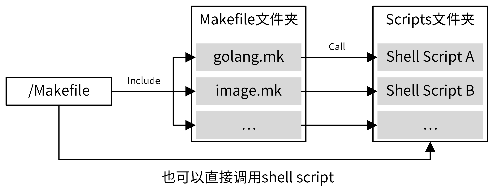

# Makefile

## 简介

要能够高效地管理项目。有效手段之一，就是通过 Makefile 来管理我们的项目，这就要求我们要为项目编写 Makefile 文件。

## 功能

- 代码生成类：
  - gen: Generate all necessary files, such as error code files.  
- 格式化类：
  - format: Gofmt (reformat) package sources (exclude vendor dir if existed). 
- 静态代码检查：
  - lint: Check syntax and styling of  go sources.
- 测试类：

  - test: Run unit test.  
  - cover: Run unit test and get test coverage. 
- 构建类

  - build: Build source code for host platform. 
  - build.multiarch: Build source  code for multiple platforms.
- Docker类

  - image: Build docker images for host arch.  

  - image.multiarch: Build docker images for multiple platforms. 

  - push: Build docker images for host arch and push images to  registry.  

  - push.multiarch: Build docker images for multiple platforms and push images to registry.  
- 部署类
  - deploy: Deploy  updated components to development env.  
- 清理类
  - clean: Remove all files that are created by building.  

## 结构

编写的第一步就是设计一个合理的 Makefile 结构。对于大型项目来说，需要管理的内容很多，所有管理功能都集成在一个 Makefile 中，可能会导致 Makefile 很大，难以阅读和维护，所以建议采用分层的设计方法。

根目录下的 Makefile 聚合所有的 Makefile 命令，具体实现则按功能分类，放在另外的 Makefile 中。我们经常会在 Makefile 命令中集成 shell 脚本，但如果 shell 脚本过于复杂，也会导致 Makefile 内容过多，难以阅读和维护。并且在 Makefile 中集成复杂的 shell 脚本，编写体验也很差。对于这种情况，可以将复杂的 shell 命令封装在 shell 脚本中，供 Makefile 直接调用，而一些简单的命令则可以直接集成在 Makefile 中。

在如下的 Makefile 组织方式中，根目录下的 Makefile 聚合了项目所有的管理功能。同时，还将这些功能进行分类，把相同类别的放在同一个 Makefile 中，这样可以使得 Makefile  更容易维护。对于复杂的命令，则编写成独立的 shell 脚本，并在 Makefile 命令中调用这些 shell 脚本。



具体目录结构如下：

```shell
├── Makefile
├── scripts
│   ├── gendoc.sh
│   ├── make-rules
│   │   ├── gen.mk
│   │   ├── golang.mk
│   │   ├── image.mk
│   │   └── ...
    └── ...
```


## 规范

一个具体的 Makefile 包括：

```

 build              Build source code for host platform.
  build.multiarch    Build source code for multiple platforms. See option PLATFORMS.
  image              Build docker images for host arch.
  image.multiarch    Build docker images for multiple platforms. See option PLATFORMS.
  push               Build docker images for host arch and push images to registry.
  push.multiarch     Build docker images for multiple platforms and push images to registry.
  deploy             Deploy updated components to development env.
  clean              Remove all files that are created by building.
  lint               Check syntax and styling of go sources.
  test               Run unit test.
  cover              Run unit test and get test coverage.
  release            Release iam
  format             Gofmt (reformat) package sources (exclude vendor dir if existed).
  verify-copyright   Verify the boilerplate headers for all files.
  add-copyright      Ensures source code files have copyright license headers.
  gen                Generate all necessary files, such as error code files.
  ca                 Generate CA files for all iam components.
  install            Install iam system with all its components.
  swagger            Generate swagger document.
  serve-swagger      Serve swagger spec and docs.
  dependencies       Install necessary dependencies.
  tools              install dependent tools.
  check-updates      Check outdated dependencies of the go projects.
  help               Show this help info.
```


## Ref

1. [跟我一起写Makefile](https://github.com/seisman/how-to-write-makefile)
2. 