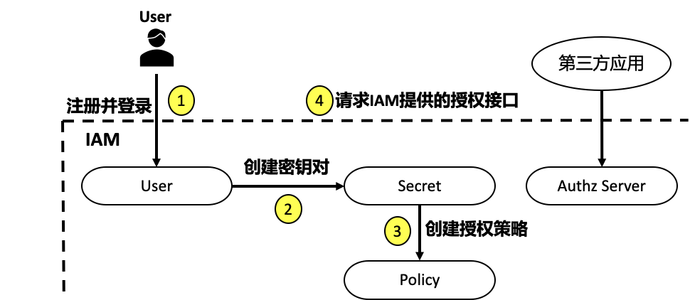
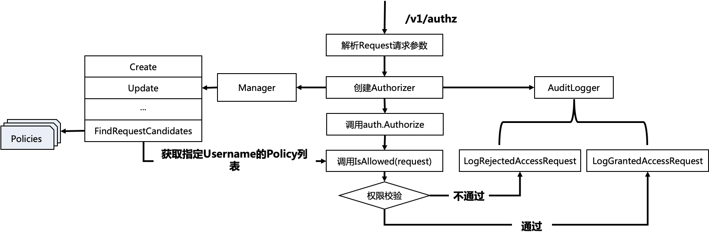

# 鉴权

## 简介

在研发中，经常会遇到这样一种恐怖的操作：张三因为误操作删除了李四的资源或某某程序员删库跑路等。操作之所以恐怖，是因为这些行为往往会带来很大的损失。那么如何避免这些风险呢？答案就是对资源做好权限管控，这是保证资源的安全是一件非常重要的事情。保证应用的资源安全，已经成为一个应用的必备能力，其具体包括以下 2 点：

- 权限模型：需要了解业界成熟的权限模型，以及这些模型的适用场景。
- 编码实现：选择或设计出了优秀的资源授权方案后，就要编写代码实现该方案。

## 权限模型

在权限模型中出现的术语如下：

| **英文名** | **中文名** | **描述**                                                     |
| ---------- | ---------- | ------------------------------------------------------------ |
| Subject    | 主体       | 通常是用户或者用户组                                         |
| Action     | 操作       | 对 Object 的操作，比如访问、创建、删除、查询、修改等         |
| Object     | 对象       | 权限所作用的对象，通常指各类资源                             |
| Effect     | 效力       | 限规则匹配后的操作，比如 Allow/Deny                          |
| Condition  | 限制条件   | 权限生效的条件                                               |
| Permission | 权限       | 用来指代是否允许某人在某种条件下对某种资源做某种操作         |
| Role       | 角色       | 权限集合，包含了一个或多个权限（Permission）                 |
| Policy     | 策略       | 一组规则/声明，在特定用户尝试执行特定操作时进行评估，然后将策略应用于用户、组和角色 |

不同的权限模型具有不同的特点，可以满足不同的需求。常见的权限模型有以下 5 种：

- 权限控制列表（Access Control List，ACL）
- 自主访问控制（Discretionary Access Control，DAC）
- 强制访问控制（Mandatory Access Control，MAC）
- 基于角色的访问控制（Role-Based Access Control，RBAC）
- 基于属性的权限验证（Attribute-Based Access Control，ABAC）

ACL 是一种简单的权限模型；DAC 基于 ACL，将权限下放给具有此权限的主题；但 DAC 因为权限下放，导致它对权限的控制过于分散，为了弥补 DAC 的这个缺陷，诞生了 MAC 权限模型。

DAC 和 MAC 都是基于 ACL 的权限模型。ACL 及其衍生的权限模型可以算是旧时代的权限模型，灵活性和功能性都满足不了现代应用的权限需求，所以诞生了 RBAC。RBAC 也是迄今为止最为普及的权限模型。

但是，随着组织和应用规模的增长，所需的角色数量越来越多，变得难以管理，进而导致角色爆炸和职责分离失败。最后，引入了一种新的、更动态的访问控制形式，称为基于属性的访问控制，也就是 ABAC。ABAC 被一些人看作是权限系统设计的未来。

### ACL

ACL 用于判断用户是否可以对资源做特定的操作。例如，允许 Colin 创建文章的 ACL 策略为：

```yaml
Subject: Colin
Action: Create
Object: Article
```


在 ACL 权限模型下，权限管理是围绕资源 Object 来设定的，ACL 权限模型也是比较简单的一种模型。

#### DAC：ACL 下放

DAC 是 ACL 的扩展模型，灵活性更强。使用这种模型，不仅可以判断 Subject 是否可以对 Object 做 Action 操作，同时也能让 Subject 将 Object、Action 的相同权限授权给其他的 Subject。例如，Colin 可以创建文章：

```yaml
Subject: Colin
Action: Create
Object: Article
```

因为 Colin 具有创建文章的权限，所以 Colin 也可以授予 James 创建文章的权限：

```yaml
Subject: James
Action: Create
Object: Article
```


经典的 ACL 模型权限集中在同一个 Subject 上，缺乏灵活性，为了加强灵活性，在 ACL 的基础上，DAC 模型将权限下放，允许拥有权限的 Subject 自主地将权限授予其他 Subject。

#### MAC

MAC 是 ACL 的扩展模型，安全性更高。MAC 权限模型下，Subject 和 Object 同时具有安全属性。在做授权时，需要同时满足两点才能授权通过：

- Subject 可以对 Object 做 Action 操作。
- Object 可以被 Subject 做 Action 操作。

 例如，我们设定了“Colin 和 James 可以创建文章”这个 MAC 策略：

```yaml
Subject: Colin
Action: Create
Object: Article
```

```yaml
Subject: James
Action: Create
Object: Article
```


还有另外一个 MAC 策略“文章可以被 Colin 创建”：

```yaml
Subject: Article
Action: Create
Object: Colin
```


在上述策略中，Colin 可以创建文章，但是 James 不能创建文章，因为第二条要求没有满足。注意在 ACL 及其扩展模型中，Subject 可以是用户，也可以是组或群组。

ACL、DAC 和 MAC 是旧时代的权限控制模型，无法满足现代应用对权限控制的需求，于是诞生了新时代的权限模型：RBAC 和 ABAC。

### RBAC

RBAC 引入了 Role（角色）的概念，并且将权限与角色进行关联。用户通过扮演某种角色，具有该角色的所有权限。

 

每个用户关联一个或多个角色，每个角色关联一个或多个权限，每个权限又包含了一个或者多个操作，操作包含了对资源的操作集合。通过用户和权限解耦，可以实现非常灵活的权限管理。例如，可以满足以下两个权限场景：

- 可以通过角色批量给一个用户授权：例如，公司新来了一位同事，需要授权虚拟机的生产、销毁、重启和登录权限。这时候，可以将这些权限抽象成一个运维角色。如果再有新同事来，就可以通过授权运维角色，直接批量授权这些权限，不用一个个地给用户授权这些权限。
- 可以批量修改用户的权限：例如，有很多用户，同属于运维角色，这时候对运维角色的任何权限变更，就相当于对运维角色关联的所有用户的权限变更，不用一个个去修改这些用户的权限。

RBAC 又分为 RBAC0、RBAC1、RBAC2、RBAC3。RBAC0 是 RBAC 的核心思想，RBAC1 是基于 RBAC 的角色分层模型，RBAC2 增加了 RBAC 的约束模型。而 RBAC3，其实相当于 RBAC1 + RBAC2。

对这四种 RBAC 的详细介绍如下：

- RBAC0：基础模型，只包含核心的四要素，也就是用户（User）、角色（Role）、权限（Permission：Objects-Operations）、会话（Session）。用户和角色可以是多对多的关系，权限和角色也是多对多的关系。
- RBAC1：包括了 RBAC0，并且添加了角色继承。角色继承，即角色可以继承自其他角色，在拥有其他角色权限的同时，还可以关联额外的权限。
- RBAC2：包括 RBAC0，并且添加了约束。具有以下核心特性：
  - 互斥约束：包括互斥用户、互斥角色、互斥权限。同一个用户不能拥有相互排斥的角色，两个互斥角色不能分配一样的权限集，互斥的权限不能分配给同一个角色，在 Session 中，同一个角色不能拥有互斥权限。
  - 基数约束：一个角色被分配的用户数量受限，它指的是有多少用户能拥有这个角色。例如，一个角色是专门为公司 CEO 创建的，那这个角色的数量就是有限的。
  - 先决条件角色：指要想获得较高的权限，要首先拥有低一级的权限。例如，先有副总经理权限，才能有总经理权限。
  - 静态职责分离（Static Separation of Duty）：用户无法同时被赋予有冲突的角色。
  - 动态职责分离（Dynamic Separation of Duty）：用户会话中，无法同时激活有冲突的角色。
- RBAC3：全功能的 RBAC，合并了 RBAC0、RBAC1、RBAC2。

此外，RBAC 也可以很方便地模拟出 DAC 和 MAC 的效果。这里举个例子，来协助你理解 RBAC。例如，我们有 write article 和 manage article 的权限：

```yaml
Permission:
  \- Name: write_article
    \- Effect: "allow"
    \- Action: ["Create", "Update", "Read"]
    \- Object: ["Article"]
  \- Name: manage_article
    \- Effect: "allow"
    \- Action: ["Delete", "Read"]
    \- Object: ["Article"]
```

同时，我们也有 Writer、Manager 和 CEO 3个角色，Writer 具有 write_article 权限，Manager 具有 manage_article 权限，CEO 具有所有权限：

```yaml
Role:
  \- Name: Writer
   Permissions:
    \- write_article
  \- Name: Manager
   Permissions:
    \- manage_article
  \- Name: CEO
   Permissions:
    \- write_article
    \- manage_article
```


接下来，对 Colin 用户授予 Writer 角色：

```yaml
Subject: Colin
Roles:
  \- Writer
```

那么现在 Colin 就具有 Writer 角色的所有权限 write_article，write_article 权限可以创建文章。 

接下来，再对 James 用户授予 Writer 和 Manager 角色：

```yaml
Subject: James
Roles:
  \- Writer
  \- Manager
```

那么现在 James 就具有 Writer 角色和 Manager 角色的所有权限：write_article、manage_article，这些权限允许 James 创建和删除文章。

### ABAC

ABAC 规定了哪些属性的用户可以对哪些属性的资源在哪些限制条件下进行哪些操作。跟 RBAC 相比，ABAC 对权限的控制粒度更细，主要规定了下面这四类属性：

- 用户属性，例如性别、年龄、工作等。
- 资源属性，例如创建时间、所属位置等。
- 操作属性，例如创建、修改等。
- 环境属性，例如来源 IP、当前时间等。

 下面是一个 ABAC 策略：

```yaml
Subject:
  Name: Colin
  Department: Product
  Role: Writer
Action:
  \- create
  \- update
Resource:
  Type: Article
  Tag:
    \- technology
    \- software
  Mode:
    \- draft
Contextual:
  IP: 10.0.0.10
```

上面权限策略描述的意思是，产品部门的 Colin 作为一个 Writer 角色，可以通过来源 IP 是 10.0.0.10 的客户端，创建和更新带有 technology 和 software 标签的草稿文章。

提示 ABAC 有时也被称为 PBAC（Policy-Based Access Control）或 CBAC（Claims-Based Access Control）。

## 开源项目

### Casbin

Casbin 是一个用 Go 语言编写的访问控制框架，功能强大，支持 ACL、RBAC、ABAC 等访问模型，很多优秀的权限管理系统都是基于 Casbin 来构建的。Casbin 的核心功能都是围绕着访问控制来构建的，不负责身份认证。

### keto

keto 是一个云原生权限控制服务，通过提供 RESTFUL API 进行授权，支持 RBAC、ABAC、ACL、AWS IAM 策略、Kubernetes Roles 等权限模型，可以解决以下问题：

- 是否允许某些用户修改此博客文章？
- 是否允许某个服务打印该文档？
- 是否允许 ACME 组织的成员修改其租户中的数据？
- 是否允许在星期一的下午 4 点到下午 5 点，从 IP 10.0.0.2 发出的请求执行某个 Job？

### go-admin

go-admin 是一个基于 Gin + Vue + Element UI 的前后端分离权限管理系统脚手架，它的访问控制模型采用了 Casbin 的 RBAC 访问控制模型，功能强大，包含了如下功能：

- 基础用户管理功能。
- JWT 鉴权。
- 代码生成器。
- RBAC 权限控制。

该项目还支持 RESTful API 设计规范、Swagger 文档、GORM 库等。go-admin 不仅是一个优秀的权限管理系统，也是一个优秀的、功能齐全的 Go 开源项目。

### gin-vue-admin

gin-vue-admin 是一个基于 Gin 和 Vue 开发的全栈前后端分离的后台管理系统，集成了 JWT 鉴权、动态路由、动态菜单、Casbin 鉴权、表单生成器、代码生成器、RBAC 权限管理模型等功能。

## Lab

### ladon

- [Ladon 示例](20_ladon/README.md)：Ladon 是用 Go 语言编写的用于实现访问控制策略的库，类似于 RBAC 和 ACL。但与 RBAC 和 ACL 相比，Ladon 可以实现更细粒度的访问控制，并且能够在更为复杂的环境中（例如多租户、分布式应用程序和大型组织）工作。因此，本课程选择 Ladon 作为基础，具体代码[在此](20_ladon/README.md)。

### apiserver 示例

apiserver 的鉴权通过提供 /v1/authz RESTful API 接口完成资源授权。/v1/authz 接口是通过 github.com/ory/ladon 来完成资源授权的。

资源授权的流程可以分为 4 步：

- 注册并登录：用户需要提供用户名、密码、昵称、邮箱、电话等信息注册并登录到 apiserver，创建需要的系统资源，比如：密钥对、授权策略等。
- 创建密钥对：因为访问 apiserver 的资源授权接口需要通过 Bearer 认证，Bearer 认证需要密钥对（secretID/secretKey）来生成 Token，所以用户需要在 apiserver 中创建自己的密钥对。
- 创建授权策略：apiserver 通过授权策略完成授权，所以用户需要在系统中创建授权策略。
- 第三方应用请求 apiserver 提供的授权接口：apiserver 会根据第三方应用的请求参数和授权策略来决定一个授权请求是否被允许。



#### Policy 接口

可以看到，在上面的流程中，apiserver 使用到了 3 种资源：User、Secret、Policy。它们映射到程序设计中就是 3 种 REST 资源。

- User：实现对用户的增、删、改、查、修改密码、批量修改等操作。
- Secret：实现对密钥的增、删、改、查操作。
- Policy：实现对策略的增、删、改、查、批量删除操作。

Policy 相关接口

| **接口名称**               | **接口功能**         |
| -------------------------- | -------------------- |
| POST  /v1/policies         | 创建授权策略         |
| DELETE  /v1/policies/:name | 删除授权策略         |
| PUT  /v1/policies/:name    | 修改授权策略属性     |
| GET  /v1/policies/:name    | 查询授权策略详细信息 |
| GET  /v1/policies          | 查询授权策略列表     |

#### 代码解析

具体代码[在此](../../scaffold/apiserver/README.md)




