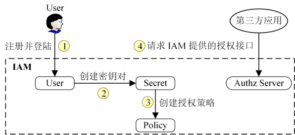

# 鉴权

## ladon

- [Ladon](20_ladon/README.md)

## apiserver 示例

通过 IAM 系统的资源授权的流程，来看下它是如何工作的，整个过程可以分为 4 步：

- 注册并登录。用户需要提供用户名、密码、昵称、邮箱、电话等信息注册并登录到 IAM 系统，创建需要的系统资源，比如：密钥对、授权策略等。
- 创建密钥对。因为访问 IAM 的资源授权接口需要通过Bearer认证，Bearer认证需要密钥对（secretID/secretKey）来生成Token，所以用户需要在 IAM 中创建属于自己的密钥对。
- 创建授权策略。IAM 通过授权策略完成授权，所以用户需要在 IAM 系统中创建授权策略。
- 第三方应用请求 IAM 提供的授权接口。Authz Server会根据第三方应用的请求参数和授权策略来决定一个授权请求是否被允许。

可以看到，在上面的流程中，IAM 使用到了 3 种系统资源：用户（User）、密钥（Secret）、策略（Policy）。它们映射到程序设计中就是 3 种 REST 资源。

- 用户（User）：实现对用户的增、删、改、查、修改密码、批量修改等操作。
- 密钥（Secret）：实现对密钥的增、删、改、查操作。
- 策略（Policy）：实现对策略的增、删、改、查、批量删除操作。

### API 接口

策略相关接口

| **接口名称**               | **接口功能**     |
| -------------------------- | ---------------- |
| POST  /v1/policies         | 创建授权策略     |
| DELETE  /v1/policies       | 批量删除授权策略 |
| DELETE  /v1/policies/:name | 删除授权策略     |
| PUT  /v1/policies/:name    | 修改授权策略属性 |
| GET  /v1/policies/:name    | 查询授权策略信息 |
| GET  /v1/policies          | 查询授权策略列表 |

