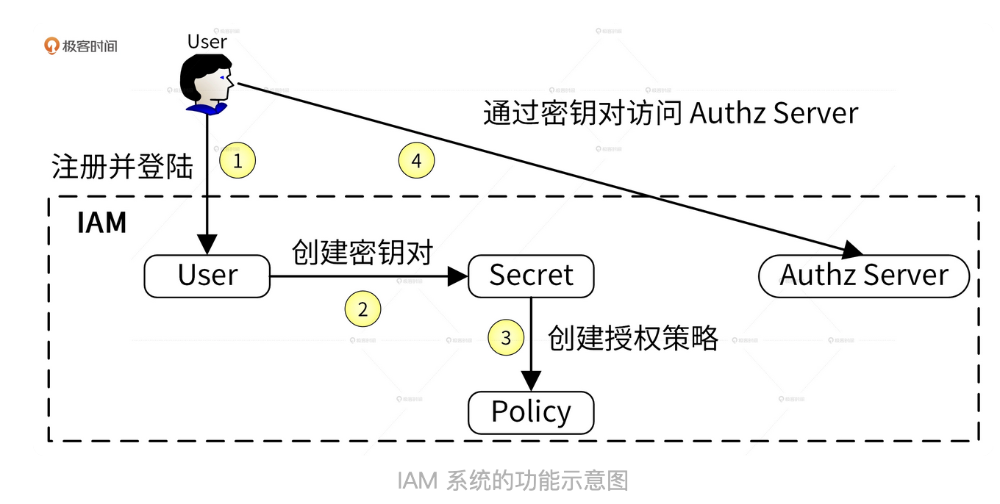
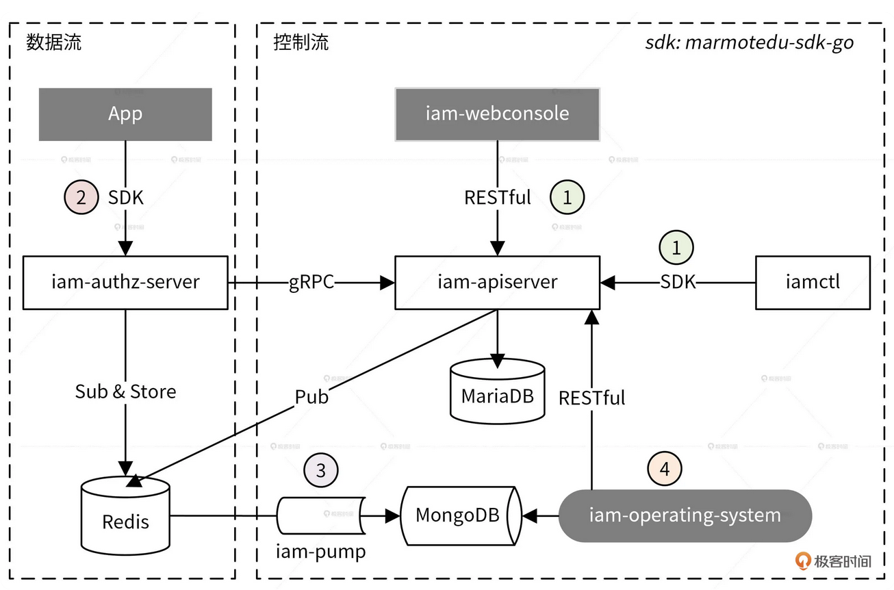
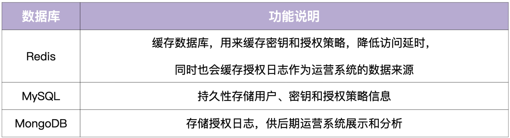
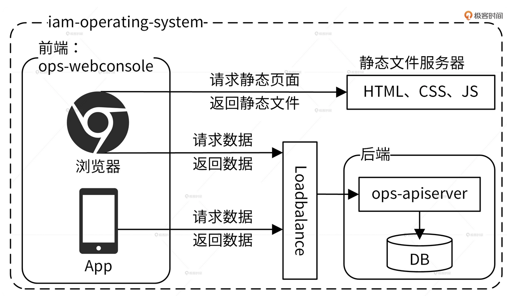

# Lab IAM

## 简介

为了保障应用的安全，需要对访问进行认证、对资源进行授权。那么，要如何实现访问认证和资源授权呢？认证功能不复杂，可以通过 JWT（JSON  Web Token）认证来实现。授权功能比较复杂，授权功能的复杂性使得它可以囊括很多 Go 应用开发技能点。因此，我们将认证和授权的功能实现升级为 IAM 系统，通过讲解它的构建过程来阐述开发的全部流程。IAM（Identity and Access Management）是一个用 Go 语言编写的一个 Web 服务，用于给第三方用户提供访问控制服务。IAM 可以帮用户解决：在特定的条件下，谁能够 / 不能够对哪些资源做哪些操作，也即完成资源授权功能。

### 业务架构

IAM 的资源授权的流程，整体过程可以分为 4 步：

1. 用户提供昵称、密码、邮箱、电话等信息注册并登录到 IAM 系统，这里是以用户名和密码作为唯一的身份标识来访问 IAM 系统，并且完成认证。
2. 因为访问 IAM  的资源授权接口是通过密钥（secretID/secretKey）的方式进行认证的，所以用户需要在 IAM 中创建属于自己的密钥资源。
3. 因为 IAM 通过授权策略完成授权，所以用户需要在 IAM 中创建授权策略。
4. 请求 IAM 提供的授权接口，IAM 会根据用户的请求内容和授权策略来决定一个授权请求是否被允许。

在上面的流程中，IAM 使用到了 3  种系统资源：用户（User）、密钥（Secret）和策略（Policy），它们映射到程序设计中就是 3 种 RESTful  资源：

- 用户（User）：实现对用户的增、删、改、查、修改密码、批量修改等操作。
- 密钥（Secret）：实现对密钥的增、删、改、查操作。
- 策略（Policy）：实现对策略的增、删、改、查、批量删除操作。

### 功能架构

IAM 中包括 9 大组件和 3 大数据库，5 个核心组件包括： iam-apiserver、iam-authz-server、iam-pump、marmotedu-sdk-go 和 iamctl 的功能。

### 数据架构

IAM 还有 3 个数据库 Redis、MySQL 和 MongoDB：

### 业务架构（详细）

1. 创建平台资源：用户通过 iam-webconsole（RESTful API）或 iamctl（sdk marmotedu-sdk-go）请求  iam-apiserver 提供的 RESTful API 接口完成用户、密钥、授权策略的增删改查，iam-apiserver  会将这些资源数据持久化存储在 MySQL 数据库中。为了确保通信安全，客户端访问服务端都是通过 HTTPS 协议来访问的。
2. 请求 API 完成资源授权：用户可以通过请求 iam-authz-server 提供的 /v1/authz 接口进行资源授权，请求  /v1/authz 接口需要通过密钥认证，认证通过后 /v1/authz 接口会查询授权策略，从而决定资源请求是否被允许。为了提高  /v1/authz 接口的性能，iam-authz-server 将密钥和策略信息缓存在内存中，以便实现快速查询。首先，iam-authz-server 通过调用 iam-apiserver 提供的 gRPC 接口，将密钥和授权策略信息缓存到内存中。同时，为了使内存中的缓存信息和 iam-apiserver 中的信息保持一致，当 iam-apiserver 中有密钥或策略被更新时，iam-apiserver 会往特定的 Redis  Channel（iam-authz-server 也会订阅该 Channel）中发送 PolicyChanged 和 SecretChanged 消息。这样一来，当 iam-authz-server 监听到有新消息时就会获取并解析消息，根据消息内容判断是否需要重新调用 gRPC 接来获取密钥和授权策略信息，再更新到内存中。
3. 授权日志数据分析：iam-authz-server 会将授权日志上报到 Redis 高速缓存中，然后 iam-pump 会异步消费这些授权日志，再把清理后的数据保存在 MongoDB 中，供运营系统 iam-operating-system 查询。iam-authz-server 将授权日志保存在 Redis 高性能  key-value  数据库中，可以最大化减少写入延时。不保存在内存中是因为授权日志量很大时，很可能会将内存耗尽，造成服务中断。
4. 运营平台授权数据展示：iam-operating-system 是 IAM 的运营系统，它可以通过查询 MongoDB  获取并展示运营数据，比如某个用户的授权/失败次数、授权失败时的授权信息等。此外，也可以通过 iam-operating-system 调用 iam-apiserver 服务来做些运营管理工作。比如，以上帝视角查看某个用户的授权策略供排障使用，或调整用户可创建密钥的最大个数，再或者通过白名单的方式，让某个用户不受密钥个数限制的影响等。

### 实现架构

前后端分离：前端负责页面的展示以及数据的加载和渲染，后端只负责返回前端需要的数据。采用了前后端分离架构之后，当你通过浏览器请求前端 ops-webconsole 时，ops-webconsole 会先请求静态文件服务器加载静态文件，比如 HTML、CSS 和  JavaScript，然后它会执行 JavaScript，通过负载均衡请求后端数据，最后把后端返回的数据渲染到前端页面中。

采用前后端分离的架构，让前后端通过 RESTful API 通信，会带来以下 5  点好处：

- 可以让前、后端人员各自专注在自己业务的功能开发上，让专业的人做专业的事，来提高代码质量和开发效率
- 前后端可并行开发和发布，这也能提高开发和发布效率，加快产品迭代速度
- 前后端组件、代码分开，职责分明，可以增加代码的维护性和可读性，减少代码改动引起的 Bug 概率，同时也能快速定位 Bug
- 前端 JavaScript 可以处理后台的数据，减少对后台服务器的压力可根据需要选择性水平扩容前端或者后端来节约成本

iam-operating-system 前后端分离架构如下：

