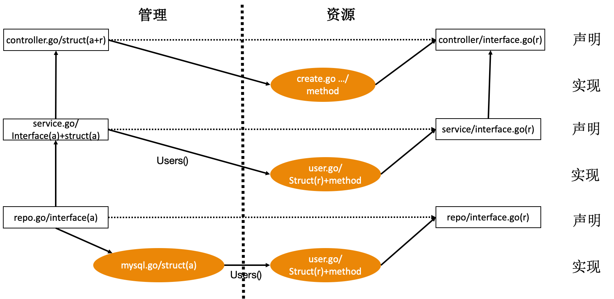

# Ctl-Srv-Repo

## 简介

参考 IAM 项目的 Gin/User 资源

每层分 2 个维度：

- 管理：与下一层的管路组件协同
- 资源：管理组件通过 Users() 函数调用该层对应的资源

### controller

- 管理：
  - interface：无
  - struct：controller.go/controller，管理与资源使用同一个struct
- 资源：
  - interface：interface.go/Controller，只有资源 interface
  - struct：controller.go/controller，管理与资源使用同一个struct

### service

- 管理：
  - interface：service.go/Service
  - struct：service.go/service
- 资源：
  - interface：interface.go/UserService
  - struct：user.go/userService

### repo

- 管理：
  - interface：repo.go/Repo
  - struct：mysql.go/repo
- 资源：
  - interface：interface.go/Users
  - struct：user.go/users

