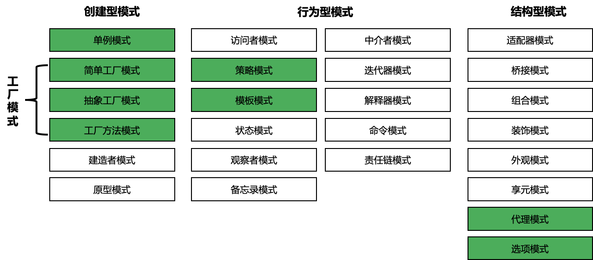

# 设计模式

在软件开发中，经常会遇到各种各样的编码场景，这些场景往往重复发生，因此具有典型性。针对这些典型场景，可以自己编码解决，也可以采取更为省时省力的方式：直接采用设计模式。设计模式简单来说，就是将软件开发中需要重复性解决的编码场景，按最佳实践的方式抽象成一个模型，模型描述的解决方法就是设计模式。使用设计模式，可以使代码更易于理解，保证代码的重用性和可靠性。

在软件领域，GoF（四人帮，全拼 Gang of Four）首次系统化提出了 3 大类、共 25 种可复用的经典设计方案，来解决常见的软件设计问题，为可复用软件设计奠定了一定的理论基础。从总体上说，这些设计模式可以分为创建型模式、结构型模式、行为型模式 3 大类，用来完成不同的场景。

本章会介绍几个在 Go 项目开发中比较常用的设计模式，帮助用更加简单快捷的方法应对不同的编码场景。其中，简单工厂模式、抽象工厂模式和工厂方法模式都属于工厂模式。



## 创建型

创建型模式（Creational Patterns）提供了一种在创建对象的同时隐藏创建逻辑的方式，而不是使用 new 运算符直接实例化对象。

### 单例模式

单例模式（Singleton Pattern）是最简单的一个模式，在 Go 中指的是全局只有一个实例，并且它负责创建自己的对象。单例模式不仅有利于减少内存开支，还有减少系统性能开销、防止多个实例产生冲突等优点。因为单例模式保证了实例的全局唯一性，而且只被初始化一次，所以比较适合全局共享一个实例，且只需要被初始化一次的场景，例如数据库实例、全局配置、全局任务池等。

单例模式又分为饿汉方式和懒汉方式：

- 饿汉方式：指全局的单例实例在包被加载时创建
- 懒汉方式：指全局的单例实例在第一次被使用时创建

#### Lab

- [单例模式](10_singleton/main.go)

```bash
cd 10_singleton
go run main.go
```

### 工厂模式

工厂模式（Factory Pattern）是面向对象编程中的常用模式。在 Go 项目开发中，可以通过使用多种不同的工厂模式，来使代码更简洁明了。Go 中的结构体+方法，可以理解为面向对象编程中的类。有了 “类”，就可以创建“类”相关的实例。可以通过简单工厂模式、抽象工厂模式、工厂方法模式这 3 种方式，来创建实例。

#### 简单工厂模式

简单工厂模式是最常用、最简单的。它就是一个接受一些参数，然后返回实例的函数。

参考代码案例，和 `p：=＆Person {}` 这种创建实例的方式相比，简单工厂模式可以确保创建的实例具有需要的参数，进而保证实例的方法可以按预期执行。例如，通过 NewPerson() 创建 Person 实例时，可以确保实例的 name 和 age 属性被设置。

##### Lab

- [简单工厂模式](20_factory/10_simple.go)

```bash
cd 20_factory
go run 10_simple.go
```

#### 抽象工厂模式

抽象工厂模式与简单工厂模式的唯一区别，就是它返回的是接口而不是结构体。通过返回接口，可以在不公开内部实现的情况下，让调用者使用提供的各种功能。

##### Lab

- [抽象工厂模式](20_factory/20_abstract.go)

```bash
go run 20_factory/20_abstract.go
```

#### 工厂方法模式

在简单工厂模式中，依赖于唯一的工厂对象，如果需要实例化一个产品，就要向工厂中传入一个参数，获取对应的对象。但如果要增加一种产品，就要在工厂中修改创建产品的函数。这会导致耦合性过高，这时就可以使用工厂方法模式。

在工厂方法模式中，将返回工厂函数，可以通过实现工厂函数来创建多种工厂，从而将过程解耦。

##### Lab
- [工厂方法模式](20_factory/30_method.go)

```bash
go run 20_factory/30_method.go
```

### 创造者模式


### 原型模式


## 结构型

结构型模式（Structural Patterns）关注类和对象的组合。


### 代理模式

代理模式 (Proxy Pattern)，可以为另一个对象提供一个替身，以控制对这个对象的访问。

Proxy 将对象嵌入其结构体，从而可通过 Proxy 的方法操作对象。

- [代理模式](60_proxy/main.go)

```bash
go run 60_proxy/main.go
```

### 选项模式

Go 中的参数传递有多种方式。

#### 普通传参

Go 语言支持按顺序传入参数来调用函数，下面是一个示例函数：

```go
// ListApplications 查询应用列表
func ListApplications(limit, offset int) []Application {
	return allApps[offset : offset+limit]
}
```

调用代码：

```go
ListApplications(5, 0)
```

当想要增加新参数时，可以直接修改函数签名。比如，下面的代码给 `ListApplications` 增加了新的过滤参数 `owner`：

```go
func ListApplications(limit, offset int, owner string) []Application {
	if owner != "" {
		// ...
	}
	return allApps[offset : offset+limit]
}
```

调用代码也需要随之改变：

```go
ListApplications(5, 0, "wukong")
// 不使用 owner 过滤
ListApplications(5, 0, "")
```

显而易见，这种普通传参模式存在以下几个明显的缺点：

- 可读性不佳：只支持用位置，不支持用关键字来区分参数，参数变多后，各参数含义很难一目了然。
- 破坏兼容性：增加新参数后，原有调用代码必须进行对应修改，比如像上方的 `ListApplications(5, 0, "")` 一样，在 `owner` 参数的位置传递空字符串。

为了解决这些问题，常见的做法是引入一个参数结构体（struct）传参。

#### 结构体传参

新建一个结构体类型，里面包含函数需要支持的所有参数：

```go
// ListAppsOptions 是查询应用列表时的可选项
type ListAppsOptions struct {
	limit  int
	offset int
	owner  string
}
```

修改原函数，直接接收该结构体类型作为唯一参数：

```go
// ListApplications 查询应用列表，使用基于结构体的查询选项
func ListApplications(opts ListAppsOptions) []Application {
	if opts.owner != "" {
		// ...
	}
	return allApps[opts.offset : opts.offset+opts.limit]
}
```

调用代码如下所示：

```go
ListApplications(ListAppsOptions{limit: 5, offset: 0, owner: "wukong"})
ListApplications(ListAppsOptions{limit: 5, offset: 0})
```

相比普通模式，使用结构体传参有以下几个优势：

- 构建参数结构体时，可显式指定各参数的字段名，可读性佳。
- 对于非必选参数，构建时可不传值，比如上面省略了 `owner`。

##### 可选参数

不过，无论是使用普通传参还是结构体传参，都无法支持真正的可选参数。给 `ListApplications`  函数增加一个新选项：`hasDeployed`——根据应用是否已部署来过滤结果。

参数结构体调整如下：

```go
// ListAppsOptions 是查询应用列表时的可选项
type ListAppsOptions struct {
	limit       int
	offset      int
	owner       string
	hasDeployed bool
}
```

查询函数也做出对应调整：

```go
// ListApplications 查询应用列表，增加对 HasDeployed 过滤
func ListApplications(opts ListAppsOptions) []Application {
	// ...
	if opts.hasDeployed {
		// ...
	} else {
		// ...
	}
	return allApps[opts.offset : opts.offset+opts.limit]
}
```

想过滤已部署的应用时，可以调用：

```go
ListApplications(ListAppsOptions{limit: 5, offset: 0, hasDeployed: true})
```

而当不需要按“部署状态”过滤时，可以删除 `hasDeployed` 字段，用以下代码调用 `ListApplications` 函数：

```go
ListApplications(ListAppsOptions{limit: 5, offset: 0})
```

但问题在于 `hasDeployed` 是布尔类型，这意味着当不为其提供任何值时，程序总是会使用布尔类型的零值（zero value）：`false`。

所以，现在的代码其实根本拿不到“未按已部署状态过滤”的结果，`hasDeployed` 要么为 `true`，要么为 `false`，不存在其他状态。

##### 指针类型支持可选

为了解决上面的问题，最直接的做法是引入指针。和普通的值类型不同，Go 里的指针类型拥有一个特殊的零值：`nil`。因此，只要把 `hasDeployed`  从布尔类型（`bool`）改成指针类型（`*bool`），就能更好地支持可选参数：

```go
// ListAppsOptions 是查询应用列表时的可选项
type ListAppsOptions struct {
	limit  int
	offset int
	owner  string
	// 启用指针类型
	hasDeployed *bool
}
```

查询函数也需要做一些调整：

```go
// ListApplications 查询应用列表，增加对 HasDeployed 过滤
func ListApplications(opts ListAppsOptions) []Application {
	// ...
	if opts.hasDeployed == nil {
		// 默认不过滤分支
	} else {
		// 按 hasDeployed 为 true 或 false 来过滤
	}
	return allApps[opts.offset : opts.offset+opts.limit]
}
```

在调用函数时，调用方如不指定 `hasDeployed` 字段的值，代码就会进入 `if opts.hasDeployed == nil` 分支，不做任何过滤：

```go
ListApplications(ListAppsOptions{limit: 5, offset: 0})
```

当调用方想按 `hasDeployed` 过滤时，可以采用下面的方式：

```go
wantHasDeployed := true
ListApplications(ListAppsOptions{limit: 5, offset: 0, hasDeployed: &wantHasDeployed})
```

如所见，因为 `hasDeployed` 如今是指针类型 `*bool` ，所以必须得先创建一个临时变量，然后取它的指针去调用函数。不得不说，这挺麻烦的对不？有没有一种方式，既能解决前面这些函数传参时的痛点，又能让调用过程不要像“手动造指针”这么麻烦呢？接下来便该选项模式出场了。

#### 函数选项模式

选项模式（Options Pattern）是 Go 项目经常使用到的模式，如 grpc/grpc-go 的 NewServer 函数，uber-go/zap 的 New 函数都用到了选项模式。使用选项模式，可以创建一个带有默认值的 struct 变量，并选择性地修改其中一些参数的值。

除了普通传参模式外，Go 语言其实还支持可变数量的参数，使用该特性的函数统称为“可变参数函数（varadic functions）”。比如 `append`、`fmt.Println` 均属此类。

```go
nums := []int{}
// 调用 append 时，传多少个参数都行 
nums = append(nums, 1, 2, 3, 4)
```

为了实现“函数式选项”模式，首先修改 `ListApplications` 函数的签名，使其接收类型为 `func(*ListAppsOptions)` 的可变数量参数。

```go
// ListApplications 查询应用列表，使用可变参数
func ListApplications(opts ...func(*ListAppsOptions)) []Application {
	// 设置好每个参数的默认值
	config := ListAppsOptions{limit: 10, offset: 0, owner: "", hasDeployed: nil}
	// 轮询 opts 里的每个函数，调用它们来修改 config 对象
	for _, opt := range opts {
		opt(&config)
	}
	// ...
	return allApps[config.offset : config.offset+config.limit]
}
```

然后，再定义一系列用于调节选项的工厂函数：

```go
func WithPager(limit, offset int) func(*ListAppsOptions) {
	return func(opts *ListAppsOptions) {
		opts.limit = limit
		opts.offset = offset
	}
}

func WithOwner(owner string) func(*ListAppsOptions) {
	return func(opts *ListAppsOptions) {
		opts.owner = owner
	}
}

func WithHasDeployed(val bool) func(*ListAppsOptions) {
	return func(opts *ListAppsOptions) {
		opts.hasDeployed = &val
}
```

这些以 `With*` 命名的工厂函数，通过返回闭包函数来修改函数选项对象 `*ListAppsOptions`。

调用时的代码如下：

```go
// 不使用任何参数
ListApplications()
// 选择性启用某些选项
ListApplications(WithPager(2, 5), WithOwner("wukong"))
ListApplications(WithPager(2, 5), WithOwner("wukong"), WithHasDeployed(false))
```

和使用“结构体传参”相比，“选项模式”有以下几个特点：

- 更友好的可选参数：比如不再需要手动为 `hasDeployed` 取指针。
- 灵活性更强：可以方便地在每个 `With*` 函数里追加额外逻辑。
- 向前兼容性好：任意增加新的选项都不会影响已有代码。
- 更漂亮的 API：当参数结构体很复杂时，该模式所提供的 API 更漂亮，也更好用。

不过，直接用选项模式，对使用方其实算不上太友好。因为每个 `With*` 都是独立的工厂函数，可能分布在各个地方，调用方在使用时，很难一站式的找出函数所支持的所有选项。

为了解决这个问题，人们在“函数式选项模式”的基础做了一些小优化：用接口（Interface）类型替代工厂函数。

#### 接口选项模式

首先，定义一个名为 `Option` 的接口类型，其中仅包含一个方法 `applyTo`：

```go
type Option interface {
	applyTo(*ListAppsOptions)
}
```

然后，把这批 `With*` 工厂函数改为各自的自定义类型，并实现 `Option` 接口：

```go
type WithPager struct {
	limit  int
	offset int
}

func (r WithPager) applyTo(opts *ListAppsOptions) {
	opts.limit = r.limit
	opts.offset = r.offset
}

type WithOwner string

func (r WithOwner) applyTo(opts *ListAppsOptions) {
	opts.owner = string(r)
}

type WithHasDeployed bool

func (r WithHasDeployed) applyTo(opts *ListAppsOptions) {
	val := bool(r)
	opts.hasDeployed = &val
}
```

做完这些准备工作后，查询函数也要做出相应的调整：

```go
// ListApplications 查询应用列表，使用可变参数，Option 接口类型
func ListApplications(opts ...Option) []Application {
	config := ListAppsOptions{limit: 10, offset: 0, owner: "", hasDeployed: nil}
	for _, opt := range opts {
		// 调整调用方式
		opt.applyTo(&config)
	}
	// ...
	return allApps[config.offset : config.offset+config.limit]
}
```

调用代码和之前类似，如下所示：

```go
ListApplications(WithPager{limit: 2, offset: 5}, WithOwner("wukong"))
ListApplications(WithOwner("wukong"), WithHasDeployed(false))
```

各个可选项从工厂函数变成 `Option` 接口后，找出所有可选项变得更方便了，使用 IDE 的“查找接口的实现”就可以轻松完成任务。


### 访问者模式


### 策略模式

### 模板模式

模版模式 (Template Pattern)  定义一个操作中算法的骨架，而将一些步骤延迟到子类中。这种方法让子类在不改变一个算法结构的情况下，就能重新定义该算法的某些特定步骤。

简单来说，模板模式就是将一个类中能够公共使用的方法放置在抽象类中实现，将不能公共使用的方法作为抽象方法，强制子类去实现，这样就做到了将一个类作为一个模板，让开发者去填充需要填充的地方。

- [模板模式](35_template/main.go)

```bash
go run 35_template/main.go
```

### 状态模式


### 观察者模式


### 备忘录模式


### 中介者模式


### 迭代器模式


### 解释器模式


### 命令模式


### 责任链模式


## 行为型

行为型模式（Behavioral Patterns）是关注对象之间的通信。


### 适配器模式


### 桥接模式


### 组合模式


### 装饰模式


### 外观模式


### 享元模式

